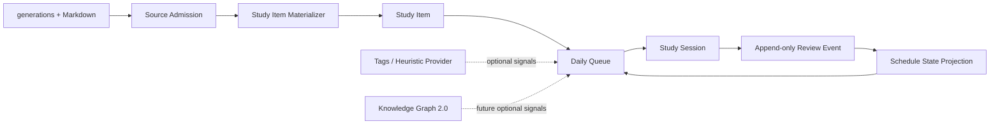

# 学习辅助 2.0 领域与数据 ADR（LA-D2）

> ADR 状态：**Accepted / 已实施 LA-P0-P4 学习闭环、反馈指标与语义接缝**
> 日期：2026-07-13
> 最近修订：2026-07-14（LA-P4 可降级语义 Provider 接缝完成）
> 当前阶段：LA-P0-P4 已完成；知识图谱 2.0 保持 KG-D0 后置立项
> 上位基线：[学习辅助 2.0 设计基线](../Features/Learning_Assistance_2_0_Design_Baseline.md)
> 产品权威：[学习辅助 2.0 产品定义](../Features/Learning_Assistance_2_0_Product_Definition.md)
> 已确认原型：[LA-D1 桌面端原型](../Features/prototypes/la-d1-prototype.html)
> 数据前置：[学习辅助 2.0 数据整备实施计划](../Features/Learning_Assistance_2_0_Data_Preparation_Plan.md)
> 决策类型：当前正式主线的领域与数据专题；不复活旧 SRS、Engagement、Mission 或 Knowledge 实现

## 0. 文档定位与权威边界

本文决定学习辅助 2.0 v1 的领域实体、身份、事件、状态投影、调度适配、学习日、队列、内容更新、来源删除、候选 schema、API contract、迁移和回滚边界。

本文不得改变 LA-D0 已确认的用户承诺：

- 三语卡拆为 English / Japanese 两个学习单元；
- 日语语法卡按整个语法点形成一个学习单元；
- 场景卡按 12 个表达拆分，每个表达仍是 `EN+JA` 组合单元；
- 使用“重来 / 困难 / 记住 / 简单”四档反馈；
- v1 只有一个活动计划；
- 默认每日行动目标 20、每日新单元上限 5；
- 到期和逾期优先于新单元；
- 默认学习时区为 `Asia/Tokyo`（2026-07-23，在首份真实队列创建前确认修订）；
- 知识图谱、标签和 LLM 不拥有调度结果。

代码和 schema 只有在本文通过后才能进入 LA-P0。实施中若发现必须改变产品行为，应先修订 LA-D0；若只改变技术实现，应先更新本文并记录原因。

## 1. 背景与输入事实

### 1.1 当前运行基线

- 生产入口是 `server.mjs`，Express API 与 React Router 在同一进程组合；
- 后端存储是 `better-sqlite3` + WAL；
- Cards Factory 的权威内容位于 Markdown 文件，`generations.markdown_content` 是同步查询投影；
- `generations.content_hash` 已强制为规范 Markdown 的 SHA-256；
- `card_tags`、`audio_files`、`card_highlights` 已存在；
- DP7 当前给出 `eligible=619`、`whole-card-only=1`、`quarantined=15`、`unresolved=0`；
- 现有代码没有学习计划、Review Event 或 Schedule State 表和 API。

### 1.2 LA-D2 必须解决的问题

1. 如何稳定标识卡内学习单元；
2. 如何让来源卡删除后学习历史仍然存在；
3. 如何识别内容变化且不误删或静默重置进度；
4. 如何保证评分重试不会产生重复事件；
5. 如何从事件重建当前调度状态；
6. 如何定义时区、跨午夜和今日到期；
7. 如何生成可解释、可恢复的每日队列；
8. 采用什么调度算法和参数；
9. 哪些表和 API 属于 v1，哪些延后；
10. 如何在不影响 Cards Factory 的前提下迁移和回滚。

## 2. 总体决策



采用以下不可逆方向：

1. **内容来源与学习状态分离**：Cards Factory 拥有卡片；学习域拥有学习单元、事件和调度。
2. **Review Event 是事实**：成功评分只追加事件；当前调度状态是可重建投影。
3. **队列是快照，不是事实**：队列可重建、可 supersede；不能代替 Review Event。
4. **会话是工作流状态**：用于恢复和防重复提交；不是完成事实的唯一来源。
5. **调度算法隐藏在端口后**：领域层只依赖 Scheduler Port，不直接散布第三方库类型。
6. **来源删除不级联删除历史**：已学习单元归档；事件和调度证据保留。
7. **无图谱稳定运行**：标签和未来图谱只能影响同优先级内的次级排序与解释。

## 3. 学习来源准入

### 3.1 准入投影

DP7 的 JSON 报告不能成为运行时唯一依赖。LA-P0 将新增 `learning_source_admissions`，把每张 `generation` 的当前资格物化为可查询投影：

| 状态 | 是否生成学习单元 | 行为 |
|---|---:|---|
| `eligible` | 是 | 按卡型标准粒度展开 |
| `whole-card-only` | 是 | 只生成 `whole` 单元 |
| `quarantined` | 否 | 显示隔离原因，不进入计划 |
| `unresolved` | 否 | 显示待处理原因，不进入计划 |

投影必须保存 `content_hash`、决策/规则版本、DP state hash、原因、评估时间，以及与资格正交的 materialization disposition：

- `create-items`：按本 generation 创建新的 Study Item；
- `adopt-existing`：作为既有逻辑单元的新内容指针，只更新原 Study Item，不创建第二套单元；
- `exclude`：不创建也不接管 Study Item。

`identity_anchor_generation_id` 保存逻辑身份锚点：普通 generation 指向自身；替换型 generation 指向最初 canonical generation。历史首次 materialize 使用已验收 DP7；新卡使用在线准入结果；规则升级时通过显式重评更新，不能由查询时临时猜测。

在线准入返回的 `review-required` 在该投影中统一映射为 `unresolved`；人工确认后才能变为 `eligible` 或 `quarantined`，不得把 API 的工作流文案当成第五种持久化资格状态。

### 3.2 重复版本

- DP7 已确认 canonical 的历史重复组只 materialize canonical generation；
- 新卡默认拒绝同卡型同规范短语重复；
- 显式 `create-version` 产生的新 generation 先进入 `unresolved`，并附 `duplicate-version-candidate` 原因；
- 人工决策为“替换 canonical”时，新 generation 的资格可以是 `eligible`，但 disposition 必须为 `adopt-existing`，`identity_anchor_generation_id` 指向原 canonical；原 Study Item 保持稳定 ID，只切换当前 `generation_id` 内容指针并执行内容更新流程；
- 人工决策为“独立内容”时，才为新 generation 创建独立 Study Item；
- 被替换的旧 generation disposition 改为 `exclude`；materializer 必须先按 identity anchor 合并，再处理 `create-items`，禁止同一逻辑单元双重物化；
- 不得仅以“ID 更新”或“创建时间更新”为依据自动迁移学习状态。

### 3.3 音频和标红

- 无音频不影响学习资格；答案面显示文字并标明音频不可用；
- 音频登记只决定播放能力，不进入 FSRS 输入；
- 标红只读展示，不改变资格、队列优先级或调度参数；
- TTS、DeepSeek、标签 provider 不可用时，已有合格内容仍可学习。

## 4. Study Item 身份与粒度

### 4.1 稳定身份键

Study Item 的幂等身份为：

```text
source_generation_id + unit_key
```

这里的 `source_generation_id` 是**永久身份锚点**，创建后不可变；它保存最初 canonical generation 的数字 ID，但**不是指向 `generations` 的外键**，以保证来源物理删除后审计身份仍存在。`generation_id` 才是当前可渲染内容指针和 nullable FK，可以在人工确认 canonical 替换后切换。来源删除时只有 `generation_id` 因 `ON DELETE SET NULL` 置空，身份锚点仍保留。实现中不得把两列都命名或解释为“当前来源”。

`unit_key` 固定如下：

| 来源卡型 | `unit_kind` | `unit_key` | 数量 |
|---|---|---|---:|
| `trilingual` | `trilingual_en` | `en` | 1 |
| `trilingual` | `trilingual_ja` | `ja` | 1 |
| `grammar_ja` | `grammar_ja` | `grammar` | 1 |
| `scenario_phrase` | `scenario_bilingual` | `scenario:01` ... `scenario:12` | 12 |
| `whole-card-only` | `whole_card` | `whole` | 1 |

场景序号必须使用两位 canonical 编号。解析器不得根据 DOM 顺序、当前标题文案或数组 index 临时生成不稳定键。

### 4.2 Locator

`unit_locator_json` 是版本化结构，不保存 CSS selector。v1 形态：

```json
{
  "schemaVersion": 1,
  "extractorVersion": "learning-unit-v1",
  "section": "scenario-expression",
  "ordinal": 1,
  "sourceHeading": "01"
}
```

三语和语法单元使用固定 section key。Materializer 必须通过结构化 Markdown parser 生成 locator，并用三类真实 fixture 做稳定性测试；不得从已渲染 HTML 反向猜测。

### 4.3 生命周期

Study Item 只使用三个持久化生命周期：

- `active`：可被计划纳入；
- `suspended`：保留事件和调度，但不进入自动队列；
- `archived`：来源被删除或内容不再可学习，保留历史且不进入队列。

“新内容、学习中、到期、逾期、困难、已掌握”都是由 Schedule State 和当前学习日计算的展示状态，不写入 Study Item 生命周期字段。

## 5. Review Event 与幂等提交

### 5.1 事件不变量

每次评分成功只产生一条 `learning_review_events`：

- 事件 append-only；正常 API 不提供 update/delete；
- `event_key` 是客户端为一次评分生成的 UUID，并有唯一约束；
- 事件保存 canonical `request_hash`；hash 至少覆盖 queue entry、Study Item、rating、expected schedule version 和 response time，不包含传输层 header；
- 同一 `event_key` + 相同请求体重试，返回原事件和原调度结果；
- 同一 `event_key` + 不同请求体，返回 `409 LEARNING_IDEMPOTENCY_CONFLICT`；
- 失败后重试同一评分必须复用原 `event_key`；只有服务器明确确认原事务未提交、且用户显式更改评分时，客户端才生成新的 `event_key`；
- 网络断开或超时属于提交结果未知，客户端必须先用原 key 重试或查询提交状态，不得直接以新 key 改分；
- 仅揭示答案、播放音频、刷新页面和提交失败都不产生 Review Event；
- 事件记录评分时的 `content_hash`、算法/依赖版本、参数 hash、调度前后快照和公开解释。

### 5.2 四档映射

| 产品反馈 | 内部值 | FSRS Rating |
|---|---:|---|
| 重来 | 1 | Again |
| 困难 | 2 | Hard |
| 记住 | 3 | Good |
| 简单 | 4 | Easy |

内部 API 接受数值 `1-4`；中文文案属于 UI。服务端必须校验范围，不能接受任意字符串映射。

### 5.3 原子事务

一次评分提交在一个 SQLite transaction 中完成：

1. 只校验请求结构并计算 canonical `request_hash`；
2. **先查询 `event_key`**：存在且 hash 相同则直接返回已保存事件和原调度结果；存在但 hash 不同则返回 `409 LEARNING_IDEMPOTENCY_CONFLICT`；
3. 仅在 key 不存在时，校验 session、queue entry、Study Item 和 `expectedScheduleVersion` 等可变前置条件；
4. 用 Scheduler Port 计算 after state；
5. 插入 Review Event；
6. 以乐观版本更新 Schedule State；
7. 更新 queue entry 的尝试次数、状态、下次可用时间和 last event；
8. 更新 session 的 current entry / last activity；
9. commit 后返回事件、解释和下一项。

任何一步失败全部回滚。SQLite busy retry 只能重试整个事务，不能只重试其中一段。幂等命中必须发生在 session/current entry/schedule version 等可变状态校验之前，否则首次成功后的网络重试会被错误判为状态冲突。

## 6. Schedule State 与调度算法

### 6.1 算法决策

v1 采用 **FSRS-6**，通过 `SchedulerPort` 接入成熟 TypeScript 实现 `ts-fsrs`，不自行翻写公式。LA-P0 POC 固定验证 `ts-fsrs@5.4.1`；正式依赖使用精确版本并由 lockfile 锁定，升级必须建立新的算法版本和回放测试。

选择理由：

- 与 LA-D0 四档反馈直接对应；
- 支持 Difficulty、Stability、Retrievability 可解释记忆状态；
- 支持短期 learning / relearning steps；
- 同时支持 ESM 和 CommonJS，符合当前 React Router ESM + 后端 CJS 边界；
- 比自研 SM-2 变体更容易建立标准 fixture 和升级边界。

不在 v1 训练个人参数。Review Event 数量和使用周期不足时使用官方默认权重；未来优化必须单独评审、保存参数版本并支持回放。

### 6.2 v1 固定参数

```json
{
  "request_retention": 0.9,
  "maximum_interval": 36500,
  "enable_fuzz": false,
  "enable_short_term": true,
  "learning_steps": ["1m", "10m"],
  "relearning_steps": ["10m"]
}
```

决策说明：

- `0.9` 作为首轮目标保持率，不在 UI 暴露高级参数；
- v1 关闭 fuzz，保证 fixture、解释和同输入回放确定；
- Again 可以在本会话或短期内重现；
- 参数 hash 和完整参数写入事件，避免未来升级后无法解释旧结果。

官方资料：

- [Open Spaced Repetition / ts-fsrs](https://github.com/open-spaced-repetition/ts-fsrs)
- [FSRS 算法说明](https://github.com/open-spaced-repetition/awesome-fsrs/wiki/The-Algorithm)

### 6.3 Scheduler Port

领域端口只暴露：

```ts
type ScheduleResult = {
  before: ScheduleSnapshot;
  after: ScheduleSnapshot;
  dueAtUtc: string;
  explanation: PublicScheduleExplanation;
  algorithm: 'fsrs-6';
  implementationVersion: string;
  parametersHash: string;
};

interface SchedulerPort {
  preview(input: ScheduleInput): Record<1 | 2 | 3 | 4, ScheduleResult>;
  apply(input: ScheduleInput & { rating: 1 | 2 | 3 | 4 }): ScheduleResult;
}
```

应用服务、路由和 React 组件不得导入 `ts-fsrs` 类型。

### 6.4 展示状态规则

持久化 FSRS state 不直接展示。用户状态按以下顺序派生：

1. `archived` -> 内容已归档；
2. `suspended` -> 已暂停；
3. 无有效 Review Event -> 新内容；
4. `due_at` 早于学习日起点 -> 已逾期；
5. `due_at` 位于当前学习日 -> 今日到期；
6. 最近有效评分为 Again/Hard，或连续两次 Again -> 困难；
7. FSRS state 为 Review，`scheduled_days >= 21`、`reps >= 3` 且最近一次不是 Again -> 已掌握；
8. 其它 -> 学习中。

“已掌握”仍保留 `due_at`，未来会再次到期。展示状态是纯函数，必须有时区边界测试。

## 7. 学习日与时间规则

### 7.1 存储格式

- 所有事实时间存 UTC ISO-8601（带 `Z`）或 Unix epoch，禁止存无时区本地时间；
- Review Event 额外保存提交时计算出的 `learning_day`（`YYYY-MM-DD`）和 `time_zone`；
- 默认 `time_zone='Asia/Tokyo'`，使用 IANA 标识；
- `learning_profiles.revision` 随 time zone 或 scheduler parameters 修改而单调递增；
- v1 学习日边界为当地 `00:00`，不提供自定义凌晨切日；
- 所有学习日和边界换算必须经过统一 Time Service；实现使用成熟 IANA 时区库或 Temporal-compatible adapter，允许在 adapter 内使用 `Intl.DateTimeFormat(..., { timeZone })` 做格式化，但禁止自行拼接固定 UTC offset 或只靠当前 offset 推导日界线；
- Time Service 必须提供 `learningDay(instant, timeZone)` 和 `dayBounds(learningDay, timeZone)` 等领域接口；`dayBounds` 返回准确 UTC 半开区间 `[dayStart, nextDayStart)`，并正确处理 23/24/25 小时自然日、DST 跳时和重复本地时间；
- 禁止裸 `date('now')` 或 `toISOString().slice(0,10)` 充当本地学习日。LA-P0 POC 必须确定 adapter/依赖、锁定版本，并用 IANA DST fixture 验证后才能进入 API 实现。

### 7.2 Due / Overdue

- `overdue`：`due_at_utc` 早于当前学习日起点；
- `due_today`：`due_at_utc` 位于 `[dayStart, nextDayStart)`；
- 短期 learning step 使用精确分钟；达到 `available_at_utc` 后可在会话内再次出现；
- 跨午夜会话不强制结束；每个事件按其提交时间归属学习日；
- 午夜后创建的新队列属于新学习日；旧会话已占用的 Study Item 不得同时进入新会话。

修改时区不会重写历史事件的 `learning_day`；只影响修改后的新事件和新队列。时区变更前必须提示“历史统计不重分日”。v1 有 active session 时禁止修改时区；无 active session 时修改会递增 profile revision、supersede 尚未开始的旧队列，并按新时区生成新队列。

## 8. Study Plan 与 Daily Queue

### 8.1 单计划模型

v1 只有一条当前计划。计划保存：

- `languages`: `en` / `ja`；
- `cardTypes`: `trilingual` / `grammar_ja` / `scenario_phrase` / `whole_card`；
- 可选 `dateRange`；
- 可选 active tag filters；
- `dailyActionGoal`（5-100，默认 20）；
- `dailyNewLimit`（0-50，默认 5）；
- `status`: `active` / `paused`；
- 单调递增 `revision`。

范围使用版本化 JSON，并在服务边界做严格 schema 校验。场景表达只有 `en` 和 `ja` 同时启用时才匹配。

### 8.2 队列物化

Daily Queue 是 `(plan_id, learning_day, plan_revision, profile_revision)` 的幂等快照。profile revision 防止同一天修改时区或调度配置后与旧队列发生身份冲突：

- 包含所有 active、范围内的逾期和今日到期项；
- 追加最多 `dailyNewLimit` 个从未评分的新单元；
- 新单元排在所有到期/困难项目之后；
- 不得为了凑满每日行动目标而突破 `dailyNewLimit`；目标是完成阈值，不是系统承诺生成的最低数量；
- 达到行动目标后不追加额外新单元；
- 修改计划会生成新 revision，并 supersede 尚未开始的旧队列；
- v1 存在 active session 时禁止创建、修改、暂停或恢复计划，API 返回 `409 LEARNING_ACTIVE_SESSION_CONFLICT`；用户必须先结束当前会话，避免新 revision 队列基于会话中的旧 Schedule State 提前物化；
- 会话结束后才允许提交计划变更；后续 ensure queue 必须按最新 plan/profile revision 和已提交 Schedule State 重新生成，已评分事件不受计划修改影响；
- 队列可从 plan、Study Item、Schedule State 和 provider 信号重建。

队列优先级固定继承 LA-D0：

1. 逾期且最近失败；
2. 其它逾期；
3. 今日到期且最近失败；
4. 其它今日到期；
5. 困难项重现；
6. 今日新单元。

最近失败已经编码在六个 priority bucket 中。同桶排序固定为：`available_at` -> `due_at` -> `provider_score DESC` -> `study_item_id`。Provider 在基础集合和新单元上限确定后才运行，只能细排相同时间优先级的已选 entry；失败、空结果或超预算时 `provider_score=NULL`，因此得到原有 `study_item_id` 基础顺序。Heuristic / Graph Provider 不得改变基础集合和六个优先级桶。

同一 Study Item 在同一 Daily Queue 中只有一个 entry。Again 或短期 Hard 产生当天短期步骤时，不插入第二行；原 entry 增加 `attempts`、更新 `available_at` 并保持 pending，达到时间后重新出现。下一次 due 已落到当前学习日之外时，该 entry 才完成本日工作流。

### 8.3 队列原因

每个 entry 必须保存：

- `reason_code`；
- `priority_bucket`；
- 基础排序字段快照；
- provider 来源、版本、score 和公开解释；
- plan revision 和范围摘要。

不得保存 LLM 私有推理。UI 只显示稳定的公开理由。

## 9. Study Session

Study Session 用于恢复交互，不决定学习事实：

- 同一时间最多一个 `active` session；
- session 绑定一个 Daily Queue；
- reveal 只更新 queue entry 的工作流状态和计时起点；
- Review Event commit 后才算完成一次行动；
- skip 不生成 Review Event，entry 保留为 skipped 并可在后续会话重新选择；
- 提前结束把未评分 entry 退回可选队列；
- 浏览器崩溃或服务重启后通过 active session 和 queue entry 恢复；
- 长时间无活动不自动写 `session_ended`；由下次恢复时显式继续或结束。

## 10. 内容更新与来源删除

### 10.1 内容 hash 变化

Materializer 检测 `generations.content_hash != study_items.content_hash` 后：

1. 用相同 `unit_key` 和新版 extractor 重新定位；
2. locator 仍唯一、卡型未变时，递增 `content_revision`、更新 hash/locator，保留调度状态；
3. UI 在下一次出现时显示“内容已更新”；
4. Review Event 继续记录评分时的 hash；历史事件不改写；
5. locator 缺失、重复、卡型变化或无法证明同一语义时，Study Item 转 `suspended`，原因 `content-remap-required`；
6. 人工接受映射后恢复；人工认定为新知识时创建新 Study Item，旧项归档。

v1 不因普通文案修改自动重置 FSRS 状态，也不依赖 LLM 判断“语义是否相同”。

若来源资格后来从 `eligible/whole-card-only` 降为 `quarantined/unresolved`，关联 active item 转 `suspended`，原因 `source-ineligible`；资格恢复且 locator 验证通过后可恢复原状态，不重写 Review Event。

### 10.2 来源删除

当前 Cards Factory 是物理删除。LA-P0 必须先把删除收敛为 application use case：

1. 删除前查找关联 Study Item；
2. 有 Review Event 的 item 转 `archived`，保存原 `source_generation_id` 和最后 content hash；
3. 尚未评分的 item 可归档后由维护任务物理清理；
4. `study_items.generation_id` 使用 `ON DELETE SET NULL`，不得 CASCADE 删除 item；
5. Review Event 与 Schedule State 不级联删除；
6. 完成数据库状态转换后再执行可补偿的文件清理，并保留失败审计。

Study Item 在创建时必须绑定真实 `generation_id`；nullable 仅用于来源删除后的 tombstone 状态。`source_generation_id` 是不可变数字审计值，不建立到 `generations` 的 FK，也不因当前内容 FK 置空而消失。

## 11. 候选数据模型

LA-P0 按以下 9 张学习领域新表形成 migration；表名不复用任何已退役 SRS 表名。若仓库新增通用 `schema_migrations`，它属于数据库基础设施，不计入这 9 张领域表。

| 表 | 所有权 | 关键字段与约束 |
|---|---|---|
| `learning_profiles` | 学习域配置 | 单例、time_zone、scheduler id/version、parameters JSON/hash、revision |
| `learning_source_admissions` | Cards -> Learning 边界投影 | generation_id PK/FK、status、content_hash、reasons、decision/state version、materialization disposition、identity anchor |
| `learning_plans` | 计划 | 单例、status、scope JSON、goal、new limit、revision |
| `study_items` | 学习单元 | generation_id nullable FK SET NULL、source_generation_id 非 FK 身份锚点、unit_key、kind、locator、hash、revision、lifecycle；唯一 `(source_generation_id, unit_key)` |
| `learning_daily_queues` | 队列快照 | plan_id、learning_day、time_zone、plan_revision、profile_revision、status、snapshot；唯一 `(plan_id, learning_day, plan_revision, profile_revision)` |
| `learning_queue_entries` | 队列工作流 | queue_id、study_item_id、reason、bucket、available_at、status、attempts；唯一 `(queue_id, study_item_id)` |
| `learning_sessions` | 会话恢复 | queue_id、status、current_entry_id、started/last/ended；最多一条 active |
| `learning_review_events` | 不可变事实 | event_key UNIQUE、request_hash、study_item/session/queue refs、rating、occurred UTC、learning_day/time_zone、content hash、before/after、algorithm/parameters/explanation |
| `learning_schedule_states` | 当前投影 | study_item_id PK、FSRS state/due/stability/difficulty/reps/lapses/steps、version、last_event_id、algorithm/parameters hash |

### 11.1 必需约束

- 所有 JSON 写入前由应用层 schema 校验；数据库至少使用 `json_valid()` CHECK；
- rating CHECK `1..4`；目标 CHECK `5..100`；新单元上限 CHECK `0..50`；
- 资格状态 CHECK `eligible/whole-card-only/quarantined/unresolved`，materialization disposition CHECK `create-items/adopt-existing/exclude`，Study Item lifecycle CHECK `active/suspended/archived`，计划状态 CHECK `active/paused`；
- queue、queue entry、session 和 FSRS state 的状态集合必须在 LA-P0 schema 中显式列举并使用数据库 CHECK，禁止把任意字符串作为持久化状态；跨字段规则至少保证 `adopt-existing` 必须带原 canonical identity anchor，`create-items` 的 identity anchor 必须等于本行 `generation_id`（同一 generation 的多个 `unit_key` 共享该锚点是预期行为）；
- event_key、queue 幂等键和 Study Item 身份键使用唯一索引；
- Schedule State 更新采用 `WHERE version = expectedVersion`；0 changes 返回 `409 LEARNING_SCHEDULE_CONFLICT`；
- Review Event 的删除只允许测试数据库 reset 和明确维护工具，生产路由无此能力；
- 所有 migration 有独立版本号，不把运行时 `ensureSchemaMigrations()` 当长期 migration 框架。

Schema 与 migration 的权威角色固定为：

- `database/schema.sql` 是**完整目标结构**的权威来源，新安装必须由它得到当前最终 schema；
- `database/migrations/*` 是**既有数据库状态转换历史**的权威来源；
- 每次 schema 变化必须在同一提交中同时更新 `schema.sql` 和新增幂等 migration，禁止只改其中一个；
- migration runner 对无 `schema_migrations` 的现有 Cards Factory 库先登记可验证的 pre-LA baseline，再按序执行；对新库执行完整 schema 后验证 postcondition，并登记对应版本；
- CI 必须比较“空库执行 schema.sql”和“pre-LA fixture 执行 migrations”后的规范化 schema，发现漂移即失败；
- 现有 `ensureSchemaMigrations()` 只保留 pre-runner 兼容职责；LA-P0 起不得继续向其中加入学习领域迁移，已存在兼容逻辑后续按独立任务收敛。

### 11.2 不新增的表

LA-P0/P1 不创建：

- 知识节点、关系或聚类表；
- streak、徽章、积分或排行榜表；
- 多用户、权限或同步表；
- LLM 调度建议表；
- 旧 `card_srs`、`card_reviews`、`user_preferences` 或同义兼容表。

## 12. API Contract

所有学习 API 放在 `/api/learning`，保持现有 JSON 错误形式，并新增稳定 `code`。写接口返回 `success: true` 和服务端最终状态。

| 方法 | 路径 | 语义 |
|---|---|---|
| GET | `/api/learning/plan` | 当前计划、revision、范围规模预览 |
| PUT | `/api/learning/plan` | 创建/修改计划；请求带 expected revision；active session 时返回 `409 LEARNING_ACTIVE_SESSION_CONFLICT` |
| POST | `/api/learning/plan/pause` | 幂等暂停，不改写 due；active session 时返回 `409 LEARNING_ACTIVE_SESSION_CONFLICT` |
| POST | `/api/learning/plan/resume` | 幂等恢复，下一次 ensure queue 生效；active session 时返回 `409 LEARNING_ACTIVE_SESSION_CONFLICT` |
| POST | `/api/learning/queues/today` | 幂等确保当前学习日队列并返回摘要 |
| GET | `/api/learning/queues/today` | 只读获取，不存在时返回明确空态而不隐式写库 |
| GET | `/api/learning/sessions/active` | 获取可恢复会话 |
| POST | `/api/learning/sessions` | 开始或显式恢复会话 |
| POST | `/api/learning/sessions/:id/reveal` | 记录工作流揭示状态，不产生 Review Event |
| POST | `/api/learning/sessions/:id/reviews` | 幂等提交评分并原子更新投影 |
| GET | `/api/learning/reviews/by-key/:eventKey` | 只读确认不确定提交是否已落库；不存在返回 404 |
| GET | `/api/learning/history` | 按 7/30/90 天或全部范围只读聚合 Review Event、队列与会话；可按 Study Item kind 筛选 |
| POST | `/api/learning/sessions/:id/skip` | 跳过当前项，不产生 Review Event |
| POST | `/api/learning/sessions/:id/end` | 主动结束或完成会话 |
| GET | `/api/learning/items/:id` | 当前提示/答案 view model、音频与标红引用 |

评分请求最小 contract：

```json
{
  "eventKey": "uuid",
  "queueEntryId": 123,
  "studyItemId": 456,
  "rating": 3,
  "expectedScheduleVersion": 7,
  "responseMs": 8400
}
```

评分响应必须包含：`reviewEvent`、`scheduleState`、`publicExplanation`、`queueProgress` 和 `nextEntry`。不得先返回成功再异步写 Review Event。

客户端提交语义固定为：

- 普通重试：请求体和 `eventKey` 都不变；
- 网络超时/断线：先重试原请求或调用 `reviews/by-key`，在提交状态明确前不允许改分；
- 服务端明确返回事务未提交后，用户选择“更改评分”：生成新 `eventKey`，重新读取当前 `expectedScheduleVersion` 后提交；
- 同 key 改 rating 永远是 `LEARNING_IDEMPOTENCY_CONFLICT`，不能被服务端猜测为用户意图。

稳定错误码至少包括：

- `LEARNING_PLAN_REVISION_CONFLICT`；
- `LEARNING_ACTIVE_SESSION_CONFLICT`；
- `LEARNING_SOURCE_INELIGIBLE`；
- `LEARNING_ITEM_ARCHIVED`；
- `LEARNING_SESSION_NOT_ACTIVE`；
- `LEARNING_ANSWER_NOT_REVEALED`；
- `LEARNING_IDEMPOTENCY_CONFLICT`；
- `LEARNING_SCHEDULE_CONFLICT`；
- `LEARNING_STORAGE_BUSY`。

## 13. 服务与代码边界

LA-P0 推荐结构：

```text
services/
  learning/
    domain/          # entities, value objects, derived status
    application/     # materialize, build queue, start session, submit review
    scheduling/      # SchedulerPort + ts-fsrs adapter
    storage/         # repositories and transactions
routes/
  learning.js        # thin HTTP adapter
app/features/
  learning/          # React Query hooks and desktop UI
```

约束：

- route 不直接写 SQL，不直接调用 `ts-fsrs`；
- React 不复制队列和状态规则；
- materializer 不拥有调度；
- scheduler adapter 不查询数据库；
- provider 只返回信号，不写队列、事件或 schedule；
- Cards Factory 删除、内容更新与学习域通过 application use case 协调。
- `routes/learning.js` 必须在 `lib/httpRuntime.createApp()` 中显式挂载、位于统一错误处理器之前；生产 `server.mjs` 与 API-only `server.js` 因此共用同一学习 API；
- `tests/integration/_harness.js` 继续通过 API-only `server.js` 启动真实 Express 栈，新增 learning route contract 测试；`testReset` 必须按子表到父表顺序清理 9 张学习领域表。

## 14. Migration 与回滚

### 14.1 LA-P0 migration 顺序

1. 备份 SQLite 和 volume，记录 schema/data hash；
2. 建 migration runner 和 `schema_migrations`，实现 pre-LA baseline 识别；
3. 同一提交更新完整 `database/schema.sql`，并用幂等 migration 为既有库创建 9 张空表与索引；
4. 从 DP7 materialize `learning_source_admissions`；
5. dry-run 展开 Study Item：2026-07-13 DP7 快照预期 1086 项；执行时必须按最新合格语料重新计算，2026-07-14 实际 1090 项；
6. apply Study Item，不创建 Review Event；
7. 对重复执行验证 0 新增、0 身份漂移；
8. 运行删除/更新 fixture，证明历史保留；
9. 再进入 LA-P1 API 和调度实现。

LA-P0 必须同步更新 `CLAUDE.md` 的当前表清单和 migration runner 运行状态；在 runner 尚未实际落地前，CLAUDE.md 只能声明已确认的双角色规则，不得把未存在的 `schema_migrations` 描述成当前运行事实。

### 14.2 回滚

- LA-P0 无 Review Event 时，可按 migration run 删除新增表并恢复备份；
- 产生 Review Event 后禁止用 DROP TABLE 作为普通回滚；代码回退必须保持新表只读并保留数据；
- 算法升级通过新 adapter/version 前滚，不原地改写旧事件；
- Schedule State 可从每个 Study Item 最新 event 的 `after_state_json` 重建；
- 队列和 session 可清理重建，但不能删除 Review Event；
- 不用容器重建替代数据库回滚。

## 15. 测试与验收

### 15.1 Unit

- 三类卡和 whole-card 的稳定 unit key/locator；
- FSRS 四档 golden fixtures；
- 参数 hash 和算法版本；
- UTC -> learning day，含跨午夜和时区修改；
- IANA `dayBounds` 覆盖普通 24 小时日、DST spring-forward 23 小时日、fall-back 25 小时日和重复本地时间，禁止固定 offset 实现通过测试；
- 用户展示状态派生；
- 六个优先级桶和稳定排序；
- 场景 `EN+JA` 范围约束；
- content hash 更新、locator 失配和归档；
- provider 失败降级不改变基础集合。

### 15.2 Integration

- materializer 重复执行幂等；
- 评分事务原子性；
- 同 event key 重试返回同一事件；
- 首次提交成功后 session 已前移、schedule version 已变化时，同 key 重试仍返回原事件而不是版本冲突；
- event key 冲突返回 409；
- Schedule State 乐观并发冲突；
- 删除 generation 后 reviewed item/event 保留；
- plan revision 与 queue supersede；active session 中创建、修改、暂停或恢复计划均返回 409，结束会话后按最新 Schedule State 生成新 revision 队列；
- 时区修改递增 profile revision，同日新队列不与旧队列唯一键冲突；active session 中拒绝修改时区；
- 服务重启后恢复 active session；
- SQLite busy retry 不产生重复事件。

### 15.3 Contract / E2E

- LA-D1 的 12 页状态均有真实 API fixture；
- 答案未揭示不能评分；
- 提交中按钮真实禁用；
- 失败重试无重复事件；
- 1280x720 桌面视口评分按钮可见；
- TTS、DeepSeek、标签 provider 失败时复习核心仍可用；
- Cards Factory 生成、查看、删除不回归；
- 不开展移动端断点与移动端验收。

## 16. 取舍与后果

### 正面后果

- 学习历史不再受 Markdown 文件生命周期绑架；
- 调度结果可解释、可回放、可升级；
- 网络重试和双击不会重复记分；
- 无知识图谱、无 LLM、无 TTS 时仍有稳定复习闭环；
- 日后接入 Graph Provider 不需要迁移 Review Event。

### 成本

- 需要 9 张职责分离的表，而不是“两张表快速上线”；
- Cards Factory 删除链路必须先重构为跨域 application use case；
- 内容更新需要版本化 locator 和人工 remap 状态；
- FSRS 升级必须维护 adapter fixture 与参数版本；
- Daily Queue 与 Schedule State 都是投影，需要明确重建工具。

这些成本用于消除旧系统“分析、调度、页面和内容生命周期混在一起”的根因，不应通过重新合并职责来规避。

## 17. LA-D2 评审门禁

- [x] 学习来源准入和未来重复版本策略确认
- [x] Study Item 身份、粒度、locator 和生命周期确认
- [x] Review Event append-only 与幂等语义确认
- [x] FSRS-6、`ts-fsrs` 适配和 v1 参数确认
- [x] “已掌握/困难/Due/Overdue”派生规则确认
- [x] 学习日、跨午夜和时区修改语义确认
- [x] 单计划、队列快照、计划 revision 和会话恢复确认
- [x] 内容更新、来源删除和 tombstone 策略确认
- [x] 9 表候选 schema 职责与 FK 方向确认
- [x] `/api/learning` contract、事务和错误码确认
- [x] migration、回滚和测试门禁确认
- [x] 明确 LA-D2 通过前没有 schema/API 实施

LA-D2 通过后才进入 LA-P0。LA-P0 首先交付 migration framework、Scheduler POC、fixtures、空表 schema 和 Study Item dry-run；不直接同时建设完整 UI。

## 18. LA-P0 实施记录（2026-07-14）

LA-P0 已按本文边界完成：

- `database/schema.sql` 与 `database/migrations/001_learning_assistance_p0.sql` 同步定义 9 张学习领域表；`schema_migrations` 记录 pre-LA baseline 和 checksum；
- 空库与 pre-LA fixture 的规范化 schema 收敛测试通过，migration checksum 漂移会拒绝启动；
- `ts-fsrs@5.4.1` 以精确版本锁定，CJS/ESM 导出和四档 golden fixture 通过；
- IANA Time Service 锁定 `@js-temporal/polyfill@0.5.1`，23/24/25 小时学习日和重复本地时间 fixture 通过；
- 运行 volume 迁移前备份位于 `/Users/xueguodong/WorkTechDir/Three_LANS_PJ_CodeX_Backups/learning-assistance-p0/20260714T093650+0900`，SQLite integrity 和外键检查通过；
- 最新 DP7 重评为 `621 eligible / 1 whole-card-only / 15 quarantined / 0 unresolved`，state hash 为 `e6ba00efe0f1fecd679fba73433c60fe25e8d757f0b6345734be59aa13c8bc58`；
- 已物化 637 条 admissions 和 1090 个 Study Items：`trilingual_en=435`、`trilingual_ja=435`、`grammar_ja=183`、`scenario_bilingual=36`、`whole_card=1`；identity digest 为 `dd450823c16d274238086d3c1eabc8fe4a8b5f66c6034fcce99584ee305a40e4`；
- 重复 dry-run 为 0 insert、0 update、0 suspend；计划、队列、会话、Review Event 和 Schedule State 仍为 0；
- 新卡继续通过现有生成 use case，并在 generation/标签事务内同步写入在线 admission；LA-P0 未新增 `/api/learning` 路由或学习 UI。
- 两条 Cards Factory 删除入口已收敛到同一 application use case：数据库事务先归档 Study Items 并删除来源，随后执行可审计的 best-effort 文件清理。
- 最终门禁：lint、271 个 unit、44 个 integration、React typecheck/build、7 个 smoke probes 和 26 个 Playwright 用例全部通过；最终 Compose 服务整体状态为 online。

LA-P0 完成时的后续门禁是 LA-P1：实现 profile/plan、队列、会话和评分 API，并继续遵守本文的事务、幂等和活动会话边界；实施结果见下一节。

## 19. LA-P1 实施记录（2026-07-14）

LA-P1 已在 LA-P0 九表结构上完成，不需要新增 schema 或 `002` migration：

- 新增 `/api/learning` 的 plan、pause/resume、today queue、active session、reveal、review、review lookup、skip、end 和 item view-model 路由；生产 `server.mjs` 与 API-only `server.js` 继续共用 `lib/httpRuntime`；
- plan scope 严格校验语言、卡型、日期范围和 active tag filters；场景单元只有 `en+ja` 同时启用才匹配；plan/profile revision 参与队列身份，时区修改 supersede 未开始队列；
- Daily Queue 固定执行六级基础策略，包含全部逾期/今日到期项，并按“剩余行动目标”和 `dailyNewLimit` 双重上限追加新单元；基础策略的 provider/version/explanation 随 entry 快照保存；
- session 可从持久化 current/revealed entry 恢复；reveal 不产生事件，skip 不产生事件，提前结束将未评分工作退回队列；
- review 在单个 SQLite transaction 内完成 event insert、Schedule State 乐观版本更新、entry 状态/attempts 和 session 前移；SQLite busy 只重试完整事务；
- 幂等顺序按本文 §5.3 实现：先验证请求结构和 hash，再先查 `event_key`，相同 key/body 在 session 已前移或 schedule version 已变化后仍返回原事件，异体请求返回 `LEARNING_IDEMPOTENCY_CONFLICT`；
- `GET /api/learning/items/:id` 按结构化 locator 提取目标 Markdown 单元；场景卡只返回对应 `### 01.`-`### 12.` 表达和对应两条音频，并公开当前 schedule version 供乐观提交；
- 在线新卡生成事务已补齐 `admission + study_items` 同步物化：三语 2 项、语法 1 项、场景 12 项；测试候选仍只写 unresolved admission，不进入学习池；
- Cards Factory 删除仍先归档 Study Items，再删除 generation；在线物化后的删除集成回归已覆盖。
- 最终门禁：lint、280 个 unit、50 个 integration、React typecheck/build、架构 ownership、7 个 smoke probes 和 26 个 Playwright 用例全部通过；`three_lans_system` viewer 已重建，DeepSeek、Kokoro、VOICEVOX、OCR 和 Storage 均为 online；真实 volume 的 637/637/1090 数据量保持不变，读 plan/queue/item 前后六张工作流表仍为 0。

LA-P1 的自动化门禁包括：范围/队列纯函数、Markdown locator、在线物化、事务回滚、plan/profile revision、active session 锁、揭示门禁、schedule 冲突、幂等重试、skip/end 恢复和 API-only Express contract。学习页面、React Query hooks、评分组件和视觉验收由下一节的 LA-P2 交付。

## 20. LA-P2 实施记录（2026-07-14）

LA-P2 在 LA-P1 API contract 上完成桌面学习闭环，不新增 schema 或 migration：

- 新增共享 `ProductShell`，将 Cards Factory 与学习区域纳入同一桌面侧栏；学习入口为 `/learn` 与 `/learn/plan`，`/learn/session` 只由开始或继续学习进入，学习记录保持 LA-P3 禁用占位；
- 学习计划支持语言、卡型、日期范围和 active tag filters；范围预览为只读 API，实时返回 generation、Study Item、单元类型分布和理论引入天数；场景单元在语言不完整时明确排除并解释；
- 今日学习连接真实 plan、Daily Queue 和 active session，显示完成数、到期/逾期、新单元、困难项及六级排序解释，并覆盖未建计划、暂停、空队列、全部完成和可恢复会话状态；
- 复习会话坚持“提示面 -> 主动回忆 -> 揭示 -> 四档评分”，揭示前不暴露目标文本和目标音频；评分区在 1280x720 桌面视口固定可见，提交中锁定，失败重试复用同一 `event_key`，显式更改评分才创建新 key；
- 答案面复用生产 Markdown renderer，保留 kanji-only ruby、音频、标红和 DOMPurify；缺失音频只降级播放能力，不阻塞评分；完整卡片以只读弹窗打开，不出现第二组评分或写入动作；
- `lib/httpRuntime` 在 API routes 之后只把 `/`、`/learn/*` 与 React Router 内部 manifest 请求交给 React Router，使生产入口和 API-only integration harness 继续共享同一 composition root，同时让退役页面和未知 API 保持安静的 Express 404；
- E2E-only seed route 只在 `E2E_TEST_MODE` 挂载，用于建立确定性的 eligible cards、admissions 与 Study Items，不进入生产路由；
- 最终门禁为 lint、280 个 unit、51 个 integration、React typecheck/build、架构 ownership、7 个 smoke probes 和 27 个 Playwright 用例全部通过；浏览器覆盖真实计划创建、只读预览、队列、揭示、四档评分、首次 503 后同 key 重试、提前结束摘要、单一评分所有权、桌面无溢出和 1280x720 固定评分区。`three_lans_system` viewer 已重建，`/learn` 与 `/learn/plan` 在真实 3010 端口无控制台错误；DeepSeek、Kokoro、VOICEVOX、OCR 和 Storage 均为 online，生产 plan 仍为 `null`。

## 21. LA-P3 实施记录（2026-07-14）

LA-P3 在现有九表领域模型上交付反馈与指标，不新增 schema、migration 或第二套分析事实：

- `LearningService.getHistory()` 与 `GET /api/learning/history` 按 `learning_day` 聚合真实 Review Event、历史 Daily Queue/entry 和 session，支持 7/30/90 天、全部范围及可选 `unitKind`；GET 路径不创建 profile、plan、queue 或任何事件；
- Daily Queue 同一学习日可能存在多个 revision，历史分配量按 `study_item_id` 去重，目标取当日最新队列快照；到期完成和新单元转化由 queue entry 与 Review Event 的真实关联判断；
- 当前逾期量使用当前计划 scope、active 标签、Schedule State 与配置时区的学习日起点实时推导，不使用裸 UTC 日期；
- 指标返回原始计数与明确分母，包括学习启动、有效会话、每日目标、到期完成、新单元转化、四档评分、重复失败、响应时间、近 7/30 天活跃学习日和前 14 个学习日基线；
- 按 Study Item kind 筛选时，不计算不可归属到单元的计划级目标、启动率和整场会话完成率，DTO 返回 `null`，前端显示 `--`，不得伪装为 `0%`；
- `skip` 仍是 session 内临时工作流状态，结束会话后恢复 pending；LA-P3 明示 `historicalSkipMetricsAvailable=false`，不从瞬时 entry 状态反推历史跳过率；
- React Router 新增 `/learn/history`，桌面侧栏启用“学习记录”；页面包含范围/单元筛选、学习概览、每日完成与积压轨迹、评分分布、单元表现和最近评分，零 Review Event 时只显示诚实空态；
- 页面只验收桌面工作台，不新增移动端断点或移动端验收范围；未恢复旧 Engagement、SRS、Mission 或 Knowledge 实现。
- 最终 acceptance 门禁为 lint、280 个 unit、52 个 integration、React typecheck/build、架构 ownership、7 个 production smoke probes 和 28 个 Playwright 用例全部通过；浏览器覆盖真实评分事实进入历史页、范围/单元筛选、前 14 日基线提示和桌面无横向溢出。

LA-P3 的下一实施阶段为 LA-P4；其完成记录见下节。该阶段只建立可降级 contract，不直接启动 Knowledge Graph 2.0 产品实现。

## 22. LA-P4 实施记录（2026-07-14）

LA-P4 在现有 `provider_score`、`explanation_json` 和 Daily Queue `snapshot_json` 上完成语义接缝，不新增 schema 或 migration：

- `services/learning/planning` 提供 `PlanningSignalProvider`、`CompositePlanningSignalProvider`、`HeuristicPlanningSignalProvider` 和 `GraphPlanningSignalProvider`；contract 版本为 1；
- Provider 是同步、无副作用的纯信号端口，禁止网络和持久化 I/O。返回 Promise、抛错、无结果或超过声明预算时，Composite 隔离该结果并继续基础调度；
- Heuristic v1 使用卡型、单元类型、日期、文件夹、标题长度、active `topic/fn/tag` 标签和 `lapses/difficulty` 实证；分数限制在 `[-100,100]`，只输出稳定公开 reason 与标签 rule reference；
- Graph Provider 只定义 `readPlanningSignal(studyItem, context)` reader 接口；默认 reader 为 `null`，返回 empty signal，不创建图谱表、不读取旧 Knowledge 数据；
- `buildQueueCandidates()` 先按 scope、六桶、行动目标和新单元上限选定基础集合，再求 Provider 信号；成功时只在相同基础时间键内排序，失败时集合和顺序都与 base policy 一致；
- Daily Queue snapshot version 2 记录 contract/provider 版本及 applied/empty/failed/timedOut 计数；entry 持久化 aggregate score 和公开 sources/reasons/evidence reference。短期困难重现由 base policy 接管并清空旧 provider score；
- 今日学习页在存在非标签类公开 reason 时显示一行简短解释；没有信号时不增加 UI 噪音；移动端继续不在验收范围内；
- 单测覆盖 score 归一化、公开 evidence、Heuristic 信号、Graph 缺席、异常、异步越界、执行超预算、基础集合不变和同桶排序；integration 覆盖 snapshot、provider score、公开解释和 rule reference 的真实 SQLite/API round trip。
- 最终 acceptance 门禁为 lint、287 个 unit、52 个 integration、React typecheck/build、架构 ownership、7 个 production smoke probes 和 28 个桌面 Playwright 用例全部通过。

学习辅助 2.0 的既定 LA-P0-P4 实施序列至此完成。后续若启动 Knowledge Graph 2.0，先进入 KG-D0 定义真实学习者问题和成功指标；不得把 Graph Provider 的可选 reader contract 当作图谱产品已经实施。

## 23. 已接受设计增补：教材课程 TC-D2（2026-07-14）

教材课程 TC-D2 已形成并被接受：[`Textbook_Courses_Domain_Data_and_Media_ADR.md`](Textbook_Courses_Domain_Data_and_Media_ADR.md)。本节记录已接受的设计增补；TC-P1 migration 落地前仍不把它误报为当前运行时 schema。

确认后，教材范围内将显式增补：

- `generations.card_type = textbook_track`；
- `study_items.unit_kind = textbook_en | textbook_ja`；
- unit key 为稳定 `expr:NN:en|ja`；
- 教材 materializer 使用逐表达、逐方向 hash，不复制 Track generation hash；
- locator v2 通过 Track/expression 稳定 ID 定位；
- plan scope v2 增加显式 `textbookTrackIds`，默认计划不包含教材；
- item view-model 从教材结构表读取，不从 Markdown 反向解析；
- Review Event、Schedule State、Daily Queue、四档评分、FSRS、幂等和学习日语义保持不变。

以上设计增补已接受。只有在 `database/schema.sql`、versioned migration、fresh/migrated schema 测试和实现代码于 TC-P1 同步落地后，才转为当前运行时实施事实。
