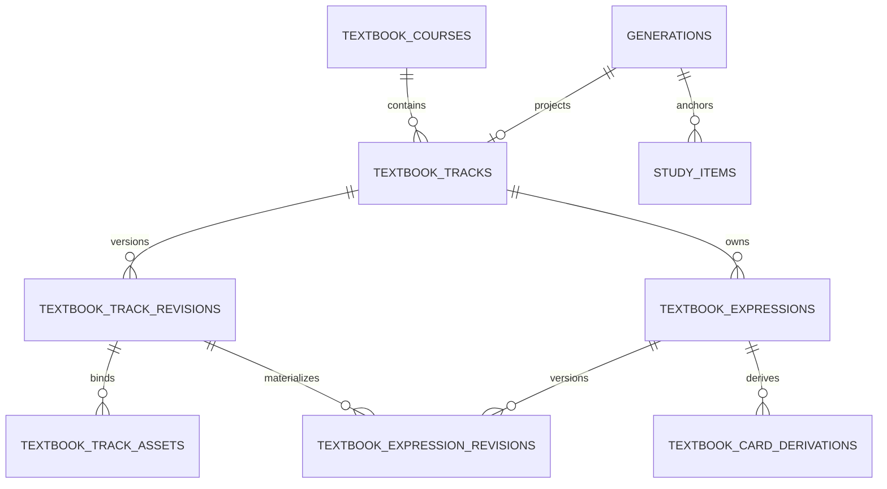

# 教材课程领域、数据、Manifest、API 与媒体 ADR（TC-D2）

> 状态：**Accepted（2026-07-14）；SaaS workflow amendment 于 2026-07-23 Accepted**
> 日期：2026-07-14
> 产品权威：[教材课程产品定义（TC-D0）](../Features/Textbook_Courses_Product_Definition.md)
> 学习领域基线：[学习辅助 2.0 领域与数据 ADR（LA-D2）](Learning_Assistance_2_0_Domain_and_Data_ADR.md)
> Manifest contract：[textbook-track-manifest.v1.schema.json](schemas/textbook-track-manifest.v1.schema.json)
> 当前边界：本文锁定 TC-D2 的领域与技术 contract；TC-P4 已完成运行时、桌面 UI、学习集成、备份恢复、完整自动化验收与真实 Track 01 本地 smoke；官方音频自动句级切分与知识图谱仍后置
>
> 注解层增补：本文 §8 与早期实施记录中的 `card_highlights` 是历史合同；自
> 2026-07-27 CA-P8 起，教材标红由
> [Card Annotation Layer ADR](Card_Annotation_Layer_ADR.md) 接管，运行时只使用
> `card_annotations`。

## 0. 决策状态与权威边界

### 0.1 2026-07-23 SaaS workflow amendment

教材长流程新增三类正式能力，且不改变原有不可变 revision、verify/publish 事务与 Study Item 所有权：

1. `textbook_expression_review_states` 是当前 Track revision 的可更新确认投影，状态固定为 `pending / needs_attention / confirmed`。它记录 expression revision、reviewer、reason 与时间，不复制正文；
2. 校对 PATCH 必须 copy-on-write：携带 expected revision，复制未变 expression，修改项创建新的 expression revision 与 Track revision。未变项可继承确认；修改项回到 `needs_attention`；
3. `textbook_operations` 与 append-only `textbook_operation_events` 负责 publish/materialize/TTS/KG sync 的可恢复后台执行。operation 只存 ID、hash、计数、公开错误码和步骤结果，不存教材正文。

operation kind 固定为 `release / tts / sync`，状态固定为 `queued / running / succeeded / partially_failed / failed / cancelled`。相同幂等键和 payload hash 返回同一 operation；相同键不同 hash 返回 409。发布成功是已提交事实，后续 TTS 或 sync 失败不得回滚发布；重试只执行失败步骤。

逐表达确认是发布前置条件。UI localStorage 不能成为确认真源，`generation_jobs` 不能冒充教材 operation。服务重启将 stale running 恢复为 queued，worker 在步骤边界安全恢复。

本文是教材课程的 TC-D2 ADR，负责把已确认的 TC-D0 产品承诺和 TC-D1 桌面原型转换为可实施的数据、Manifest、API、媒体和学习域 contract。

权威关系如下：

1. `CLAUDE.md` 与实际代码拥有当前运行事实的最高权威；
2. TC-D0 拥有用户任务、产品语义、内容诚信和非目标；
3. 本文拥有教材实体、修订、hash、Manifest、API、媒体和迁移 contract；
4. LA-D2 继续拥有计划、队列、会话、评分、Review Event、FSRS 和学习日语义；
5. 本文只对教材单元显式增补 LA-D2，不建立第二套学习系统；
6. Manifest JSON Schema 是机器可校验的输入 contract，本文是其语义解释；
7. 实际教材截图、官方音频、Manifest 和英日原文都不得进入 Git；
8. 本文被用户接受后才允许进入 TC-P0；实施发现必须改变产品承诺时，必须回到 TC-D0/D1 重新确认。

### 0.1 本 ADR 显式增补 LA-D2

本文接受后，LA-D2 的以下不变量增加教材例外或扩展：

- `generations.card_type` 增加 `textbook_track`；
- `study_items.unit_kind` 增加 `textbook_en` 与 `textbook_ja`；
- 教材 Study Item 的 `content_hash` 使用逐表达、逐方向 hash，不复制 Track generation hash；
- locator 增加结构化教材表达定位；
- plan scope 增加课程/Track 范围；
- item view-model 从教材结构表读取，不从 Markdown 反向解析；
- Review Event、Schedule State、Daily Queue、幂等评分和 FSRS 不变。

### 0.2 明确不改变的边界

- 应用内 OCR 不参与教材导入；
- 中文不生成 TTS；
- 官方整轨音频不进入 `audio_files`；
- 知识图谱 2.0 不是依赖；
- 不把教材投影暴露到 Cards Factory；
- 不做移动端页面、断点或专项验收；
- 不把真实媒体目录交给 `express.static`；
- 不允许 Skill 直接写 SQLite。

## 1. 决策摘要

TC-D2 采用以下方案：

1. **双层内容模型**：教材结构表是事实；每个 Track 同步维护一条 `textbook_track` generation 作为兼容投影；
2. **一个稳定 Track generation**：修订原地更新同一 generation，历史由教材 revision 表保存，不创建 replacement generation；
3. **七张教材领域表**：课程、Track、Track revision、资产、表达身份、表达 revision、派生卡关系；
4. **独立教材 FTS/read model**：教材原文不进入 `generations_fts`，Cards Factory 的 storage/query 层默认排除 `textbook_track`；
5. **逐方向内容 hash**：英文、日文分别计算；修改一个表达只影响真实变化的 Study Item；
6. **稳定表达身份**：`expr:NN` 一经首次发布不得复用；display ordinal 可变化但不构成身份；
7. **Track 级显式发布**：verified 只形成可浏览投影；published 才物化 Study Item 并提交计划 revision；
8. **Manifest 在 Git 外**：Git 只保存通用 JSON Schema；实际 Manifest 和原文留在本地媒体域与 SQLite；
9. **双媒体根**：宿主来源只读根与应用工作数据根分离；所有播放通过按 ID 的受控接口；
10. **Range/ETag contract**：官方音频支持 `GET/HEAD`、单 Range、`If-Range`、`304` 和 `416`；
11. **派生卡规范化去重**：不把永久关系压在 `source_context_json`；
12. **无破坏回滚**：产生 Review Event 后只允许停用/归档，不删除教材表或学习历史。

## 2. 已核实的当前事实

本文基于 2026-07-14 代码核实结果：

- `generations` 的 Markdown/HTML 路径和 `content_hash` 均为必填；
- `generations_fts` 当前无差别索引全部 generation；
- Cards Factory 的历史、最近、搜索和统计默认没有排除卡型；
- `audio_files` 是包含 TTS provider/model/voice 的合成音频登记表；
- `study_items` 当前只允许五种 `unit_kind`，且同一来源 generation 下 `unit_key` 唯一；
- 当前 materializer 把 generation hash 复制给全部 Study Item；
- 当前学习 item view-model 从 generation Markdown 解析内容；
- 当前 plan scope v1 不包含课程或 Track 范围；
- `card_highlights` 可以用 folder/base/source hash 标识内容版本；
- Express 只静态暴露 `public/`，`RECORDS_PATH` 通过受控文件路由访问；
- 生产入口和 API-only integration harness 共用 `lib/httpRuntime`；
- 当前 migration runner 在事务中执行 SQL，尚不支持在事务外关闭 foreign key 后重建受 CHECK 约束的父表。

这些事实意味着教材不能只增加一个 React 页面；必须同时解决 schema CHECK、FTS、存储作用域、materializer、plan scope、媒体安全和 migration runner。

## 3. 领域模型与不变量



### 3.1 事实与投影

- 教材表保存官方原文、派生内容、来源证据、修订和资产；
- `generations` 保存当前 Track 的 Markdown/HTML 投影身份；
- `study_items` 保存稳定学习单元身份与当前 per-unit hash；
- Review Event 是评分事实，不回写教材内容；
- Markdown、HTML、FTS 和 Daily Queue 都是可重建投影；
- 任何投影不得反向成为官方原文的权威来源。

### 3.2 七张领域表

#### `textbook_courses`

课程身份与本地来源说明：

```text
id INTEGER PRIMARY KEY
course_key TEXT NOT NULL UNIQUE
title TEXT NOT NULL
source_notice TEXT NOT NULL
status TEXT NOT NULL CHECK active|archived
created_at TEXT NOT NULL
updated_at TEXT NOT NULL
```

`course_key` 是 URL、Manifest 和稳定外部引用使用的 slug；课程重命名不改变它。

#### `textbook_tracks`

Track 的稳定逻辑身份和当前状态：

```text
id INTEGER PRIMARY KEY
course_id INTEGER NOT NULL FK textbook_courses
track_number INTEGER NOT NULL
display_order INTEGER NOT NULL
title TEXT NOT NULL
status TEXT NOT NULL CHECK draft|verified|published|archived
current_revision_id INTEGER NULL FK textbook_track_revisions
pending_revision_id INTEGER NULL FK textbook_track_revisions
generation_id INTEGER NULL UNIQUE FK generations ON DELETE SET NULL
published_at TEXT NULL
created_at TEXT NOT NULL
updated_at TEXT NOT NULL
UNIQUE(course_id, track_number)
```

`track_number` 是教材编号；`display_order` 允许用户调整课程中的显示顺序。

#### `textbook_track_revisions`

一次可审计的 Track 导入或修订：

```text
id INTEGER PRIMARY KEY
track_id INTEGER NOT NULL FK textbook_tracks
revision_number INTEGER NOT NULL
parent_revision_id INTEGER NULL FK textbook_track_revisions
status TEXT NOT NULL CHECK draft|verified|published|superseded|rejected
origin TEXT NOT NULL CHECK import|user-edit|structure-edit|ai-regeneration
manifest_schema_version TEXT NOT NULL
manifest_relative_path TEXT NULL
manifest_file_hash TEXT NULL
source_fingerprint TEXT NULL
content_hash TEXT NOT NULL
projection_hash TEXT NULL
expression_count INTEGER NOT NULL
skill_name TEXT NULL
skill_version TEXT NULL
change_summary TEXT NULL
created_at TEXT NOT NULL
verified_at TEXT NULL
published_at TEXT NULL
UNIQUE(track_id, revision_number)
```

`manifest_file_hash` 是规范化 Manifest 文件字节的 SHA-256；Manifest 自身不包含该字段，避免递归 hash。只有 `origin=import` 必须提供 Manifest、source fingerprint 和 Skill 信息；应用内校对产生的 copy-on-write revision 不伪造新的来源 Manifest。`source_fingerprint` 使用 `WHERE source_fingerprint IS NOT NULL` 的 partial unique index。

数据库 CHECK 必须保证：`origin=import` 时 Manifest、source fingerprint、Skill 字段全为非空；其它 origin 必须有 `parent_revision_id`，且不得声称新的来源 Manifest。

#### `textbook_track_assets`

Track revision 使用的截图与官方整轨音频：

```text
id INTEGER PRIMARY KEY
track_revision_id INTEGER NOT NULL FK textbook_track_revisions
asset_key TEXT NOT NULL
kind TEXT NOT NULL CHECK source_image|official_audio
ordinal INTEGER NOT NULL
relative_path TEXT NOT NULL
sha256 TEXT NOT NULL
byte_size INTEGER NOT NULL
mime_type TEXT NOT NULL
duration_ms INTEGER NULL
availability TEXT NOT NULL CHECK available|missing|hash-mismatch
observed_mtime_ms INTEGER NULL
verified_at TEXT NULL
UNIQUE(track_revision_id, asset_key)
UNIQUE(track_revision_id, kind, ordinal)
```

表内只存相对于只读来源根的路径，不存宿主机绝对路径。

#### `textbook_expressions`

跨 revision 保持稳定的表达身份：

```text
id INTEGER PRIMARY KEY
track_id INTEGER NOT NULL FK textbook_tracks
expression_key TEXT NOT NULL
lifecycle TEXT NOT NULL CHECK active|retired
created_revision_id INTEGER NOT NULL FK textbook_track_revisions
retired_revision_id INTEGER NULL FK textbook_track_revisions
created_at TEXT NOT NULL
updated_at TEXT NOT NULL
UNIQUE(track_id, expression_key)
```

`expression_key` 使用 `expr:NN`，不是数组下标，也不随排序改变。

#### `textbook_expression_revisions`

一个 Track revision 中某个表达的内容：

```text
id INTEGER PRIMARY KEY
track_revision_id INTEGER NOT NULL FK textbook_track_revisions
expression_id INTEGER NOT NULL FK textbook_expressions
display_ordinal INTEGER NOT NULL
official_en TEXT NOT NULL
official_ja TEXT NOT NULL
derived_zh_cue TEXT NOT NULL
ruby_json TEXT NOT NULL
analysis_json TEXT NOT NULL
confidence_json TEXT NOT NULL
source_spans_json TEXT NOT NULL
field_provenance_json TEXT NOT NULL
editor_note TEXT NULL
en_unit_hash TEXT NOT NULL
ja_unit_hash TEXT NOT NULL
created_at TEXT NOT NULL
UNIQUE(track_revision_id, expression_id)
UNIQUE(track_revision_id, display_ordinal)
```

词组、语法、语气和英日对照在 v1 使用有界、版本化的 `analysis_json`，因为它们没有独立发布、删除或复习生命周期；未来出现独立生命周期时才允许正规化成新表。`field_provenance_json` 逐字段记录 `official-source`、`skill-extracted`、`ai-derived` 或 `user-edited` 及上一内容 hash，使 UI 能区分教材词汇块、官方来源转写、AI 补充和人工修订。

#### `textbook_card_derivations`

选区到普通生成卡的永久关系：

```text
id INTEGER PRIMARY KEY
expression_id INTEGER NOT NULL FK textbook_expressions
source_expression_revision_id INTEGER NOT NULL FK textbook_expression_revisions
selection_language TEXT NOT NULL CHECK en|ja
selection_text TEXT NOT NULL
selection_hash TEXT NOT NULL
target_card_type TEXT NOT NULL CHECK trilingual|grammar_ja
target_generation_id INTEGER NULL FK generations ON DELETE SET NULL
generation_job_id INTEGER NULL FK generation_jobs ON DELETE SET NULL
status TEXT NOT NULL CHECK pending|running|completed|failed|superseded
derivation_revision INTEGER NOT NULL DEFAULT 1
request_context_json TEXT NOT NULL
created_at TEXT NOT NULL
updated_at TEXT NOT NULL
UNIQUE(expression_id, selection_hash, target_card_type)
```

同一表达、同一规范化选区、同一卡型的重试更新同一关系。用户明确要求基于新内容重新生成时，增加 `derivation_revision`，不得创建无关系的重复行。

### 3.3 表数量取舍

v1 不增加独立 note/grammar/phrase 表，也不增加第二套 TTS 表：

- 结构化分析留在 expression revision 的有界 JSON；
- EN/JA 单句 TTS 继续登记到 `audio_files`；
- 官方音频只登记到 `textbook_track_assets`；
- 搜索使用一张虚拟 FTS 表，不算业务事实表。

### 3.4 跨表一致性

SQLite 的单列 FK 不能表达以下同属关系，TC-P1 必须用 trigger 与 service 双重校验：

- Track 的 current/pending revision 必须属于该 Track；
- Track 的 generation 必须是 `card_type=textbook_track`，且不得被另一个 Track 复用；
- expression revision 的 expression 与 Track revision 必须属于同一 Track；
- derivation 的 source expression revision 必须属于该 expression；
- published Track 必须有 current published revision、generation 和 admission；
- archived Track 不得继续成为新计划 revision 的可选范围。

任何不一致都应在事务提交前失败，不能依赖页面隐藏坏数据。

## 4. 稳定身份与修订状态机

### 4.1 表达身份

1. Draft 首次校对期间允许拆分、合并和重排；
2. verified 前，系统可以规范化 `expr:NN`，但必须在 dry-run 中显示 identity diff；
3. 首次 published 后，已发布 key 永不复用；
4. 单纯重排只改变 `display_ordinal`；
5. 拆分时，语义连续的主表达保留旧 key，新表达获得该 Track 下一个单调递增 key；
6. 合并时，保留主表达 key，其余身份标为 retired；
7. 有 Review Event 的 Study Item 不删除；对应表达退休时把 Study Item 归档，保留事件与 Schedule State；
8. unit key 固定为 `${expression_key}:en` 或 `${expression_key}:ja`。

无法自动确定保留哪个 key 时，verify 返回 `TEXTBOOK_UNIT_REMAP_REQUIRED`，必须由用户确认映射。

### 4.2 Track revision 状态

```text
draft -> verified -> published -> superseded
  |         |
  +-------> rejected
```

- 未发布 Track：`current_revision_id` 可以指向 verified revision；
- 已发布 Track 接收新导入时：旧 current 继续提供浏览和学习，新 revision 放入 `pending_revision_id`；
- pending verified 后，在一个事务中成为 current；若 Track 已发布，新 current 同时转为 published，旧 current 标记 superseded；
- 若 Track 已 published，接受修订不会清空发布状态；
- generation 投影、当前 expression read model 和受影响 Study Item 在同一事务更新；
- TTS 可异步补齐，不属于官方文本切换事务；
- rejected revision 永远不能成为 current。

所有 revision 内容行在插入后不可变，只有 Track revision 的状态和确认时间可以变化。数据库 trigger 禁止更新/删除 expression revision 与 asset 行，并禁止修改 Track revision 的内容字段。校对页的字段修改、中文/ruby 重生成、拆分和合并都采用 copy-on-write：从 expected revision 复制未变内容、生成新的 draft revision、记录 parent/origin/change summary，并把 Track 的 pending 指针切换到新 revision。这样 Skill 初始抽取、每次人工修订和最终发布内容都能追溯；PATCH API 返回新的 revision ID，而不是原地覆盖旧行。

### 4.3 Track generation 策略

一个 Track 在生命周期内只维护一个稳定 generation：

```text
card_type      = textbook_track
source_mode    = textbook_import
llm_provider   = codex-skill
llm_model      = import-textbook-track@<skillVersion>
folder_name    = textbook:<courseKey>
base_filename  = track-<NN>
request_id     = textbook:<courseKey>:track:<NN>
```

路径字段存储相对于 `TEXTBOOK_WORK_PATH` 的不可变 revision 投影路径，例如：

```text
projections/<courseKey>/track-<NN>/r<revision>/track-<NN>.md
projections/<courseKey>/track-<NN>/r<revision>/track-<NN>.html
projections/<courseKey>/track-<NN>/r<revision>/track-<NN>.meta.json
```

这些路径只能由教材 storage adapter 解析，不能交给 Cards Factory 的 RECORDS adapter 或通用删除 use case。generation 在 revision 接受事务中切换到新的不可变路径；旧 revision 文件保留用于审计和安全回退，不依赖跨 SQLite/文件系统的伪原子“覆盖 current 文件”。教材导入不创建 `observability_metrics`，也不冒充 DeepSeek 生成任务。

## 5. 三层 hash contract

### 5.1 Manifest 文件 hash

- 对严格 schema 校验后的 canonical JSON bytes 计算 SHA-256；
- key 排序、UTF-8、无 BOM、LF、无无意义空白；
- hash 存入数据库和导入请求，不写回 Manifest 本体；
- 同一 hash 的重复导入必须幂等返回现有 revision。

### 5.2 Track 内容与投影 hash

`source_fingerprint` 包含来源图片/官方音频 asset hash、课程 key、Track 编号和抽取器版本，用于识别相同输入。

`content_hash` 包含 Manifest 的语义内容和 asset hash，但排除：

- 创建时间；
- Manifest 文件位置；
- 本机绝对路径；
- 运行时 availability；
- 数据库 ID。

`projection_hash` 对 canonical Markdown 投影计算，包含当前页面会显示的官方原文、派生中文、ruby、分析和编辑备注；它可以比 Study Item hash 更频繁变化。

### 5.3 Study Item 逐方向 hash

使用稳定 JSON 序列化和 SHA-256：

```json
{
  "version": 1,
  "expressionKey": "expr:01",
  "direction": "en",
  "prompt": "derived zh cue",
  "target": "official English"
}
```

```json
{
  "version": 1,
  "expressionKey": "expr:01",
  "direction": "ja",
  "prompt": "derived zh cue",
  "target": "official Japanese",
  "ruby": [{"text": "...", "reading": "..."}]
}
```

影响矩阵：

| 修改 | EN hash | JA hash |
|---|---:|---:|
| English 官方原文 | 变 | 不变 |
| Japanese 官方原文 | 不变 | 变 |
| Japanese ruby | 不变 | 变 |
| 中文派生提示 | 变 | 变 |
| 词组/语法/语气/对照分析 | 不变 | 不变 |
| 编辑备注 | 不变 | 不变 |
| 置信度与来源坐标 | 不变 | 不变 |
| 官方/TTS 音频路径或可用性 | 不变 | 不变 |

这项规则保证修改第 07 个表达的 ruby 时，仅 `expr:07:ja` 增加 `content_revision`。分析文本仍显示在答案面，但不触发 FSRS 内容更新提示。

## 6. 对学习辅助 2.0 的增补

### 6.1 Study Item 扩展

`study_items.unit_kind` 增加：

```text
textbook_en
textbook_ja
```

locator v2：

```json
{
  "schemaVersion": 2,
  "extractorVersion": "textbook-unit-v1",
  "section": "textbook-expression",
  "trackId": 42,
  "expressionId": 4201,
  "expressionKey": "expr:01",
  "direction": "en"
}
```

materializer 必须从 `textbook_expression_revisions` 获取 per-unit hash。普通三语、语法、场景和 whole-card 行为保持原样。

教材发布使用专用 materializer，并复用底层 Study Item upsert 规则；不得把教材 generation 送入 DP7 eligibility report。现有 `materializeLearningP0` 的“报告卡片数等于全库 generation 数”假设必须改为只比较 Cards Factory 支持的 generation 集合，否则教材投影出现后，数据整备重跑会被无关卡型破坏。

### 6.2 item view-model

教材 item view-model 直接查询结构表，不从 generation Markdown 反向解析：

- `textbook_en`：中文提示 -> 官方 English；答案附 Japanese 对照、分析和 EN TTS；
- `textbook_ja`：中文提示 -> 官方 Japanese；答案附 kanji-only ruby、English 对照、分析和 JA TTS；
- reveal 前不返回目标语言文本或目标音频 URL；
- API 只返回按 ID 的播放 URL，不返回数据库或宿主路径；
- `contentUpdated` 由最近一次 Review Event 的 `content_hash` 与当前 item hash 比较得出；
- 已有 Schedule State、Review Event 和 FSRS 参数不因内容修订而重建。

### 6.3 plan scope v2

scope v2 在现有字段上增加：

```json
{
  "version": 2,
  "cardTypes": ["textbook_track"],
  "languages": ["en", "ja"],
  "textbookTrackIds": [42]
}
```

规则：

- 旧 scope v1 读取为 `textbookTrackIds: []`；
- 新写入和 preview 输出 v2；
- 默认计划不自动包含教材；
- 选择教材卡型时必须至少选择一个 Track；
- 匹配同时要求 card type、Track ID 和语言方向；
- 现有 `dateRange` 和 `tags` 只过滤 Cards Factory 来源；教材使用显式 Track 身份，不因导入日期或缺少 `card_tags` 被意外排除；
- scope options 返回 course/Track 的稳定 ID、标题、状态和候选单元数；
- Track 发布使用 expected plan revision 做影响确认，不修改已经物化的当天队列；
- 学习历史允许按课程、Track 和方向筛选，但继续读取同一 Review Event 表。

### 6.4 发布语义

verified 只代表内容可浏览，不产生 Study Item。published 事务必须：

1. 校验 current revision、manifest hash、asset 状态和用户确认；
2. 创建或更新稳定 generation 投影；
3. 创建或更新 `learning_source_admissions`：`admission_source=manual`、`decision_version=textbook-publish-v1`、`state_version=textbook-admission-v1`，admission `content_hash` 使用 Track generation 投影 hash；
4. 物化全部 active expression 的 EN/JA Study Item；
5. 归档 retired expression 对应 item；
6. 创建新的 plan revision 或确认当前 plan 不包含该 Track；
7. 返回新增、更新、归档、未变和最短引入日预览；
8. 不重写当日已有 Daily Queue。

## 7. Cards Factory 隔离与教材搜索

### 7.1 独立 FTS 决策

采用教材独立 FTS/read model：

- `generations_fts` 的 insert trigger 只处理 `NEW.card_type <> 'textbook_track'`；delete trigger 只处理 `OLD.card_type <> 'textbook_track'`；
- update 必须覆盖四种转换：普通->普通执行 delete+insert，普通->教材只 delete，教材->普通只 insert，教材->教材不操作；
- `generations_fts` 是 external-content FTS，禁止使用会重新索引全部 `generations` 的通用 `rebuild` 命令；migration 与维护工具必须显式清空并执行带 `WHERE card_type <> 'textbook_track'` 的 filtered rebuild；
- migration 执行 filtered rebuild，移除任何教材投影；
- 新建 `textbook_expressions_fts`，只由教材服务维护当前 revision 的 EN/JA/ZH/标题搜索；
- 教材搜索只从 `/api/textbooks/search` 暴露；
- FTS 是投影，损坏时可从当前 revision 重建。

### 7.2 Cards Factory storage 层强制排除

排除不能只依赖路由参数。以下 storage/query 方法都必须默认增加 `card_type <> 'textbook_track'`：

- history list 和 count；
- recent；
- full-text search；
- generation statistics 和 card type aggregation；
- 默认 generation lookup 用于 Cards Factory 详情/删除。

`/api/history/:id` 与 `/api/records/:id` 遇到教材 generation 返回 404 或专用拒绝错误。显式教材 service 可以按 ID 读取；Cards Factory 不能靠猜 ID 打开或删除教材。

投影位于 `TEXTBOOK_WORK_PATH`，不在 `RECORDS_PATH`，因此文件夹/卡片文件浏览天然隔离。集成测试必须证明全部无过滤 Cards Factory endpoint 都不返回教材。

## 8. 标红与派生卡

### 8.1 标红身份

继续复用 `card_highlights`：

```text
folder_name = textbook:<courseKey>
base_filename = track-<NN>
source_hash = current projection_hash
generation_id = stable textbook generation id
```

教材使用专用 highlights API 直接调用 storage port。通用 `/api/highlights/by-file` 必须拒绝 `textbook:` 前缀，防止逻辑路径被当作 RECORDS 路径。

投影变化后创建新的 source hash 版本；旧标红保留审计但不自动迁移到已改变文本。标红不进入 Study Item hash。

### 8.2 派生卡流程

1. 客户端提交 expression ID、source revision、语言、选区和目标卡型；
2. 服务端重新从当前官方文本校验选区，不信任客户端完整句；
3. 按 Unicode NFC、保留大小写和标点语义的规则计算 `selection_hash`；
4. 已有 completed 关系则返回现有卡；
5. pending/running 返回当前任务；
6. failed 允许在同一关系上重试；
7. 生成任务使用 `source_context_json` 传递临时上下文；
8. 完成后在同一事务写 `target_generation_id` 和 completed 状态。

## 9. Manifest contract

### 9.1 存储边界

- Git 只保存 [`textbook-track-manifest.v1.schema.json`](schemas/textbook-track-manifest.v1.schema.json)；
- 实际 Manifest 保存到只读教材来源根下的课程目录；
- 导入后数据库保存 Manifest 相对路径和 hash；
- 教材原文只进入本地 SQLite、Manifest 和应用工作投影；
- 单元测试使用合成 fixture，禁止复制真实 Track 01 文本。

### 9.2 v1 结构

Manifest 必须包含：

- `schemaVersion = textbook-track-manifest/v1`；
- course key/title/source notice；
- Track number/order/title/expected expression count；
- draft revision 及可选 parent hash；
- source image 与 official audio asset；
- stable expression key、ordinal、官方 EN/JA、派生 ZH、ruby、analysis、置信度、来源坐标和 unit hashes；
- Skill name/version/UTC 创建时间；
- source fingerprint 与 semantic content hash。

### 9.3 Schema 之外的确定性校验

JSON Schema 不能独立表达的规则由 import validator 强制：

- asset key、expression key 和 ordinal 唯一且顺序连续；
- `expectedExpressionCount === expressions.length`；
- official source span 引用存在的 source image；
- 每个 Manifest 至少有一张 source image，v1 最多绑定一个 official audio；
- source span 的 `x + width`、`y + height` 不得超过 1；
- `rubySegments.text` 拼接后与 official Japanese 完全一致；
- `reading` 只允许出现在包含汉字的 segment；
- EN/JA unit hash 必须由服务端重算并一致；
- source fingerprint/content hash 必须由服务端重算并一致；
- 路径不得含反斜线，并且必须通过真实文件根校验；
- asset size、MIME 和 SHA-256 必须与文件一致；
- asset 扩展名必须与探测到的 MIME 一致，不能只信 Manifest 声明；
- 同 Track 同 source fingerprint 的重复 dry-run 不产生新 revision。

### 9.4 Skill contract

`import-textbook-track` Skill：

- 读取用户明确提供的本地截图和音频路径；
- 生成 Git 外 draft Manifest；
- 不调用应用内 `/api/ocr`；
- 不直接访问 SQLite；
- 不发布 Track；
- 将低置信度、错配、非直译和人工补充显式标记；
- 先调用 dry-run API，用户确认后才调用正式 import API。

## 10. 媒体根与安全播放

### 10.1 双根目录

```text
TEXTBOOK_SOURCE_ROOT=/media/textbooks   # 宿主来源，容器只读 bind mount
TEXTBOOK_WORK_PATH=/data/textbooks      # 投影与 TTS，Docker named volume，可写
```

- 来源根保存用户拥有的截图、官方音频和实际 Manifest；
- 工作根保存生成的 Markdown/HTML/meta 投影与单句 TTS；
- Compose 通过 `TEXTBOOK_SOURCE_PATH` 提供宿主目录；
- 功能由 `TEXTBOOK_FEATURE_ENABLED` 控制；TC-P2 起默认开启，可用 `false/no/off/0` 显式关闭；
- DB 永远不保存宿主绝对路径。

### 10.2 路径解析

官方资产路径 resolver 必须：

1. 拒绝绝对路径、NUL、空路径和 `..` segment；
2. 使用 allowlist 扩展名和 MIME；
3. 对根和目标执行 `realpath`，验证目标仍在根内；
4. 对路径每一级执行 `lstat`；v1 拒绝任何 symlink；
5. 只接受 regular file；
6. 不在错误或日志中返回真实路径；
7. 由 asset ID 查路径，不接受播放 API 的用户路径参数。

### 10.3 官方音频 Range API

```text
GET  /api/textbooks/assets/:assetId/content
HEAD /api/textbooks/assets/:assetId/content
```

Contract：

- 无 Range：`200`；
- 单一合法 byte Range：`206`；
- 非法、越界或多 Range：`416`；
- 匹配 `If-None-Match`：`304`；
- `If-Range` 不匹配：忽略 Range，返回完整 `200`；
- `Accept-Ranges: bytes`；
- ETag 为 `"sha256-<asset hash>"`；
- 设置准确的 `Content-Type`、`Content-Length` 和 `Content-Range`；
- `Cache-Control: private, max-age=0, must-revalidate`；
- 使用流式 `createReadStream`，不把整轨读入内存。

导入/重新绑定时做完整 hash。播放前检查 size/mtime；发生变化时惰性重算 hash，hash 不同则标记 `hash-mismatch` 并阻止官方播放。该故障不阻止文字和 TTS。

### 10.4 单句 TTS

- EN/JA TTS 继续使用 `audio_files`；
- stable suffix 使用不含冒号的 `_en_expr_01` / `_ja_expr_01` 规范化形式；
- provider 继续为 EN Kokoro、JA VOICEVOX；
- 不产生中文 TTS；
- 教材专用按 audio file ID 的播放 route 从工作根读取；
- 只返回播放 URL、状态和语言，不向客户端返回 `file_path`；
- 官方整轨和单句 TTS 共用前端 Audio Coordinator，启动一个来源必须停止另一个来源。

## 11. API contract

路由统一挂载到 `lib/httpRuntime.createApp()`，进入 API-only integration harness。所有成功响应使用 `{ success: true, ... }`，错误使用现有错误 envelope 和稳定 error code。

### 11.1 浏览与搜索

```text
GET /api/textbooks/courses
GET /api/textbooks/courses/:courseKey
GET /api/textbooks/courses/:courseKey/tracks/:trackNumber
GET /api/textbooks/search?q=<query>&courseKey=<optional>
```

### 11.2 导入与校对

```text
POST  /api/textbooks/imports/dry-run
POST  /api/textbooks/imports
GET   /api/textbooks/revisions/:revisionId
PATCH /api/textbooks/revisions/:revisionId
POST  /api/textbooks/revisions/:revisionId/structure
POST  /api/textbooks/revisions/:revisionId/verify
```

dry-run/import body 只接受 source-root-relative Manifest path 和 expected manifest hash。PATCH/structure 必须携带 expected revision，并以 copy-on-write 返回新的 draft revision ID；verify 只改变目标 revision 的状态和 Track 指针。并发冲突统一返回 409。

### 11.3 发布与学习

```text
POST /api/textbooks/tracks/:trackId/publish
```

body 至少包含：

```json
{
  "expectedTrackRevision": 3,
  "expectedPlanRevision": 8,
  "confirmUnitCount": 40,
  "confirmMissingTts": true
}
```

返回 generation/admission、insert/update/archive/unchanged 单元数、计划 revision 和影响摘要。

### 11.4 标红、派生卡与媒体

```text
GET    /api/textbooks/tracks/:trackId/highlights
PUT    /api/textbooks/tracks/:trackId/highlights
DELETE /api/textbooks/tracks/:trackId/highlights/:highlightId
POST   /api/textbooks/expressions/:expressionId/derivations/preview
POST   /api/textbooks/expressions/:expressionId/derivations
GET    /api/textbooks/assets/:assetId/content
HEAD   /api/textbooks/assets/:assetId/content
GET    /api/textbooks/audio/:audioFileId/content
HEAD   /api/textbooks/audio/:audioFileId/content
```

### 11.5 错误码

| Code | HTTP | 含义 |
|---|---:|---|
| `TEXTBOOK_MANIFEST_INVALID` | 400 | Schema 或确定性校验失败 |
| `TEXTBOOK_IMPORT_CONFLICT` | 409 | 同身份输入与已存内容冲突 |
| `TEXTBOOK_REVISION_CONFLICT` | 409 | 乐观 revision 不匹配 |
| `TEXTBOOK_TRACK_NOT_FOUND` | 404 | 课程或 Track 不存在 |
| `TEXTBOOK_TRACK_NOT_VERIFIED` | 409 | 未校对内容尝试发布 |
| `TEXTBOOK_MEDIA_NOT_FOUND` | 404 | 资产不存在或不可用 |
| `TEXTBOOK_MEDIA_HASH_MISMATCH` | 409 | 文件与登记 hash 不一致 |
| `TEXTBOOK_MEDIA_RANGE_INVALID` | 416 | Range 非法、越界或多段 |
| `TEXTBOOK_MEDIA_PATH_REJECTED` | 403 | 路径越界或 symlink |
| `TEXTBOOK_DERIVATION_CONFLICT` | 409 | 派生身份冲突 |
| `TEXTBOOK_UNIT_REMAP_REQUIRED` | 409 | 已发布表达拆并需人工映射 |

## 12. 事务、并发与幂等

### 12.1 导入事务

- dry-run 只读 DB 和文件，不产生业务行；
- import 先完成 schema/hash/path 校验，再开启事务；
- course/track/import revision/assets/expressions/expression revisions 在一个事务写入；
- 同 manifest hash 或 source fingerprint 返回原 revision；
- 同 Track revision number 但内容不同返回冲突；
- 校对与结构编辑永不原地修改内容行，而是在事务中 copy-on-write 新 revision；
- generation 投影只在 verify/accept 阶段创建或更新；
- 文件投影先写入 revision 专属临时目录，fsync 后原子 rename 成不可变 revision 目录；
- DB 事务只把 generation/current revision 指针切换到已经验证 hash 的不可变文件；事务失败时旧指针保持有效，新目录作为可识别 orphan 由清理任务回收；
- DB 成功但后续 TTS 失败只标记音频缺失，不回滚官方文本。

### 12.2 发布事务

- expected track/plan revision 都通过后才写；
- generation、admission、Study Item、Track 状态和 plan revision 原子提交；
- Review Event 和 Schedule State 不在发布事务中改写；
- 重试相同发布请求必须返回同一结果；
- 发布中途失败不留下部分 Study Item。

### 12.3 隐私与日志

- 日志只记录 course key、track number、revision ID、计数、hash 前缀和 error code；
- 不记录教材全文、中文提示、来源坐标、selection text 或绝对路径；
- observability payload 不保存官方原文；
- API 错误不回显本地文件名之外的路径信息。

## 13. Schema 与 migration 策略

### 13.1 双真源同步

TC-P1 必须在同一个提交中更新：

1. `database/schema.sql`，用于全新安装的 desired schema；
2. `database/migrations/002_textbook_courses.sql`，用于现有 volume；
3. migration checksum；
4. migration runner；
5. fresh DB 与 migrated DB 的规范化 schema 等价测试。

不得只改 migration 或只改 `schema.sql`。

### 13.2 `study_items` CHECK 重建

SQLite 不能直接扩展 CHECK。现有 Study Item 又被 Review Event、Schedule State、Queue Entry 等子表引用，因此 migration runner 增加显式 metadata：

```sql
-- migration:foreign-keys-off
```

runner contract：

1. 只允许在启动阶段、HTTP listen 前执行；
2. 在 transaction 外执行 `PRAGMA foreign_keys = OFF`；
3. 开启事务，创建新 `study_items`、复制全部行、删除旧表并 rename；
4. 保留 ID、FK 值、索引、trigger、hash 和时间戳；
5. 在提交前执行 `PRAGMA foreign_key_check`，任何结果都 rollback；
6. migration checksum 只在成功事务中登记；
7. `finally` 中重新开启 foreign keys；
8. 重新开启后再次执行 `foreign_key_check`；
9. 未识别 marker、嵌套关闭或 HTTP 已监听时拒绝执行。

POC 已确认：`defer_foreign_keys=ON` 不能安全完成本次父表替换；只有 transaction 外关闭 foreign keys、事务内替换并做 foreign key check 的路径可行。因此此 runner 扩展是 TC-P1 的 P1 门禁。

### 13.3 migration 002 内容

- 创建七张教材事实表及索引；
- 创建教材 FTS；
- 重建 `study_items`，加入两个 unit kind；
- 重建 `generations_fts` trigger，排除教材；
- 调整 DP7/materializer 的全库计数假设，只校验其支持的 Cards Factory generation 集合；
- 保持全部现有 generation、admission、Study Item、Review Event、Schedule State、Queue 和 Session 行不变；
- 不导入真实教材数据；
- feature flag 保持关闭。

### 13.4 迁移前后证明

必须记录：

- SQLite backup 与 Docker volume backup；
- `integrity_check` 和 `foreign_key_check`；
- 九张学习表逐表行数；
- `study_items` identity digest；
- Review Event event-key digest；
- migration checksum；
- fresh/migrated schema diff；
- FTS 中教材行数为 0。

## 14. 回滚与停用

### 14.1 尚无用户教材数据

- 关闭 feature flag；
- 卸载 source bind mount；
- 新表为空时可以通过单独 migration 删除；
- 扩展后的 `study_items` CHECK 可以保留，不需要破坏性回退；
- Cards Factory 隔离条件保留也不影响普通卡。

### 14.2 已导入但未发布

- 关闭 route/UI；
- 保留教材表、Manifest 和 generation 投影；
- 不删除来源文件；
- 可以归档 Track；
- 不创建 Study Item，因此不影响学习历史。

### 14.3 已发布或已有 Review Event

- 禁止 DROP 教材表、generation 或 Study Item；
- 关闭 feature flag 并把教材 Study Item suspend/archive；
- 保留 Review Event、Schedule State、计划 revision 和修订历史；
- 卸载媒体根只降级官方音频，不得导致学习事实丢失；
- 恢复功能时从原身份继续，不重新物化重复 item。

## 15. 测试与验收门禁

### 15.1 Manifest 与领域单测

- JSON Schema valid/invalid fixture；
- additional properties、路径、hash、MIME、计数和 source span；
- kanji-only ruby 与正文拼接；
- stable expression key、拆分/合并/retire；
- canonical JSON、source fingerprint、content/projection/unit hash；
- 单 expression 单方向修改矩阵；
- 派生 selection hash 与唯一性。

### 15.2 Migration 与数据库集成

- fresh DB 与 pre-TC volume migration；
- runner marker、foreign key OFF/ON 和失败恢复；
- migration checksum 漂移拒绝；
- 迁移前后全部学习事实 count/digest 一致；
- 只修改第 07 个 ruby 时仅 `expr:07:ja` 更新；
- 发布事务全成或全败；
- 重复 import/publish 幂等；
- FTS 重建和教材隔离。

### 15.3 API 与媒体集成

- API-only harness 挂载全部教材 route；
- dry-run 无写入；
- revision 乐观锁；
- absolute/`..`/NUL/symlink/根外 realpath 拒绝；
- GET/HEAD、200/206/304/416、If-Range；
- hash mismatch 降级；
- 不返回绝对路径；
- Cards Factory history/recent/search/statistics/detail/delete 全部隔离；
- 派生卡成功、失败重试和重复命中。

### 15.4 学习域集成

- scope v1 兼容读取和 v2 写入；
- Track 未选中时不进入候选集；
- EN/JA 方向匹配；
- 组合计划中的 Cards Factory date/tag filters 不误伤显式选择的教材 Track；
- 发布不改当日已有队列；
- reveal 前不返回目标文本/音频；
- 四档评分、幂等和 FSRS 与普通单元一致；
- content update 只影响真实方向；
- 退休表达保留历史并归档 item；
- 历史按课程/Track/方向聚合。

### 15.5 桌面 E2E 与真实本地 smoke

- 仅 1280x720 和 1440x900；
- 教材空态、列表、校对、学习页和发布预览；
- 官方音频与 TTS 互斥；
- 标红、派生卡、媒体错误和内容更新；
- 无水平溢出、console error 或未处理 rejection；
- 真实 Track 01 只在本地 smoke 中使用，不进入截图基线、fixture、日志或 Git；
- Docker Compose 使用只读来源挂载和工作 named volume；
- 关闭 source mount 时应用仍可启动，教材显示受控降级。

## 16. 实施顺序

| 阶段 | 交付 | 硬门禁 |
|---|---|---|
| TC-P0 | `import-textbook-track` Skill、Manifest validator、Track 01 dry-run | 数量/配对/ruby/hash/幂等；内容保持 draft |
| TC-P1 | migration runner、七表、storage、import use case、媒体服务 | 双真源、FK、Range、路径与事务 |
| TC-P2 | 教材首页、校对页、Track 学习页 | 真实本地浏览、逐条人工确认、互斥播放、标红和降级 |
| TC-P3 | 派生卡、发布、plan scope v2、复习与历史 | 去重、40 单元、per-unit hash、同一 SRS |
| TC-P4 | 完整验收、备份、运行手册和文档封板 | lint/unit/integration/build/desktop E2E/Docker/smoke |

TC-P0 不改 schema。TC-P1 先以 feature flag 关闭状态落基础能力。TC-P2 验收通过后默认显示教材导航，但仍只允许 draft import 与 verified 人工确认。TC-P3 才允许把 Track 发布到学习辅助。

## 17. TC-D2 门禁

- [x] 领域事实、generation 投影和 Study Item 职责分离
- [x] 七张表及稳定身份、revision 和派生卡去重已定义
- [x] 一个 Track 一个稳定 generation 的修订策略已定义
- [x] Track、Manifest、projection 和 per-unit hash 已分层
- [x] 单表达单方向更新矩阵已锁定
- [x] `textbook_en/ja`、locator、view-model 和 plan scope v2 已定义
- [x] Cards Factory storage/read model 和 FTS 隔离已定义
- [x] Manifest JSON Schema 和额外确定性校验已定义
- [x] 官方媒体与 TTS 的根目录、路径和 Range contract 已定义
- [x] API、错误码、事务、幂等和日志边界已定义
- [x] migration runner 的 FK-off 安全协议已定义并有 POC 依据
- [x] fresh/migrated 双真源、回滚和测试门禁已闭环
- [x] 用户确认本 ADR，允许进入 TC-P0（通过明确要求执行 TC-P0，2026-07-14）

TC-D2 门禁已通过。TC-P0 不创建教材运行时表、不修改 `study_items`，也不调用应用 OCR 或 SQLite。

## 18. TC-P0 技术 dry-run 记录（2026-07-14）

TC-P0 已完成以下 Git 内交付：

- `skills/import-textbook-track/`：可自动发现的 Codex Skill、UI metadata、字段 reference；
- `hash-assets.mjs`：只读资产路径、MIME、字节数和 SHA-256 计算；
- `validate-manifest.mjs`：strict JSON Schema、路径、资产、表达身份、source span、kanji-only ruby 和三层 hash 校验；
- `manifest-lib.mjs`：稳定 JSON、source/content/unit/manifest hash 与不含正文的摘要；
- 合成单测覆盖幂等、逐方向 hash、okurigana 错误、symlink、缺失文件和绝对路径不泄漏；
- Schema 明确区分 `official-source` 教材词汇块、`ai-derived` 分析和 `user-edited` 内容。

真实 Track 01 只在 Git 外的本地媒体根执行，未写 SQLite、未调用 `/api/ocr`、未进入测试 fixture 或日志。dry-run 只记录以下非正文结果：

| 指标 | 结果 |
|---|---:|
| source image | 2 |
| official audio | 1 |
| expression pair | 20 |
| official phrase | 7 |
| grammar note | 20 |
| annotated ruby segment | 37 |
| candidate Study Item | 40（20 EN + 20 JA） |
| low-confidence item | 1（`expr:20` pairing） |

Hash：

```text
manifestFileHash  4b3782c87ee99435a2969ecc8dae0075c586f164b281219233f15d11d0a7cf0b
sourceFingerprint 1f9574a05ea5232212ba19cd7fc8d3d04cf86c45ca67f08022bec02a98e68b6f
contentHash       8908a25d6442388c1b20f379dd0fb6ff1e4791614258786907b27c5f57a078eb
```

同一 Manifest 的第二次只读 dry-run 保持 Manifest 与 summary 字节 SHA-256 不变。真实 hash 隔离验证结果：ruby 修改只改变一个 JA unit；中文提示修改改变同表达 EN/JA 两项；分析备注修改不改变 unit hash。

TC-P0 的技术门禁通过。根据 2026-07-14 的产品决定，TC-P1 可将该 Manifest 作为 `draft` 导入，20 组官方转写、中文提示、ruby 和 `expr:20` 非逐字对应说明统一在 TC-P2 校对页面逐条人工确认。官方整轨只用于页面播放和人工对照，不参与自动切分、ASR 或内容覆盖；未经 `verified` 不得创建 generation 投影、发布学习单元或进入 SRS。

## 19. TC-P1 后端基础实施记录（2026-07-14）

TC-P1 已完成 feature-flagged backend foundation，默认 `TEXTBOOK_FEATURE_ENABLED=false`，不显示正式教材 UI，也不发布学习单元。

已落地内容：

- `database/schema.sql` 与 `database/migrations/002_textbook_courses.sql` 同步定义七张教材表、教材表达 FTS、`textbook_en/ja` unit kind 和过滤版 `generations_fts`；
- `services/storage/db/migrationRunner.js` 支持受控 `-- migration:foreign-keys-off`，用于重建带 CHECK 的父表，并在事务内外执行 `PRAGMA foreign_key_check`；
- `services/textbooks/manifestContract.mjs` 成为 Skill 与运行时共享的 hash、路径和确定性校验 contract；
- `services/textbooks/manifestValidator.js` 只接受 source-root-relative Manifest path 与 expected hash，不返回绝对路径或教材正文到日志；
- `services/storage/db/textbooks.js` 支持 draft 导入、幂等去重、课程/Track 查询、教材表达搜索与资产状态更新；
- `routes/textbooks.js` 提供 `/api/textbooks` dry-run/import/course/track/search 与官方音频 content API；
- 官方音频播放通过资产 ID 访问，支持 `GET`/`HEAD`、单 Range、`ETag`、`If-None-Match`、`If-Range`、`416 Content-Range` 和 hash drift 409；
- `docker-compose.yml` 增加只读 `TEXTBOOK_SOURCE_PATH -> /media/textbooks` 和 `textbook_work` named volume；
- Cards Factory 的 history/search/recent/statistics/detail 默认排除 `card_type='textbook_track'`，教材搜索走独立端点；
- `testReset` 在 E2E 模式临时移除不可变 revision/asset 删除触发器，清理后恢复。

仍未落地且不得提前假装完成：

- TC-P2 教材首页、校对页、Track 学习页；
- 人工确认 Track 01 的 20 组官方转写、中文提示、ruby 与 `expr:20` 说明；
- `textbook_track` generation 当前投影、发布、materializer、plan scope v2 和 Study Item 物化；
- 标红、派生卡生成 UI、教材学习历史和真实本地 smoke。

TC-P1 验证结果：

```text
npm run test:unit        293/293 pass
npm run test:integration 54/54 pass
npm run lint             pass
```

新增集成覆盖包括：draft import 不创建 generation/study_items、重复导入幂等、Cards Factory 默认搜索隔离、官方音频 HEAD/Range/ETag/304/416/hash drift。

## 20. TC-P2 校对工作台实施记录（2026-07-15）

TC-P2 已完成正式 `/textbooks` 桌面工作台，并把 `TEXTBOOK_FEATURE_ENABLED` 默认切到开启；需要禁用时显式设置 `TEXTBOOK_FEATURE_ENABLED=false`。

完成范围：

- React Router route `/textbooks` 与 ProductShell 侧栏“教材课程”；
- Manifest dry-run/import 表单，仍只写 draft 教材事实表；
- 课程/Track 列表、教材表达搜索、Track summary 和人工 verify；
- 官方整轨播放器继续走受控 `/api/textbooks/assets/:id/content`，不使用 `express.static`，不写 `audio_files`；
- 表达详情显示 English/Japanese 官方原文、Japanese ruby、AI 派生中文提示、短语、语法、置信度和 EN/JA unit hash；
- 本机 localStorage 标红用于人工校对辅助；
- 选区派生卡面板为 TC-P3 入口占位，不创建 generation；
- 单句 EN/JA 按钮只调用浏览器 `speechSynthesis` 做预听，不登记系统 TTS 资产。

后端新增 `POST /api/textbooks/revisions/:revisionId/verify`：该操作把 Revision 与 Track 推进到 `verified`，要求资产可用，并保持 `generation_id = NULL`、Study Item 数量不变、Review Event 不产生。发布、投影、教材高亮持久化、Card Derivation API、单句 TTS 和学习辅助物化均延后到 TC-P3+。

## 21. TC-P3 学习集成实施记录（2026-07-15）

TC-P3 已把 verified 教材 Track 接入学习辅助 2.0，但仍保持人工显式发布门禁。

后端新增：

- `GET /api/textbooks/tracks/:id/publish-preview`：返回 active 表达数、将创建的 `textbook_en/ja` 单元数、当前计划 revision 与按 `dailyNewLimit` 推算的最短引入天数；
- `POST /api/textbooks/tracks/:id/publish`：仅允许 verified Track，创建或更新稳定 `generations.card_type='textbook_track'` 投影，写入 manual learning admission，并 upsert `textbook_en/ja` Study Items；
- `POST /api/textbooks/expressions/:id/derivations/preview` 与 `POST /api/textbooks/expressions/:id/derivations`：按 `(expression_id, selection_hash, target_card_type)` 去重，创建 generation job，并回写 `target_job_id`；
- `learningService` 支持 `textbook_en/ja` item view-model、history filter、scope options 中的 published Track 列表；
- `materializeLearningP0` 的全库一致性检查排除 `textbook_track`，避免 DP7 重跑误伤 manual 教材 Study Items。

前端新增：

- `/textbooks` Track summary 的 publish preview 与“发布到学习计划”操作；
- 表达详情选区可创建三语卡或日语语法卡生成任务；
- 学习计划增加“教材课程”卡型和 published Track 显式选择；
- 学习记录增加教材 EN/JA 过滤；
- 复习页可显示教材单元答案，但不把 `textbook_track` 投影交给普通 CardModal。

验收覆盖：

- `tests/integration/textbooks.test.js` 覆盖 import -> verify -> publish -> learning scope preview -> item view-model -> derivation job；
- lint、React typecheck、React build 均作为 TC-P3 回归门禁。

未纳入 TC-P3：正式单句 TTS 资产、教材高亮持久化、generation job 成功后自动把 `textbook_card_derivations.target_generation_id` 回写为 completed。

## 22. TC-P3.1 教材学习闭环实施记录（2026-07-15）

TC-P3.1 完成 TC-P3 明确后置的三项运行时能力，不改变 TC-D2 的表归属、发布门禁或学习调度语义。

完成范围：

- generation job 在成功、最终失败、重试和取消时同步 `textbook_card_derivations`；成功态写入 `target_generation_id`，重复派生优先复用已完成关系；
- 派生卡使用合法且稳定的单层 Cards Factory 目录 `Textbook-<course>-Track-<NN>`；旧版斜杠目录失败任务会在重试前修正 job 和 request payload；
- 教材 Track 使用专用 highlights API 与 `card_highlights` 既有存储，服务端以当前 Track projection hash 校验版本，并验证 EN/JA/ZH 官方或派生源文本没有被标红 payload 改写；
- 通用 `/api/highlights/by-file` 拒绝 `textbook:` 逻辑路径，教材标红不经过 Cards Factory 文件路径解析；
- `/textbooks` 支持真实选区标红、持久化、清除和重开恢复，学习答案 view-model 合并同一 Track 的个人标红；
- published Track 可显式生成 EN/JA 单句 TTS；英文复用 Kokoro，日文复用 VOICEVOX，中文不生成 TTS；
- TTS 资产继续登记在 `audio_files`，教材 API 只返回受控 playback URL，不泄漏文件路径；文字变化时旧登记不会被误判为可复用资产；
- 生成 TTS 的 Range/HEAD 媒体路由同时执行工作根、realpath 与符号链接约束；
- 前端 Audio Coordinator 保证官方整轨与单句 TTS 互斥播放，复习页使用同一受控 TTS URL。

回归门禁：

- `npm run lint -- --quiet`；
- `npm run typecheck:react`；
- `npm run build:react`；
- unit 294/294；
- integration 56/56；
- 教材集成测试覆盖 TTS 去重与文本变更重生、Range/HEAD、标红保存/版本校验/删除/学习投影，以及派生任务成功态回写。

仍未纳入：官方整轨音频的句级时间轴、强制对齐、口语评分、知识图谱信号和移动端页面。

## 23. TC-P4 架构验收记录（2026-07-15）

TC-P4 完成完整验收、业务备份、运行手册和文档封板。它不扩大 TC-D0 产品范围，也不越过“人工确认后才能发布”的门禁。

新增验收资产：

- `scripts/tests/textbookAcceptance.sh` 与 `npm run test:textbooks:acceptance` 统一执行 lint、unit、integration、typecheck、production build、API smoke、全站桌面 E2E/visual、Compose contract 和可选 Git 外 Manifest 校验；
- `tests/e2e/textbooks.spec.js` 使用不含教材内容的合成 Manifest，覆盖 1280x720 空态、1440x900 导入/校对/发布、标红持久化、派生任务、官方/TTS 音频互斥和无横向溢出；
- `Docs/Operations/Textbook_Courses_Runbook.md` 固化导入、人工校对、媒体、修订、备份、恢复、降级和故障处理；
- `Docs/TestReports/Textbook_Courses_TC_P4_Acceptance_20260715.md` 保存不含教材原文的验收结果。

门禁发现并修复三项真实问题：

1. 标红按钮的 `mouseup` 会冒泡到详情面板并清空选区；选区捕获现只归正文区域所有；
2. 已发布 Track 导入新修订后，查询错误优先 current revision；现统一优先 pending revision，人工确认后再切 current；
3. expression revision locator 变化会把所有方向误判为内容更新；现 content revision 只由逐方向 unit hash 或 unit kind 变化驱动，locator 可无噪声刷新。

最终门禁：unit 294/294、integration 57/57、API smoke 7/7、desktop E2E/visual 32/32、lint/typecheck/build/Compose contract 全绿。真实 Track 01 只在本机 Git 外校验并以 draft 导入；20 组表达、40 个候选单元、2 张来源图、1 个官方音频，`expr:20` pairing 保持低置信度等待人工确认。生产数据库仍为 0 个 `textbook_track` generation 和 0 个教材 Study Item。

## 24. DS-W2 SaaS workflow 实施记录（2026-07-23）

本轮实现 2026-07-23 amendment，不修改 TC-D2 原有来源、学习和媒体边界：

- migration 006 与 `schema.sql` 同步增加 `textbook_expression_review_states`、`textbook_operations` 和 `textbook_operation_events`；
- copy-on-write 修订保持表达修订不可变，并按变更方向重算 unit hash；
- verify 和 release 都要求当前 revision 的全部表达已确认；
- release operation 使用 Track、kind、preview revision、idempotency key 和 payload hash 建立完整命令身份；
- operation event 保持 append-only，启动恢复 stale running，重试跳过已成功步骤；
- workflow view-model 是 Stage、计数、可执行命令和异常任务的唯一服务端来源；
- URL 只保存 Track、Stage、Task 和 operation ID，不保存教材正文、路径或 hash；
- 应用仍无教材 OCR/截图导入端点，Skill 仅通过正式 API 导入已批准 draft。

实现期间修复了两项边界问题：幂等重放必须先于可变 Track 状态校验；测试数据清理必须按叶子到根删除 Track revision 自引用链。验收结果为 unit 347/347、integration 63/63、API smoke 7/7、desktop E2E/visual 38/38，详见 [`../TestReports/SaaS_Textbook_Workflow_DS_W2_Acceptance_20260723.md`](../TestReports/SaaS_Textbook_Workflow_DS_W2_Acceptance_20260723.md)。
