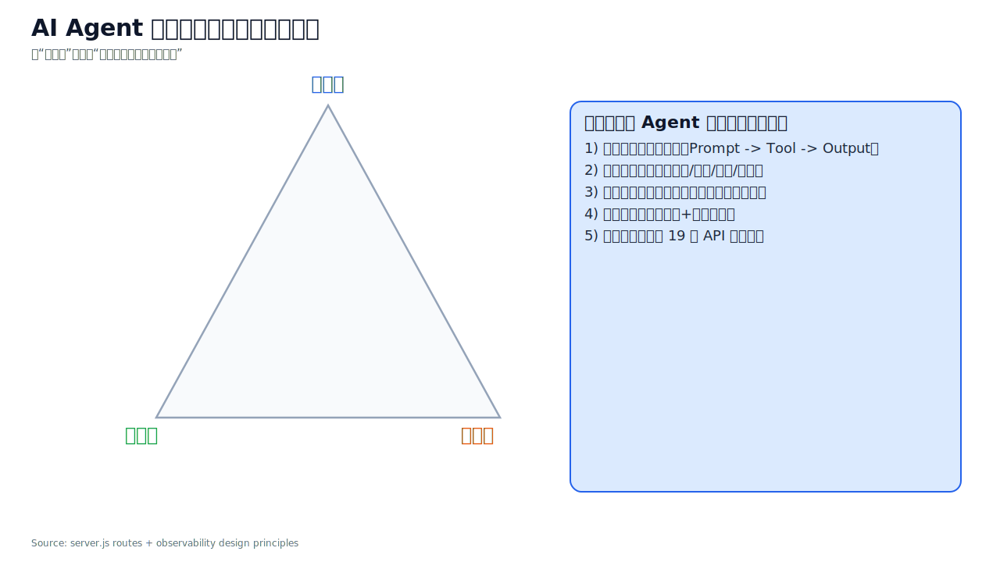
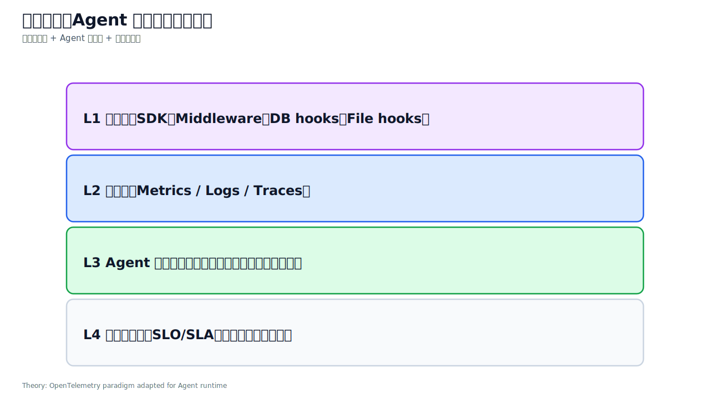
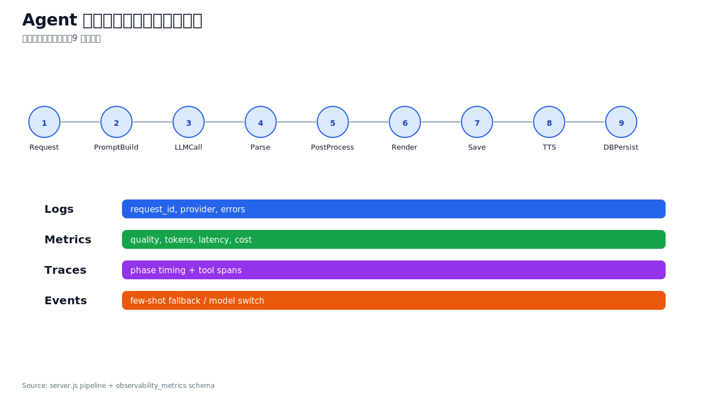
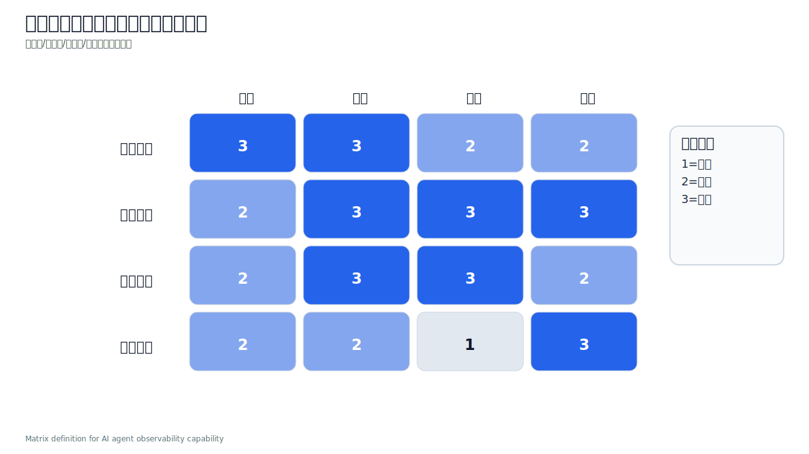
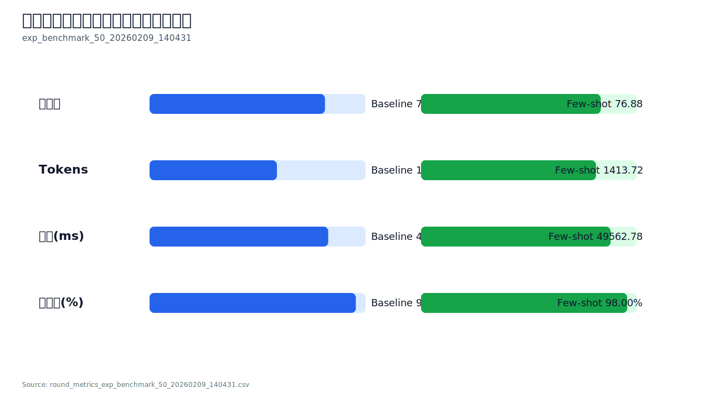
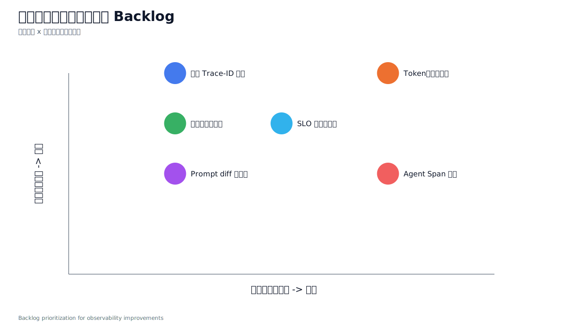

# AI Agent 可观测性：理论到落地（Slides Outline）

**演示主题**: AI Agent 服务系统可观测性——从理论框架到工程落地  
**适用对象**: 架构评审 / 平台工程 / Agent 应用开发团队  
**结合工程**: Trilingual Records（本仓库）  
**目标**: 用“可观测性”支撑 Agent 的稳定运行、问题定位与持续优化

---

## Slide 1 为什么要做 Agent 可观测性

- 核心问题：Agent 在多阶段执行时，失败点隐蔽、归因复杂、优化依赖猜测。
- 业务诉求：把“能跑”升级为“可解释、可定位、可优化”。
- 本页回答：可观测性是 Agent 工程化落地的必要前提。

**讲者备注**：先统一价值目标，再进入理论与实现细节。  
**Data Source**: `server.js`, `Docs/SystemDevelopStatusDocs/BACKEND.md`

---

## Slide 2 理论框架：四层可观测模型

- L1 采集层：SDK、日志钩子、DB/文件钩子。
- L2 遥测层：Logs / Metrics / Traces。
- L3 Agent 语义层：计划步骤、工具调用、反思决策。
- L4 业务目标层：SLO、成功率、稳定性、成本。

**讲者备注**：经典三支柱足够“看见系统”，语义层才足够“看懂 Agent”。  
**Data Source**: 可观测性通用理论 + 本工程实现映射

---

## Slide 3 Agent 生命周期与信号采集点

- 将一次生成请求拆为 9 个阶段：Request 到 DB Persist。
- 每阶段定义应采集的日志、指标、追踪、事件。
- 工程目标：任何失败都可回放到“具体阶段 + 具体字段”。

**讲者备注**：先有阶段，再有指标；否则指标无法解释根因。  
**Data Source**: `server.js`, `services/observabilityService.js`

---

## Slide 4 可观测对象矩阵（范围定义）

- 观察对象分四层：业务质量、模型行为、系统性能、安全合规。
- 信号类型分四类：日志、指标、追踪、事件。
- 通过矩阵识别“薄弱项”和“补强优先级”。

**讲者备注**：矩阵是治理工具，不是展示工具。用于决定下一步投入。  
**Data Source**: 本工程现状评估口径

---

## Slide 5 本工程落地映射：覆盖度现状

- 已覆盖：API 入口、DB 关键表、生成阶段、实验导出维度。
- 当前状态：主链路具备可观测基础，具备实验闭环能力。
- 下一步：从“可观测”走向“可运营”（SLO + 告警 + 自动化复盘）。

**讲者备注**：强调“已完成”与“未完成”的边界，避免过度承诺。  
**Data Source**: `server.js`, `database/schema.sql`, `Docs/SystemDevelopStatusDocs/*`

---

## Slide 6 数据模型实践：可追溯关系

- 核心链路：`generations -> observability_metrics -> experiment_*`。
- 关键能力：请求、输出、指标、实验轮次可关联回放。
- 价值：一条异常可追溯到 Prompt、模型、输出与统计结果。

**讲者备注**：没有结构化数据模型，就没有可重复的优化。  
**Data Source**: `database/schema.sql`

---

## Slide 7 服务入口实践：API 可观测面

- 对 API 路由按业务分类统计，识别高频入口。
- 当前高价值入口：`/generate`、`/ocr`、`/history`、`/experiments`。
- 优化建议：增加 route 级 P95/P99、trace_id 透传、错误聚合。

**讲者备注**：流量集中点优先补强，边缘路由后置优化。  
**Data Source**: `server.js`

---

## Slide 8 实验实践：可观测证据（质量/成本/时延）

- 基于 benchmark 实验对比 baseline 与 few-shot。
- 观测结论：质量提升与 token 增加并存，时延变化可控。
- 含义：优化不是单指标胜利，需多指标联动判断。

**讲者备注**：这页强调“trade-off 可见且可量化”。  
**Data Source**: `Docs/TestDocs/data/round_metrics_exp_benchmark_50_20260209_140431.csv`

---

## Slide 9 统计可信度：从现象到结论

- 使用 paired t-test / Wilcoxon / CI / Cohen's d 验证结果。
- 目标：避免“看起来更好”误判为“真正有效”。
- 本工程结果：few-shot 提升在统计上成立，但效应量中等。

**讲者备注**：观测不只采集，还要形成可信结论。  
**Data Source**: `Docs/TestDocs/data/round_kpi_summary_exp_benchmark_50_20260209_140431.json`

---

## Slide 10 差距评估：可观测到可运营

- 以目标门槛评估当前状态：质量增益、Token 增幅、延迟增幅、稳定性、效率。
- 输出达标/待优化清单，转化为工程任务。
- 作用：让优化路线可排期、可验收。

**讲者备注**：没有目标阈值，团队无法达成一致动作。  
**Data Source**: benchmark 结果 + 运营目标提案

---

## Slide 11 可优化项：Backlog 优先级矩阵

- 维度：业务影响（Impact）x 实施复杂度（Effort）。
- 高优先级项：Trace-ID 统一、异常告警规则、Token 预算自适应。
- 中期项：Prompt diff 可视化、SLO 周报、Agent Span 明细。

**讲者备注**：先做高影响低复杂，再做平台化能力。  
**Data Source**: 当前实现差距分析

---

## Slide 12 落地计划：30/60/90 天执行

- Phase 1（0-30天）：统一标识链路、补齐错误观测、定 SLO。
- Phase 2（31-60天）：上线告警、可视化注入链路、沉淀复盘 SOP。
- Phase 3（61-90天）：自动化周报、门禁优化、容量成本联动。

**讲者备注**：按阶段交付可见成果，避免大而全一次性改造。  
**Data Source**: 本工程优化路线规划

---

## 收尾页（可选）

- 结论 1：可观测性是 Agent 可运营的底座，不是附加项。  
- 结论 2：本工程已具备“采集-分析-实验-回归”闭环雏形。  
- 结论 3：下一阶段重点是 SLO、告警、Trace 统一和门禁自动化。

