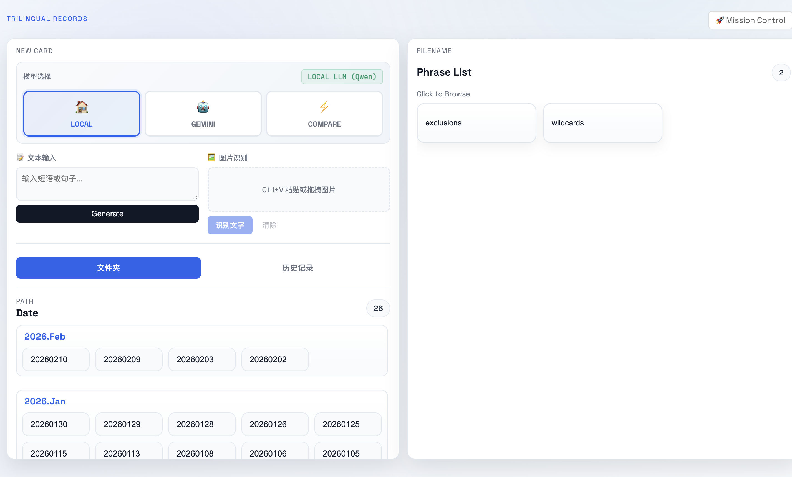
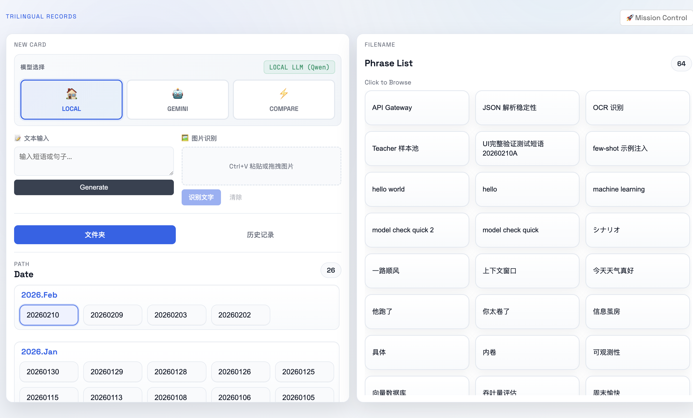
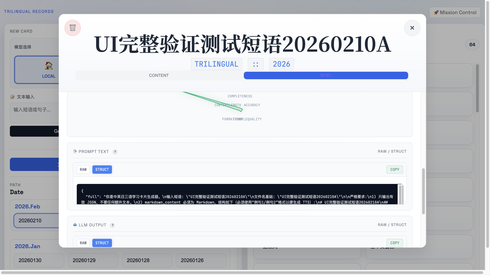
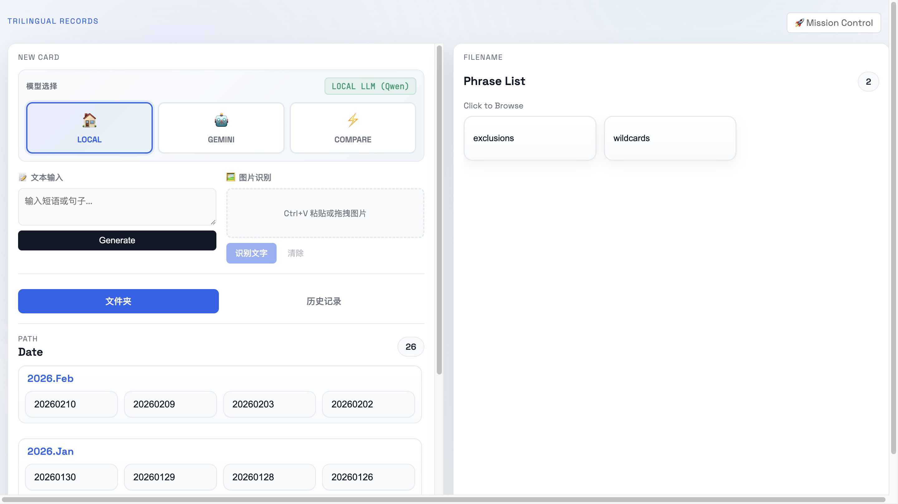
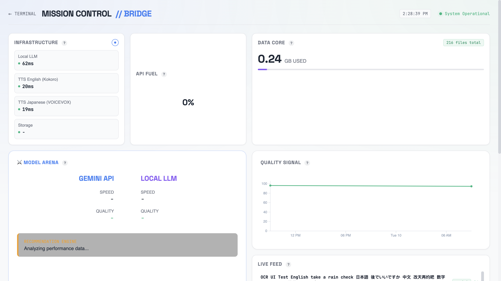
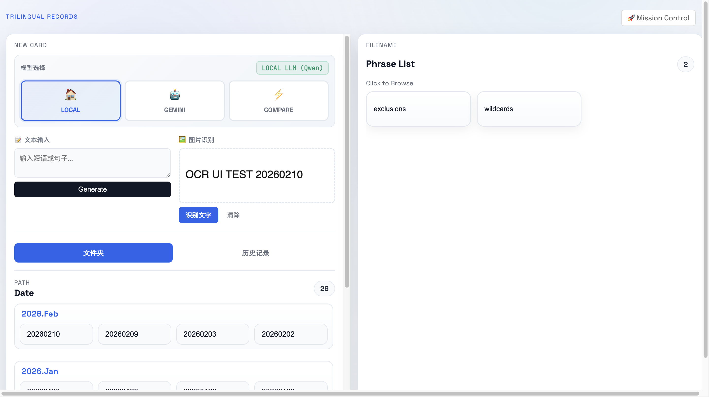
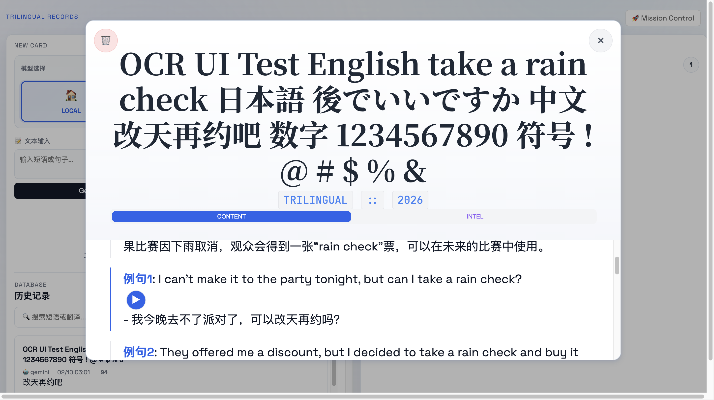

# UI 完整验证测试报告（2026-02-10）

## 1. 测试结论

- 总体结论: **核心主流程可用**（主页加载、文本生成、列表自动刷新、卡片详情/INTEL、删除、Mission Control 指标说明弹窗、历史记录详情、音频播放）
- 阻塞问题: **OCR 在当前本地 LLM 配置下失败**（`POST /api/ocr` 返回 500，错误为当前模型非多模态）
- 本轮判定: **部分通过（Partial Pass）**

## 2. 测试时间与环境

- 执行时间: `2026-02-10 14:36:04 JST`
- 前端地址: `http://localhost:3010/`
- Dashboard: `http://localhost:3010/dashboard.html`
- 容器健康状态:
  - `trilingual-viewer` Up
  - `trilingual-tts-en` Up (healthy)
  - `trilingual-tts-ja` Up
- `/api/health` 结果摘要:
  - Local LLM: online, model=`qwen2_5_7b`
  - TTS English/Japanese: online
  - Storage: online, recordsCount=216
- Gemini Proxy: running (`localhost:3210`)

## 3. 用例覆盖与结果

| 用例ID | 用例名称 | 结果 | 证据 |
|---|---|---|---|
| UI-01 | 首页加载与基础控件显示 | PASS | 截图 `01_home_loaded.png` |
| UI-02 | 文件夹/短语列表浏览与卡片打开 | PASS | 截图 `02_card_modal_content.png` |
| UI-03 | 文本生成学习卡片（Local） | PASS | 截图 `02_generating_progress.png`, `03_generation_completed_and_list_refresh.png` |
| UI-04 | 新生成卡片 INTEL 显示（含 Prompt/Output） | PASS | 截图 `05_new_card_modal_intel.png` |
| UI-05 | 卡片删除（含确认）与列表刷新 | PASS | 截图 `06_delete_record_result.png` |
| UI-06 | Mission Control 页面渲染 | PASS | 截图 `08_dashboard_overview.png` |
| UI-07 | Mission Control 问号说明弹窗 | PASS | 截图 `07_dashboard_help_popup.png` |
| UI-08 | OCR 输入识别流程（UI） | FAIL | 网络 reqid=22: `POST /api/ocr` -> 500，截图 `10_ocr_failed_non_multimodal.png` |
| UI-09 | 历史记录打开卡片并进入 INTEL | PASS | 截图 `12_history_modal_intel_prompt_output.png` |
| UI-10 | 历史记录卡片音频播放请求 | PASS | 网络 reqid=40: `.wav` 请求 200，截图 `13_history_modal_content_audio.png` |

## 4. 关键验证说明

### 4.1 自动刷新机制验证

- 文本生成完成后，短语列表自动出现新条目（无需手工刷新）
- 证据: `03_generation_completed_and_list_refresh.png`

### 4.2 INTEL 一致性验证（历史记录 vs 卡片详情）

- 在历史记录打开的卡片中，INTEL 页的 `Prompt Text` 与 `LLM Output` 可见且非空
- RAW/STRUCT 与 COPY 控件存在并可操作
- 证据: `12_history_modal_intel_prompt_output.png`

### 4.3 删除功能验证

- 点击 `🗑️ Delete Record` 出现确认对话框
- 确认后记录从列表移除，页面状态刷新
- 证据: `06_delete_record_result.png`

### 4.4 音频链路验证

- 在内容页点击例句播放按钮，浏览器发起音频请求并返回 200
- 证据:
  - Network reqid=40: `GET ..._en_1.wav` -> 200
  - 截图: `13_history_modal_content_audio.png`

## 5. 缺陷与风险

### DEFECT-01（高优先）: OCR 在本地模式不可用

- 现象: 点击“识别文字”后弹出失败提示
- 根因: 当前本地模型 `qwen2_5_7b` 非多模态，无法处理 OCR 图像输入
- 技术证据:
  - reqid=22: `POST /api/ocr` -> 500
  - 报错: `not a multimodal model`
- 影响: OCR 输入主链路不可用，无法通过 UI 完成图像到文本提取
- 修复建议:
  - 方案A: OCR 路由切换到独立视觉模型（例如 Qwen-VL / Gemini / PaddleOCR）
  - 方案B: 保留本地 LLM 仅用于文本生成，OCR 前置为专用 OCR 服务
  - 方案C: 前端在 Local 非多模态时禁用 OCR 按钮并展示明确引导

## 6. 截图索引

截图目录: `Docs/TestDocs/screenshots/ui_full_validation_20260210_141801/`

## 7. 回归建议

1. 优先修复 OCR 路由模型能力匹配问题（多模态/专用 OCR）并做一次 OCR 专项回归。
2. 继续保持 INTEL 页与历史记录详情统一的数据来源，避免字段缺失回归。
3. 将本报告中的 10 个用例固化为自动化 smoke（Playwright 或现有 DevTools 脚本）。

