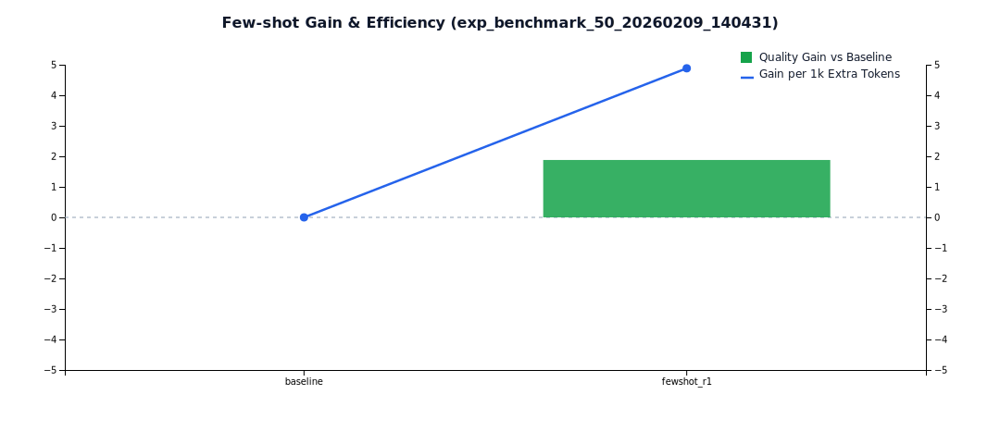
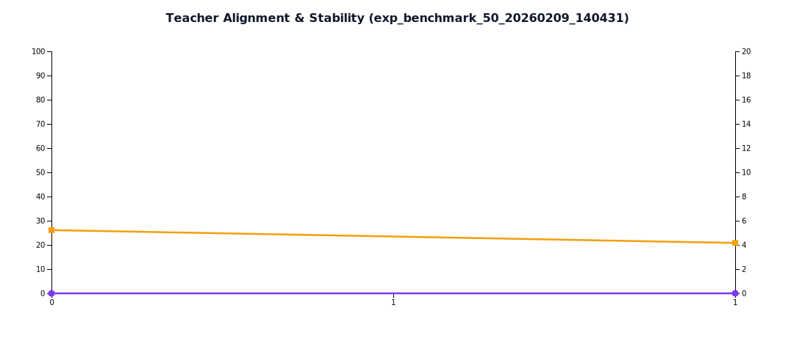
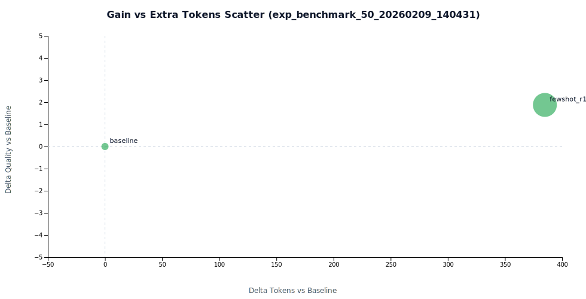

# Few-shot 轮次实验报告（exp_benchmark_50_20260209_140431）

- 生成时间: 2026-02-09T06:36:34.107Z

## KPI 总览

- 可见提升轮次数: **1/2**（50.0%)
- 平均 Teacher 对齐率: **0.0%**
- 平均稳定性 CV: **4.7%**
- few-shot 作用可见: **是**
- 最佳质量轮次: **fewshot_r1 (76.9)**
- 最佳效率轮次: **fewshot_r1 (4.88)**

### 统计检验

- 配对样本数: **48**
- 配对 t 检验 p-value: **0.0005**
- Wilcoxon 签名秩 p-value: **0.0010**
- 95% 置信区间: **[0.84, 2.83]**（均值差 +1.83）
- Cohen's d 效应量: **0.537**（medium）
- 统计显著 (p<0.05): **是**

## 轮次指标表

| Round | Avg Quality | ΔQuality | Avg Tokens | ΔTokens | Gain/1kExtraTokens | Quality SD | p-value | 95% CI | Cohen d |
|---|---:|---:|---:|---:|---:|---:|---:|---:|---:|
| baseline | 75.00 | 0.00 | 1028.78 | 0.00 | - | 3.92 | - | - | - |
| fewshot_r1 | 76.88 | 1.88 | 1413.72 | 384.94 | 4.88 | 3.20 | 0.0005 | [0.84, 2.83] | 0.537 (medium) |

## 图表

## 数据文件

- Docs/TestDocs/data/round_trend_exp_benchmark_50_20260209_140431.json
- Docs/TestDocs/data/round_metrics_exp_benchmark_50_20260209_140431.csv
- Docs/TestDocs/data/round_kpi_summary_exp_benchmark_50_20260209_140431.json