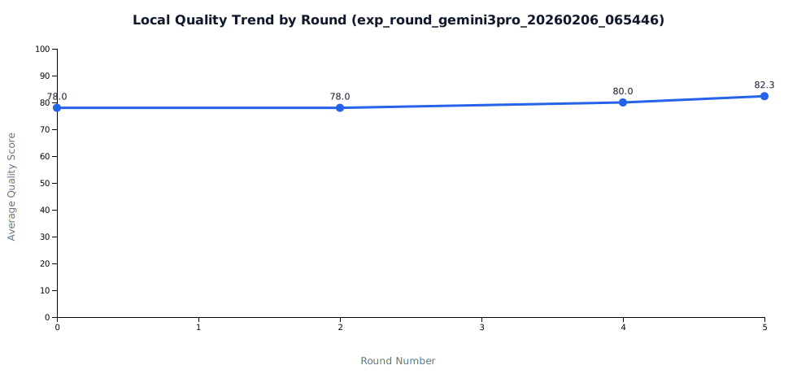
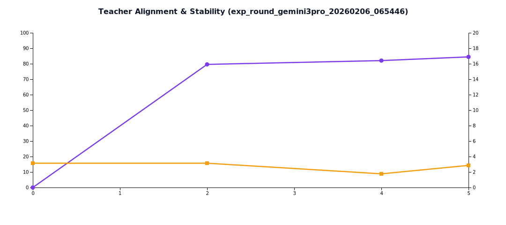

# Few-shot 轮次实验报告（exp_round_gemini3pro_20260206_065446）

- 生成时间: 2026-02-06T07:11:56.755Z

## KPI 总览

- 可见提升轮次数: **2/4**（50.0%)
- 平均 Teacher 对齐率: **82.0%**
- 平均稳定性 CV: **2.7%**
- few-shot 作用可见: **是**
- 最佳质量轮次: **fewshot_r3 (82.3)**
- 最佳效率轮次: **fewshot_r3 (6.70)**

## 轮次指标表

| Round | Avg Quality | ΔQuality | Avg Tokens | ΔTokens | Gain/1kExtraTokens | Teacher Align | Quality SD |
|---|---:|---:|---:|---:|---:|---:|---:|
| baseline | 78.00 | 0.00 | 1102.33 | 0.00 | - | 0.0% | 2.45 |
| fewshot_r1 | 78.00 | 0.00 | 1324.33 | 222.00 | 0.00 | 79.6% | 2.45 |
| fewshot_r2 | 80.00 | 2.00 | 1482.67 | 380.33 | 5.26 | 82.1% | 1.41 |
| fewshot_r3 | 82.33 | 4.33 | 1749.33 | 647.00 | 6.70 | 84.4% | 2.36 |

## 图表

## 数据文件

- Docs/TestDocs/data/round_trend_exp_round_gemini3pro_20260206_065446.json
- Docs/TestDocs/data/round_metrics_exp_round_gemini3pro_20260206_065446.csv
- Docs/TestDocs/data/round_kpi_summary_exp_round_gemini3pro_20260206_065446.json