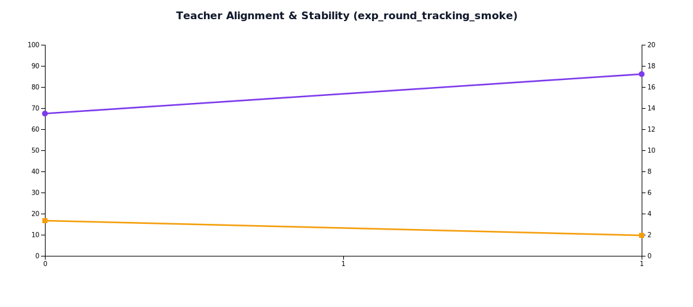

# Few-shot 轮次实验报告（exp_round_tracking_smoke）

- 生成时间: 2026-02-06T06:47:22.399Z

## KPI 总览

- 可见提升轮次数: **1/2**（50.0%)
- 平均 Teacher 对齐率: **76.8%**
- 平均稳定性 CV: **2.6%**
- few-shot 作用可见: **是**
- 最佳质量轮次: **fewshot_r1 (77.5)**
- 最佳效率轮次: **fewshot_r1 (92.11)**

## 轮次指标表

| Round | Avg Quality | ΔQuality | Avg Tokens | ΔTokens | Gain/1kExtraTokens | Teacher Align | Quality SD |
|---|---:|---:|---:|---:|---:|---:|---:|
| baseline | 60.00 | 0.00 | 405.00 | 0.00 | - | 67.4% | 2.00 |
| fewshot_r1 | 77.50 | 17.50 | 595.00 | 190.00 | 92.11 | 86.1% | 1.50 |

## 图表

## 数据文件

- Docs/TestDocs/data/round_trend_exp_round_tracking_smoke.json
- Docs/TestDocs/data/round_metrics_exp_round_tracking_smoke.csv
- Docs/TestDocs/data/round_kpi_summary_exp_round_tracking_smoke.json