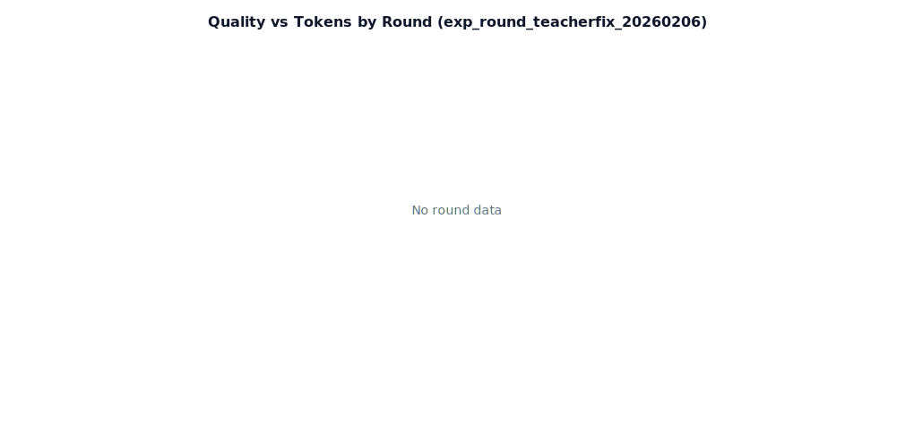
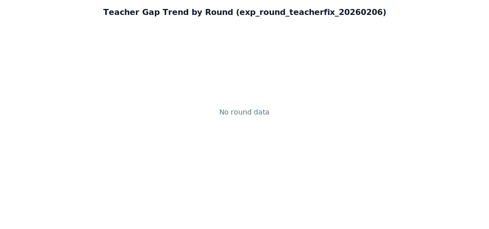

# Round 实验报告（Teacher Fix）- exp_round_teacherfix_20260206

**实验日期**: 2026-02-06  
**实验 ID**: `exp_round_teacherfix_20260206`  
**目标**: 修复“few-shot 示例未注入”后，验证 teacher 样本池 + 预算收敛策略的有效性。  
**模型**: Local `qwen2_5_7b` + Teacher `gemini`  
**样本短语**: `提示词工程` / `API Gateway` / `多模型对比`

---

## 1. 本轮修复点

1. few-shot 取样优先读取 `teacher_references`（同实验、当前轮次及之前）。  
2. 示例输出压缩：限制 `exampleMaxChars`，仅保留必要结构，降低 prompt 膨胀。  
3. teacher gap 聚合改为可继承历史轮次 teacher 数据（`round_number <= 当前轮次`）。  
4. 轮次脚本加入 `is_teacher_reference=true` 的 teacher 种子轮次。

---

## 2. 执行配置

配置文件：`Docs/TestDocs/data/rounds_teacher_first_v1.json`

| Round | 类型 | Provider | few-shot 配置 |
|---|---|---|---|
| 0 | baseline | local | disabled |
| 1 | teacher_seed_r1 | gemini | disabled |
| 1 | fewshot_r1 | local | count=1, minScore=70, budget=0.15, maxChars=420 |
| 2 | fewshot_r2 | local | count=2, minScore=75, budget=0.18, maxChars=460 |
| 3 | fewshot_r3 | local | count=3, minScore=75, budget=0.20, maxChars=500 |

---

## 3. 结果概览

### 3.1 轮次指标

| Round | 成功率 | 平均质量分 | 平均 Tokens | 平均延迟 |
|---|---:|---:|---:|---:|
| baseline | 3/3 | 82.00 | 1095.00 | 54.07s |
| teacher_seed_r1 | 3/3 | 96.00 | 452.67 | 34.56s |
| fewshot_r1 | 3/3 | 79.00 | 1352.67 | 59.93s |
| fewshot_r2 | 3/3 | 80.33 | 1527.33 | 56.73s |
| fewshot_r3 | 3/3 | 79.33 | 1548.33 | 56.56s |

### 3.2 对 baseline 的增量（local 轮次）

| Round | 质量分增量 | Tokens 增量 | 延迟增量 |
|---|---:|---:|---:|
| fewshot_r1 | -3.00 | +257.67 | +5.86s |
| fewshot_r2 | -1.67 | +432.33 | +2.67s |
| fewshot_r3 | -2.67 | +453.33 | +2.50s |

---

## 4. 关键验证结论

### 4.1 修复是否生效

- `few_shot_runs` 统计：`count=15`，`fewshot_enabled=9`，`example_count>0=9`。  
- `fallback_reason` 统计：`none=12`，`budget_reduction=3`，`budget_exceeded_disable=0`，`no_examples=0`。  
- `teacherRefs` 数量：`3`（对应 3 条短语）。

结论：**“示例注入未发生”问题已修复**，few-shot 机制在本轮已稳定生效。

### 4.2 质量表现

- 机制生效后，当前参数组合没有带来质量提升（对 baseline 出现轻微下降）。  
- 主要体现为 token 成本上升，质量未同步收益，说明需要继续做“示例质量筛选 + prompt 压缩策略”联合调优。

---

## 5. 图表

### 5.1 质量趋势

### 5.2 质量 vs Tokens（双轴）

### 5.3 Teacher Gap 趋势

---

## 6. 数据文件

- 轮次汇总：`Docs/TestDocs/data/rounds/exp_round_teacherfix_20260206/summary.json`
- 趋势 JSON：`Docs/TestDocs/data/round_trend_exp_round_teacherfix_20260206.json`
- 趋势 CSV：`Docs/TestDocs/data/round_trend_exp_round_teacherfix_20260206.csv`
- 增量 CSV：`Docs/TestDocs/data/round_deltas_exp_round_teacherfix_20260206.csv`

---

## 7. 下一轮建议（直接可执行）

1. 仅保留 Teacher 样本中 quality 最高的前 1 条（`count=1`），并将 `exampleMaxChars` 下调到 `280~360`。  
2. 在 `getRelevantExamples` 加入词面/语义相似度阈值，避免“高分但不相似”示例污染。  
3. 增加 `teacher_r2` 更新轮次，形成 “teacher refresh -> local evaluate” 的迭代闭环。
