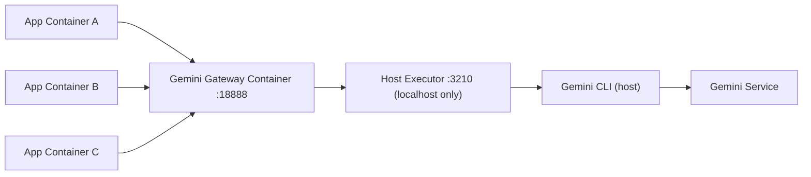

# Gemini CLI 调用方式详解（当前系统）

更新时间：2026-02-12

## 1. 文档目的与范围

本文总结当前仓库中 **Gemini CLI 的实际调用路径**、配置方式、运行依赖、故障排查与推荐实践。
当前执行规范已与 `Gateway_18888_服务调用说明.md` 对齐：业务容器统一经 Gateway(`18888`)调用。

说明范围：
- 服务端调用链：`/api/generate` -> Gemini 路径
- 宿主机代理调用链：`gemini-host-proxy`
- 关键环境变量与模型选择
- 与“日期归档”相关的行为（`target_folder`）

---

## 2. 当前三种 Gemini 相关调用形态

### 2.1 形态 A（主用）：Host Proxy 模式

- 入口：`POST /api/generate`，请求体带 `llm_provider=gemini`
- 模式开关：`GEMINI_MODE=host-proxy`
- 运行链路：
  1. `server.js` 在 `generateWithProvider()` 中判断 `useGeminiProxy`
  2. 调用 `services/geminiProxyService.js` 的 `runGeminiProxy()`
  3. `runGeminiProxy()` 发 HTTP 到 Gateway（固定端口 `18888`）
  4. Gateway 鉴权、参数校验、队列调度、熔断与转发
  5. 宿主机 Host Executor (`scripts/gemini-host-proxy.js`) 接收 `/api/gemini`
  6. 执行器内部 `spawn('gemini', ['--model', '<model>', '-p', '<prompt>'])`
  7. 返回 `{ markdown, rawOutput, model }`
  8. 后端将 markdown 渲染为 html，生成音频任务并落库/落盘

这是当前 Docker 场景下最稳定、最推荐的方式。

### 2.2 形态 B（兼容）：CLI 直连模式

- 模式开关：`GEMINI_MODE=cli`
- 调用：`services/geminiCliService.js` 直接在服务进程所在机器执行 `gemini`
- 典型用途：非容器运行、或容器内已安装并认证 Gemini CLI 的场景

### 2.3 形态 C（历史）：Gemini API 直连

- 文件：`services/geminiService.js`
- 备注：当前项目主线已封存 API 直连，不作为推荐链路。

---

## 3. 关键代码锚点

- 模式分流与调用：`server.js`
  - `const geminiMode = (process.env.GEMINI_MODE || 'cli').toLowerCase();`
  - `useGeminiCli / useGeminiProxy`
  - `runGeminiCli(...)` / `runGeminiProxy(...)`
- Host Proxy HTTP 客户端：`services/geminiProxyService.js`
- Gateway 对接地址：`GEMINI_PROXY_URL`（应指向 `:18888`）
- CLI 直连客户端：`services/geminiCliService.js`
- Host Proxy 服务端：`scripts/gemini-host-proxy.js`
- Host Proxy 管理脚本：`scripts/start-gemini-proxy.sh`

---

## 4. 环境变量与职责

## 4.1 服务端（viewer）

- `GEMINI_MODE`
  - `host-proxy`：调用宿主机代理（推荐）
  - `cli`：本机/容器直接执行 Gemini CLI
- `GEMINI_PROXY_URL`
  - 默认推荐：`http://host.docker.internal:18888/api/gemini`（Gateway 固定端口）
- `GEMINI_PROXY_AUTH_MODE`
  - `apikey`（默认）或 `bearer`
- `GEMINI_PROXY_API_KEY`
  - `apikey` 模式下使用；调用 Gateway 必填
- `GEMINI_PROXY_BEARER_TOKEN`
  - `bearer` 模式下使用（未设置时可回退到 `GEMINI_PROXY_API_KEY`）
- `GEMINI_PROXY_MODEL`
  - 代理默认模型（如果请求未显式透传 `llm_model`）
- `GEMINI_PROXY_REQUEST_TIMEOUT_MS`
  - viewer 调用 proxy 的请求超时（默认 `120000`）
- `GEMINI_PROXY_RETRIES`
  - 超时/5xx 的自动重试次数（默认 `1`，即最多 2 次尝试）
- `GEMINI_PROXY_AUTO_RESET`
  - 超时时自动调用 proxy reset（默认 `true`）
- `GEMINI_PROXY_RETRY_DELAY_MS`
  - 重试退避基线毫秒（默认 `1200`）
- `GEMINI_CLI_MODEL`
  - CLI 模式默认模型（`GEMINI_MODE=cli` 时使用）

## 4.2 代理进程（宿主机）

- `GEMINI_PROXY_PORT`：默认 `3210`
- `GEMINI_PROXY_BIN`：默认 `gemini`
- `GEMINI_PROXY_TIMEOUT_MS`：Gemini CLI 子进程超时（代码默认 `90000`，启动脚本默认导出 `150000`）
- `GEMINI_PROXY_MODEL`：代理默认模型
- `GEMINI_PROXY_MODEL_ARG`：默认 `--model`
- `GEMINI_PROXY_PROMPT_ARG`：默认 `-p`

---

## 5. 请求参数与模型透传

`POST /api/generate`（Gemini）常用字段：

```json
{
  "phrase": "提示词工程",
  "llm_provider": "gemini",
  "llm_model": "gemini-3-pro-preview",
  "enable_tts": true,
  "target_folder": "20260129"
}
```

字段语义：
- `llm_provider=gemini`：走 Gemini 路径
- `llm_model`：覆盖默认模型并透传到 proxy/cli
- `target_folder`：强制写入指定日期目录（用于历史重建）

---

## 6. 日期归档行为（重点）

当前支持 `target_folder`：
- 若不传：默认按当天目录（`YYYYMMDD`）保存
- 若传入：按指定目录保存（例如 `20251216`）

实现点：
- `server.js`：`generateWithProvider()` 支持 `options.targetFolder`
- `services/fileManager.js`：`ensureFolderDirectory(folderName)`

注意：
- 文件归档日期由 `folder_name` 体现（这是当前主口径）
- `generations.generation_date` 仍按“实际生成时间”写入，不等同于 `target_folder` 历史日期

---

## 7. 宿主机代理运行方式

执行规范（严格）：
- 业务容器调用 `Gateway:18888`
- Gateway 转发到宿主机执行器 `Host Executor:3210`

宿主机执行器启动/停止/状态：

```bash
bash scripts/start-gemini-proxy.sh start
bash scripts/start-gemini-proxy.sh status
bash scripts/start-gemini-proxy.sh reset
bash scripts/start-gemini-proxy.sh stop
```

健康检查：

```bash
curl -s http://localhost:3210/health
```

代理直测：

```bash
curl -s -X POST http://localhost:3210/api/gemini \
  -H 'Content-Type: application/json' \
  -d '{"prompt":"请只回复 ok","baseName":"probe","model":"gemini-3-pro-preview"}'
```

Gateway 直测（业务侧）：

```bash
curl -s -X POST http://localhost:18888/api/gemini \
  -H 'Content-Type: application/json' \
  -H "X-API-Key: ${GEMINI_PROXY_API_KEY}" \
  -d '{"prompt":"请只回复 ok","model":"gemini-3-pro-preview","project":"three-lans"}'
```

---

## 8. 当前模型可用性结论（本机实测，2026-02-10）

最近实测结论：
- 可用：
  - `gemini-3-pro-preview`（当前默认）
  - `gemini-3-flash-preview`
  - `gemini-2.5-pro`
  - `gemini-2.5-flash`
  - `gemini-2.5-flash-lite`
- 不可用（当前账号/环境，返回 `ModelNotFoundError 404`）：
  - `gemini-3-pro`
  - `gemini-3-flash`
  - `gemini-3-pro-latest`
  - `gemini-2.5-pro-latest`
  - `gemini-pro-latest`
  - `gemini-flash-latest`
- 不应作为模型名：`gemini-cli`（不是有效模型 ID）

实践建议：
- 默认模型优先设置为 `gemini-3-pro-preview`
- teacher 池建议优先 `gemini-3-pro-preview`
- 若要降成本/提速，可切换 `gemini-3-flash-preview` 或 `gemini-2.5-flash`

---

## 9. 常见故障与排查

### 9.1 `fetch failed`（viewer 调用 gemini 失败）

原因：Gateway 或 Host Executor 未启动，或 URL 不通。

排查：
1. `curl http://localhost:18888/health`
2. `bash scripts/start-gemini-proxy.sh status`
3. `curl http://localhost:3210/health`
4. 检查 `GEMINI_PROXY_URL` 是否为 `http://host.docker.internal:18888/api/gemini`
5. 检查是否携带 `X-API-Key` 或 `Authorization: Bearer`

### 9.2 `ModelNotFoundError: 404`

原因：`--model` 指定了当前账号不可用模型。

处理：
- 改为当前可用模型（优先 `gemini-3-pro-preview`，次选 `gemini-2.5-pro`）。

### 9.3 `Rate limit exceeded`（429）

原因：`/api/generate` 内有节流（默认 4 秒）。

处理：
- 批处理时每次调用间隔 >= 4 秒
- 或在脚本中实现 429 重试与退避

### 9.4 `Gemini CLI timeout`

原因：CLI 执行超时。

处理：
- 当前已内置：
  - 请求自动重试（`GEMINI_PROXY_RETRIES`）
  - 超时时自动调用 reset（`GEMINI_PROXY_AUTO_RESET=true`）
- 可继续优化：
  - 调大 `GEMINI_PROXY_TIMEOUT_MS` / `GEMINI_PROXY_REQUEST_TIMEOUT_MS`
  - 缩短 prompt 或拆分批任务
  - 在批量脚本里分组请求并限制并发

### 9.5 `401 UNAUTHORIZED`

原因：Gateway 要求鉴权，调用未带有效密钥。

处理：
- 配置 `GEMINI_PROXY_AUTH_MODE=apikey`
- 配置 `GEMINI_PROXY_API_KEY=<your-key>`
- 或使用 Bearer：`GEMINI_PROXY_AUTH_MODE=bearer` + `GEMINI_PROXY_BEARER_TOKEN`

---

## 10. 推荐基线配置（Gateway18888 + 宿主机 CLI）

```bash
# viewer
GEMINI_MODE=host-proxy
GEMINI_PROXY_URL=http://host.docker.internal:18888/api/gemini
GEMINI_PROXY_AUTH_MODE=apikey
GEMINI_PROXY_API_KEY=local-dev-key-0123456789
GEMINI_PROXY_MODEL=gemini-3-pro-preview

# host executor
GEMINI_PROXY_PORT=3210
GEMINI_PROXY_BIN=gemini
GEMINI_PROXY_MODEL=gemini-3-pro-preview
GEMINI_PROXY_TIMEOUT_MS=150000
```

---

## 11. 结论

当前系统中，Gemini CLI 的主调用方式是：
- **容器内服务 -> Gateway(18888) -> 宿主机 Host Executor(3210) -> Gemini CLI -> 返回 markdown -> 本地渲染与落盘/落库**。

在此架构下：
- 模型可由 `llm_model` 每次请求透传
- 历史重建可通过 `target_folder` 保留原日期目录
- 生产稳定性取决于 Gateway 队列/熔断、Host Executor 常驻状态、模型可用性与节流重试策略

---

## 12. 标准化扩展方案：独立 Gemini CLI 代理容器（跨工程复用）

目标：将 Gemini CLI 能力沉淀为本机共享基础设施，供多个工程容器统一调用，避免每个项目重复实现代理逻辑。

### 12.1 设计约束（必须明确）

- 容器内通常无法直接执行宿主机 `gemini` 二进制（macOS 宿主机与 Linux 容器 ABI 不兼容）。
- 因此推荐采用双层结构：
  - 宿主机执行层：真正调用 Gemini CLI
  - 网关容器层：对外暴露统一 API（供其他容器调用）

### 12.2 推荐架构



职责划分：
- `Host Executor`（宿主机进程）：
  - 执行 `gemini -p ... --model ...`
  - 管理 timeout/kill/reset
  - 仅监听 `127.0.0.1`，不直接暴露给其他机器
- `Gateway Container`（容器）：
  - 暴露统一 API
  - 处理认证、重试、限流、日志与观测
  - 转发到 `http://host.docker.internal:3210`
- `业务容器`：
  - 仅访问 `http://gemini-gateway:18888`

### 12.3 统一 API 建议

建议同时保留两套接口，兼顾兼容与标准化：
- 兼容接口：`POST /api/gemini`
- 标准接口（推荐新增）：`POST /v1/chat/completions`、`GET /v1/models`

字段约定（`/api/gemini`）：
- 入参：`prompt/baseName/model/timeoutMs`
- 出参：`markdown/rawOutput/model`
- 错误：统一格式，包含状态码与原始错误摘要

### 12.4 共享网络部署建议

```bash
# 1) 共享 Docker 网络（仅需创建一次）
docker network create ai-shared-net

# 2) 启动宿主机执行层
bash scripts/start-gemini-proxy.sh start

# 3) 启动网关容器（加入 ai-shared-net，内部转发到 host.docker.internal:3210）
# 4) 每个业务项目容器加入同一 external network: ai-shared-net
```

业务容器环境变量统一为：
- `GEMINI_MODE=host-proxy`
- `GEMINI_PROXY_URL=http://gemini-gateway:18888/api/gemini`
- `GEMINI_PROXY_AUTH_MODE=apikey`
- `GEMINI_PROXY_API_KEY=<gateway-api-key>`

### 12.5 Gateway 容器建议能力

- 可靠性：
  - 网关请求超时
  - timeout/5xx 自动重试（指数或线性退避）
  - timeout 时调用宿主机执行层 `/admin/reset`
  - 并发上限与队列上限（防止 CLI 堆积）
- 安全：
  - `X-API-Key` 或 Bearer 鉴权
  - 仅内网端口暴露
  - 可选 prompt 脱敏日志
- 可观测：
  - 指标：QPS、P95、超时率、reset 次数、重试次数、队列长度
  - 日志字段：`request_id/project/model/attempt/latency_ms/error_class`

### 12.6 与当前实现的关系

当前仓库已具备宿主机执行层核心能力：
- `/api/gemini`
- `/health`
- `/admin/reset`
- timeout 进程清理与重试链路（viewer 侧）

后续新增 `Gateway Container` 时，可复用现有宿主机代理逻辑，不影响现有业务 API 协议。

### 12.7 迁移路径（建议）

1. 保持当前单项目模式可用（不阻塞业务）。
2. 抽离并部署共享 `Gateway Container` 到 `ai-shared-net`。
3. 逐个项目将 `GEMINI_PROXY_URL` 切换到 `http://gemini-gateway:18888/api/gemini`。
4. 灰度观察超时率、P95、reset 次数。
5. 稳定后下线各项目内重复代理脚本。

### 12.8 验收标准

- 至少 3 个不同项目容器可稳定调用同一网关。
- 并发压测下无僵尸进程、无持续超时堆积。
- timeout 后可自动恢复，重试链路可观测。
- 故障请求可通过 `request_id` 完整追踪。
