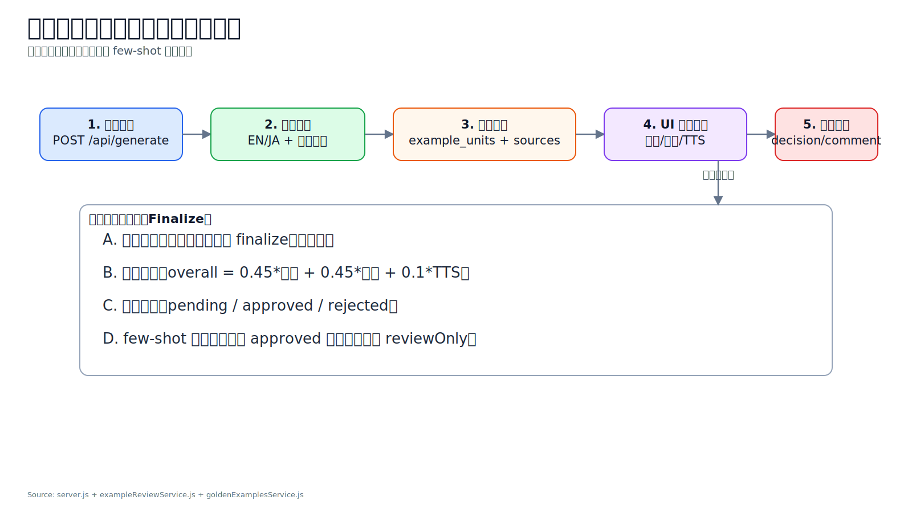
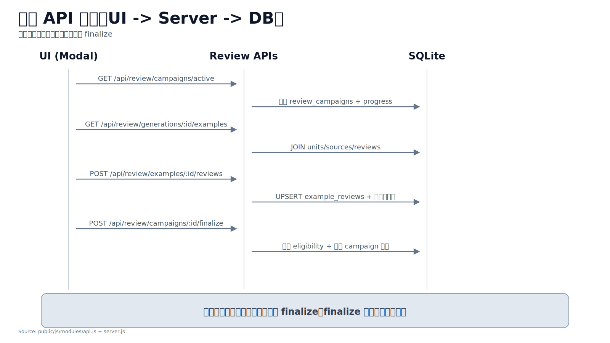
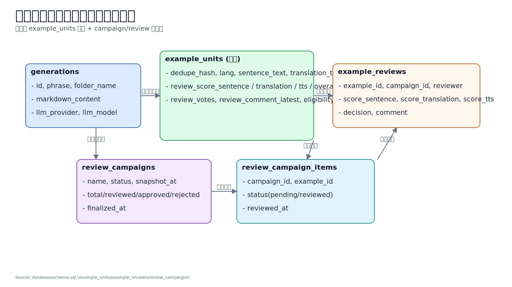
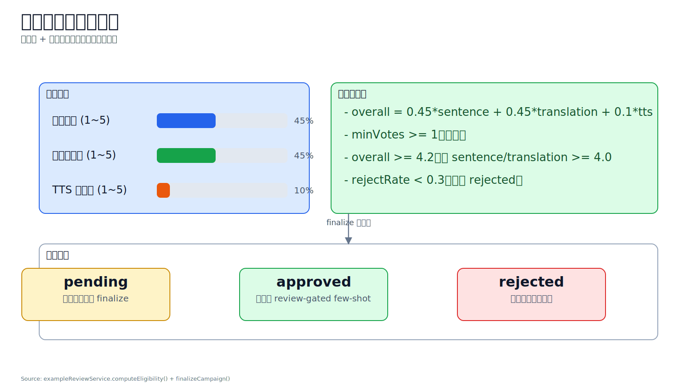
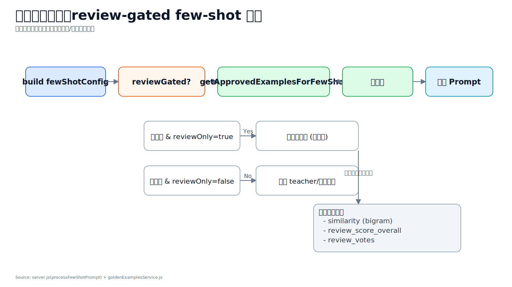

# 学习卡片人工评分与评论机制技术说明

## 1. 文档目标

本文说明当前系统中“学习卡片生成后的人工评分与评论”机制，包括：

- 前端如何对例句进行评分、评论与统一处理；
- 后端如何落库、聚合、判定注入资格；
- few-shot 在运行时如何消费人工审核通过样本；
- 关键 API、数据表、配置项和运行建议。

---

## 2. 机制总览（端到端）

系统将每次卡片生成结果中的例句拆解为可评审样本，经过人工评分和统一 finalize 后，转化为 few-shot 可注入样本。



核心结论：

1. **生成即入池**：生成成功后自动解析 EN/JA 例句并写入样本池。
2. **评分可追溯**：每条例句都可保存分数、决策、评论、reviewer。
3. **统一处理入池**：campaign finalize 后才会更新最终 `eligibility`。
4. **运行时消费**：few-shot 检索优先使用 `approved` 样本。

---

## 3. 前端功能说明（你在页面上看到的功能）

前端实现位于：

- `/Users/xueguodong/WorkTechDir/Three_LANS_PJ_CodeX/public/js/modules/app.js`
- `/Users/xueguodong/WorkTechDir/Three_LANS_PJ_CodeX/public/js/modules/api.js`

### 3.1 评审面板能力

在学习卡片弹窗中，评审区支持：

- 对每条例句打 3 个分：`原句`、`翻译`、`TTS`（均为 1~5）；
- 设置注入决策：`推荐注入` / `不推荐注入` / `中立`；
- 填写评论（可选）；
- 批次操作：创建评审批次、刷新进度、统一处理并入池。

### 3.2 批次约束

- 默认要求“全部样本完成评分”后才能 finalize；
- 若还有 `pending_examples`，前端会禁用 finalize 按钮并提示剩余数量。

---

## 4. API 设计与交互时序



### 4.1 主要接口

- `GET /api/review/campaigns/active`：读取当前活动批次；
- `POST /api/review/campaigns`：创建批次（快照模式）；
- `GET /api/review/campaigns/:id/progress`：读取批次进度；
- `GET /api/review/generations/:id/examples`：读取某卡片对应的例句样本；
- `POST /api/review/examples/:id/reviews`：保存或更新评分/评论；
- `POST /api/review/campaigns/:id/finalize`：统一处理并更新资格；
- `POST /api/review/backfill`：补扫历史生成记录并入池。

后端路由定义位于：

- `/Users/xueguodong/WorkTechDir/Three_LANS_PJ_CodeX/server.js`

---

## 5. 数据模型与表职责



核心表定义位于：

- `/Users/xueguodong/WorkTechDir/Three_LANS_PJ_CodeX/database/schema.sql`

### 5.1 关键表

1. `example_units`（样本主表）
   - 保存去重后的例句实体；
   - 保存聚合评分、投票数、最新评论、注入资格。
2. `example_unit_sources`（来源映射）
   - 记录样本来自哪个 generation、哪个 slot（如 `en_1`、`ja_2`）。
3. `example_reviews`（评分明细）
   - 保存 reviewer 的逐条评分、决策、评论。
4. `review_campaigns` / `review_campaign_items`（批次）
   - 管理“快照评审”和进度统计。

### 5.2 去重策略

去重 hash 由以下字段组成：

- `lang + sentence_text + translation_text`（规范化后）

即同语言、同原句、同译文会归并为同一个 `example_unit`。

---

## 6. 评分模型与资格判定



评分与资格逻辑实现位于：

- `/Users/xueguodong/WorkTechDir/Three_LANS_PJ_CodeX/services/exampleReviewService.js`

### 6.1 聚合分公式

```text
overall = 0.45 * sentence + 0.45 * translation + 0.1 * tts
```

### 6.2 默认判定阈值（可通过 policy 覆盖）

- `minVotes >= 1`
- `minOverall >= 4.2`
- `minSentence >= 4.0`
- `minTranslation >= 4.0`
- `maxRejectRate < 0.3`

判定输出：

- `approved`：可进入注入候选；
- `rejected`：不参与注入；
- `pending`：尚未满足评审条件。

### 6.3 决策与评论作用

- `decision=reject` 会影响 reject rate，从而影响最终资格；
- `comment` 会写入明细，并回写 `review_comment_latest` 供后续复盘。

---

## 7. 后台如何使用这些评分结果（few-shot 注入）



相关逻辑位于：

- `/Users/xueguodong/WorkTechDir/Three_LANS_PJ_CodeX/server.js`
- `/Users/xueguodong/WorkTechDir/Three_LANS_PJ_CodeX/services/goldenExamplesService.js`
- `/Users/xueguodong/WorkTechDir/Three_LANS_PJ_CodeX/services/exampleReviewService.js`

### 7.1 运行时策略

在 `getRelevantExamples()` 中：

1. 若 `reviewGated=true`，先查 `approved` 样本（人工通过池）；
2. 若找到样本，直接作为 few-shot 候选；
3. 若未找到且 `reviewOnly=true`，返回空（不注入）；
4. 若未找到且 `reviewOnly=false`，回退到 teacher/历史高质量样本。

### 7.2 候选排序

人工通过样本会按以下优先级排序：

1. 与当前短语的相似度（bigram）
2. `review_score_overall`
3. `review_votes`

---

## 8. 配置项（与评审注入直接相关）

### 8.1 环境变量

- `ENABLE_REVIEW_GATED_FEWSHOT`：是否启用人工评审门控；
- `REVIEW_GATED_FEWSHOT_ONLY`：仅允许人工通过样本（无样本即不注入）；
- `REVIEW_GATE_MIN_OVERALL`：人工样本最低总分阈值；
- `REVIEW_DEFAULT_REVIEWER`：默认 reviewer 标识。

### 8.2 请求级覆盖（`/api/generate` 的 fewshot_options）

可按请求覆盖：

- `reviewGated`
- `reviewOnly`
- `reviewMinOverall`

---

## 9. 运维与使用建议

### 9.1 建议流程

1. 开启新批次（snapshot）；
2. 完成全量评分与评论；
3. finalize 统一处理资格；
4. 在 few-shot 运行中开启 review-gated；
5. 观察质量、token、延迟变化并复盘。

### 9.2 常见问题

1. **为什么样本没有进入注入？**  
   - 可能未 finalize；  
   - 或总分/维度分/reject rate 未达阈值；  
   - 或开启了 `reviewOnly` 但 approved 样本不足。
2. **为什么看到 pending？**  
   - 票数不够，或批次未完成统一处理。
3. **评论会直接改变注入吗？**  
   - 评论本身不直接改资格；决策与评分会影响资格计算。

---

## 10. 代码索引（快速定位）

- 路由层：`/Users/xueguodong/WorkTechDir/Three_LANS_PJ_CodeX/server.js`
- 评审服务：`/Users/xueguodong/WorkTechDir/Three_LANS_PJ_CodeX/services/exampleReviewService.js`
- few-shot 检索：`/Users/xueguodong/WorkTechDir/Three_LANS_PJ_CodeX/services/goldenExamplesService.js`
- 前端 UI：`/Users/xueguodong/WorkTechDir/Three_LANS_PJ_CodeX/public/js/modules/app.js`
- 前端 API：`/Users/xueguodong/WorkTechDir/Three_LANS_PJ_CodeX/public/js/modules/api.js`
- 表结构：`/Users/xueguodong/WorkTechDir/Three_LANS_PJ_CodeX/database/schema.sql`

---

## 11. 图表生成说明（D3）

- 渲染脚本：`/Users/xueguodong/WorkTechDir/Three_LANS_PJ_CodeX/d3/render_review_scoring_docs_charts.mjs`
- 图表输出目录：`/Users/xueguodong/WorkTechDir/Three_LANS_PJ_CodeX/Docs/TestDocs/charts/review_scoring/`
- 生成命令：

```bash
node /Users/xueguodong/WorkTechDir/Three_LANS_PJ_CodeX/d3/render_review_scoring_docs_charts.mjs
```

