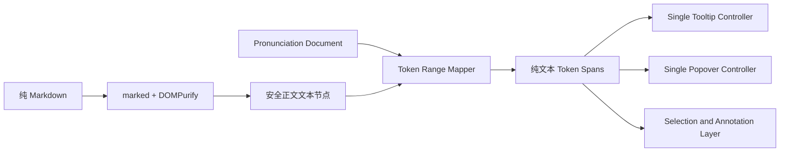

# 日语按需注音浮层与 Ruby 退役设计（PF-D0）

> 状态：**Draft · 待产品与架构评审，不代表当前运行基线**
>
> 日期：2026-08-03；真实卷实证复审修订：2026-08-03
>
> 产品范围：桌面端学习卡片、教材课程与复习答案面中的日语按需注音
>
> 上位约束：
> [卡片注解层 ADR](../Architecture/Card_Annotation_Layer_ADR.md)、
> [学习卡片选区与注解层 UX 评估](Card_Annotation_and_Selection_UX_Evaluation.md)、
> [朗读选区 TTS 设计](Selection_TTS_Product_and_Technical_Design.md)、
> [知识图谱 2.0 产品定义](Knowledge_Graph_2_0_Product_Definition.md)、
> 根 `CLAUDE.md` 的 Markdown-first、内容不可变、桌面端优先与领域所有权边界
>
> 文档角色：本文是新的专题设计草案，定义 `<ruby>/<rt>/<rp>` 注音方式的退役目标与
> Tooltip/Popover 替代方案。本文在 Accepted 前**不授权修改卡片正文、数据库 schema、
> generation content hash 或现有学习调度数据**。

## 0. 一句话结论

系统可以彻底停止使用 `<ruby>` 作为活动注音方式，但替代方案不能只是“删除标签并加
Tooltip”。正确方向是：

> 卡片正文只保存和显示纯日语文本；词语边界、整体读音、词形、来源和人工修正作为
> 独立结构化数据保存；Tooltip 只做快速读音预览，Popover 承载完整学习动作。

最终活动系统中：

- 新生成 Markdown 不含 `<ruby>`、`<rt>`、`<rp>`；
- 浏览器正文 DOM 不含 `<ruby>`、`<rt>`、`<rp>`；
- 选区、复制、标红、TTS、知识点查询和生成卡片只读取纯正文；
- 历史 Ruby 内容只允许作为迁移输入或不可变审计档案存在，不再作为运行时注音来源；
- Tooltip/Popover 的读音来自结构化 pronunciation token，而不是浏览器临时猜测。

## 1. 为什么要退役 Ruby

### 1.1 当前实际问题

当前 CardModal 使用 `<ruby><rt>` 在汉字上方显示假名，并通过 CSS 禁止选择 `rt/rp`。
这已经减轻了“复制时混入假名”的问题，但没有解决底层布局与命中问题：

- 注音宽于汉字时，浏览器 Ruby 排版可能拉宽基文字符，形成不自然的汉字间距；
- 用户拖动时容易命中注音区域，尤其难以精确选择单词或短语；
- 鼠标松开与 React 选区状态更新存在时序差，右键工具条可能不及时出现；
- `Range.getBoundingClientRect()` 会受到 Ruby 盒模型影响，工具条定位不稳定；
- 注解投影必须持续维护 `rt/rp` 排除规则；
- Ruby 只能表达“基文上方是什么读音”，不擅长表达整词、复合词、词形、歧义、来源和
  人工修正。

### 1.2 本次设计的根本变化

旧模式把“正文”和“读音”混在同一个 DOM 结构里：

```html
<ruby>勤務表<rt>きんむひょう</rt></ruby>
```

新模式把它们分开：

```html
<span class="pronunciation-token" data-token-id="token-123">勤務表</span>
```

```json
{
  "surface": "勤務表",
  "reading": "きんむひょう",
  "unitKind": "compound"
}
```

正文 DOM 中只有用户真正看到、选择和复制的文字。读音由浮层控制器根据
`data-token-id` 查出并展示。

### 1.3 真实数据规模与可行性基线（2026-08-03）

本轮评审对当前运行中的 `three_lans_system_trilingual_records` Docker volume 做了只读
审计，结果如下：

| 项目 | 真实数量 | 对设计的含义 |
|---|---:|---|
| generation 总数 | 675 | 迁移不是小样本功能 |
| 含 Ruby 的卡片 | 672（99.6%） | 几乎所有历史卡都受影响 |
| Ruby 标签总数 | 13,528 | 必须使用脚本化 dry-run，不能手工搬运 |
| 不同 Ruby 基文 | 2,829 | 读音词典与人工裁决需要复用结果 |
| 严格相邻 Ruby 组合 | 598 组、涉及 1,321 个标签 | 这些位置可能需要合并为整词或复合词 |
| 不同相邻组合 | 466 种 | PF-P0 必须给出裁决来源和人工工作量 |

“严格相邻 Ruby 组合”的审计口径是两个或多个结构完整的
`<ruby>base<rt>reading</rt></ruby>` 标签直接相邻，不把任意 HTML、空白或其它文本跨过去
合并。PF-P0 必须把该口径固化成可重复运行的只读审计脚本和 manifest，不能只把本表数字
抄进实施报告。

这组数据说明：整词合并不是少数演示样例，而是一个需要明确预算的内容质量工程。不过，
598 个相邻组仍是一个有边界的候选集合，适合采用“确定性自动处理大多数 + 466 种候选
集中裁决”的路线，而不需要逐条人工检查 13,528 个标签。

### 1.4 历史结构破损卡片前置隔离

同一次只读审计发现：60 / 675（8.9%）张卡的 Markdown 去除前导空白后不以 `#` 开头。
它们全部来自 `gemini-2.5-flash`，创建时间集中在 2026-02-09 至 2026-02-10；抽样内容包括
“我明白您的要求”“我将使用搜索工具”等模型规划或工具叙述。2026 年 6 月后的疑似项经
复核均为正常正文，当前 DeepSeek 链路未发现同类新增。

这属于历史数据质量问题，不是 Tooltip/Popover 的产品能力，但会污染 pronunciation
迁移：只检查“新旧可见正文一致”仍会让错误中文叙述顺利生成日语读音数据。因此必须在
任何 Ruby 自动迁移之前增加独立的结构体检和隔离清单：

- 已有明确 `qa:quarantined`、`qa:test-artifact` 或不可恢复决策的卡片直接排除；
- 无 H1 标题、模型规划叙述、工具调用残留、结构不完整的卡片进入人工清单；
- 可机械修复的卡片走现有 hash-gated 数据修复流程；
- 不可恢复卡片归档或保持隔离，不生成 pronunciation document；
- 该清理应单独形成审计报告，不与 Ruby 迁移写入混在同一批次。

## 2. 目标与非目标

### 2.1 v1 目标

1. 日语正文恢复自然行高和字距；
2. 悬停一个词时显示该**整个词语**的读音，而不是逐个汉字读音；
3. 单击词语打开 Popover，提供读音、词形、组成、TTS 和学习动作；
4. 原生拖动选择、双击选词、右键工具条、复制和标红稳定工作；
5. 新卡片不再产生 Ruby 标记；
6. 历史卡片经过只读审计和受控迁移后停止依赖 Ruby 运行链路；
7. 人工确认、教材来源和用户修正优先于自动分析；
8. KG、TTS 或自动分析不可用时，纯正文仍可正常阅读和选择。

### 2.2 不在 v1 范围

- 移动端页面、触摸手势或移动端验收；
- 中文注音或中文 TTS；
- 发音评分、录音、ASR；
- 自动把每次悬停记为“查词”；
- 用 LLM 直接覆盖已确认读音；
- 为每个日语字符创建独立键盘 Tab 停靠点；
- 因删除 Ruby 而原地改写已有 generation 并破坏 `content_hash`；
- 让 pronunciation 域接管知识图谱、学习调度或 FSRS 状态。

## 3. 核心产品交互

### 3.1 默认阅读状态

页面默认只显示自然日语正文：

```text
来月の勤務表、もう掲示板に貼ってあったよ。
```

不再永久显示上方小假名。包含可用读音数据的词语可以使用极轻的 hover/focus 状态，
但不应给所有词加粗边框或高饱和底色，避免正文变成一排按钮。

### 3.2 Tooltip：快速读音

鼠标停留在词语约 250ms 后显示轻量 Tooltip：

```text
きんむひょう · 复合词
```

Tooltip 规则：

- 只显示读音与简短类型；
- 不放按钮、输入框或可聚焦内容；
- 鼠标离开、失焦或按 Escape 后关闭；
- 不写 KG lookup event；
- 不创建学习记录；
- 相同 token 的多个 DOM 片段共享一个 Tooltip。

WAI-ARIA Tooltip 模式要求焦点停留在触发元素；包含操作按钮的悬浮内容应改用非模态
dialog/Popover，而不是继续塞进 Tooltip：
[W3C Tooltip Pattern](https://www.w3.org/WAI/ARIA/apg/patterns/tooltip/)。

### 3.3 Popover：完整学习操作

单击词语或在注音导航模式中按 Enter/Space，打开非模态 Popover：

```text
勤務表
きんむひょう
复合词 · 名词

词语组成
勤務  きんむ
表    ひょう

[朗读] [查知识点] [加入本次学习] [生成卡片]
[修正读音]
```

Popover 可以包含：

- 表层词、整体读音、辞书形、词性和活用；
- 中文简释；
- 复合词组成和单字详情；
- 当前例句或教材来源；
- 现有 Selection TTS 的日语朗读；
- 显式“查知识点”；
- 加入本次学习；
- 生成三语卡、语法卡或场景卡；
- 人工修正读音或词语范围；
- 关闭按钮、Escape 关闭和焦点恢复。

Popover 使用现有 Radix 体系的受控包装，保持项目 token 和安静学习工作台视觉；它遵循
Dialog 语义，并支持受控开合、焦点、Escape、Portal 和碰撞处理：
[Radix Popover](https://www.radix-ui.com/primitives/docs/components/popover)。

### 3.4 鼠标与选区优先级

必须固定以下顺序：

1. 指针按下后发生拖动，优先解释为文字选择；
2. `window.getSelection()` 非空时，不打开 Popover；
3. 单击且未拖动，打开当前词语 Popover；
4. 双击时选择完整 pronunciation token，并打开现有选区工具条；
5. 右键时同步重新读取当前 Selection，不能依赖上一帧 React state；
6. 选区工具条打开时关闭 Tooltip/Popover；
7. Popover 打开时关闭选区工具条；
8. 页面滚动、切 Tab 或关闭 CardModal 时关闭所有浮层并 abort 在途请求。

### 3.5 键盘策略

不允许把正文中的数十个词语全部设为普通 Tab stop。推荐两层键盘策略：

- 默认模式：正文整体只有现有阅读区焦点，继续支持 Shift+方向键选择；
- 注音导航模式：用户显式进入后，使用 roving tabindex 在当前句子的 pronunciation token
  之间移动，Enter/Space 打开 Popover，Escape 返回正文阅读区。

## 4. 词语范围与单字范围

### 4.1 主规则

> 正文只使用一层、互不重叠的“主 pronunciation token”。默认选择最长且已接受的词语或
> 复合词。单字读音作为 Popover 内部的 component 展示，不与整词争夺正文命中区域。

这里的“最长 accepted”是**展示时的选择规则，不是发现或自动接受规则**。系统不能把两个
相邻 Kuromoji token 简单拼接后就宣称得到一个词。一个复合 token 只有满足 §4.4 的来源
门禁后，才可进入最长匹配集合。

示例：

| 正文 | 主 token | Popover 内部组成 |
|---|---|---|
| 勤務表 | 勤務表 / きんむひょう / compound | 勤務 + 表 |
| 来月 | 来月 / らいげつ / word | 来 + 月（可选详情） |
| 掲示板 | 掲示板 / けいじばん / compound | 掲示 + 板 |
| 食べました | 食べ / たべ / word；ました / ました / auxiliary | 食べる的活用关系 |
| 一人 | 一人 / ひとり / word | 特例词典或人工确认 |

### 4.2 单字触发条件

只有以下情况允许正文中的单个汉字成为主 token：

- 该汉字在句中本身就是独立词；
- 教材或人工明确标注为单字学习目标；
- 复合词分析处于 unresolved，且产品明确要求用户逐字确认。

不得仅因为 Kuromoji 把词拆开，就自动把每个汉字变成独立 Tooltip。

### 4.3 重叠关系

词语、复合词、短语、语法结构可能互相重叠。正文 DOM 不允许嵌套多层可点击 span。
处理方式是：

- 正文只渲染一层主 token；
- phrase、grammar pattern、component、KG relation 存在数据层；
- Popover 内显示这些关系；
- 选中更长短语后，现有选区工具条继续负责生成卡片和知识点动作。

### 4.4 Accepted 整词的来源门禁

整词或复合词只有满足以下任一条件才可标为 `accepted`：

1. 教材官方数据或用户人工确认明确给出整体范围与读音；
2. 项目特例词典存在版本化条目；
3. Kuromoji 本身输出单一 token，且读音未命中特例冲突清单；
4. 相邻 token 合并规则命中已通过 PF-P0 人工抽样验收的确定性规则；
5. DeepSeek proposal 经人工接受并转成可审计的 manual/dictionary 事实。

以下情况不得自动接受：

- 仅因为两个 Ruby 标签相邻；
- 仅因为多个 token 都是名词；
- 仅因为连续字符全部是汉字；
- Kuromoji 与特例词典、教材或人工数据冲突；
- LLM 只返回解释但没有稳定范围和读音证据。

在 accepted 来源尚未建立前，页面应显示较小的已确认 token，或将该位置标为 unresolved；
不得为了兑现“整词 Tooltip”而伪造整词身份。

## 5. 数据模型草案

以下名称是 PF-D0 草案，不在本文阶段创建表；表号、约束和迁移文件由 PF-D2 ADR 决定。

### 5.1 Pronunciation Document

每份活动卡片内容对应一个读音文档：

```text
pronunciation_documents
- id
- target_kind            generation | textbook_track | textbook_expression
- target_id
- target_revision_hash
- projection_version
- schema_version
- analyzer_version
- status                 ready | partial | unresolved | stale
- created_at_utc
- updated_at_utc
```

### 5.2 Pronunciation Token

```text
pronunciation_tokens
- id
- document_id
- block_key
- start_codepoint
- end_codepoint
- surface
- reading_hiragana
- lemma
- part_of_speech
- inflection_type
- inflection_form
- unit_kind              word | compound | kanji | auxiliary | phrase
- source                 textbook | manual | dictionary | kuromoji | llm_proposal
- confidence
- resolution_status      accepted | unresolved | rejected | superseded
- components_json
- analyzer_version
- created_at_utc
- updated_at_utc
```

位置使用纯正文的 Unicode code point offset；与现有 annotation 的 UTF-16 selector 不共用
同一字段。两者通过明确的 projection adapter 转换，禁止默认认为 code point 与 UTF-16
offset 相同。

Kuromoji 当前返回片假名 reading，例如 `キンム`、`ヒョウ`。写入
`reading_hiragana` 前必须执行确定性的片假名到平假名转换，并同时保留 analyzer 原始值或
可重建证据，避免实现阶段把“输出格式不同”误认为“读音已人工校正”。建议 PF-D2 在 token
中补充 `reading_raw` 或在 evidence JSON 中保存原始 analyzer 输出。

### 5.3 人工修正事件

读音和范围修正使用 append-only 事件，不静默覆盖历史：

```text
pronunciation_correction_events
- id
- token_id
- event_key
- correction_kind        reading | boundary | unit_kind | component
- previous_value_json
- corrected_value_json
- reviewer
- reason
- created_at_utc
```

投影可根据事件重建；重复 `event_key` 同 body 幂等，不同 body 返回冲突。

## 6. 智能来源与裁决

### 6.1 来源优先级

从高到低：

1. 教材官方内容或用户人工确认；
2. 用户修正事件；
3. 项目特例词典；
4. Kuromoji/Kuroshiro 确定性分析；
5. DeepSeek 异步 proposal；
6. 无法稳定判断时进入 unresolved。

### 6.2 Kuromoji 的职责

复用现有 `services/generation/japaneseFurigana.js` 中的 Kuromoji analyzer，负责：

- 基础分词；
- 辞书形；
- 词性；
- 活用类型和活用形；
- 初始读音候选。

Kuromoji 不是最终权威。`一人`、人名、地名、惯用复合词和上下文读音必须经过特例词典、
教材来源、人工确认或受控 proposal 补充。

当前分析器实测结果明确说明该限制：

```text
勤務表          -> 勤務(キンム) + 表(ヒョウ)
一人            -> 一(イチ) + 人(ニン)       // 常用读音应为 ひとり
取り扱い説明書  -> 取り扱い + 説明 + 書
掲示板          -> 掲示板(ケイジバン)
来月            -> 来月(ライゲツ)
```

因此 PF-P0 不是普通性能 POC，而是“整词承诺是否有足够事实来源”的产品门禁。没有词典、
人工裁决和可解释合并规则时，系统只能稳定提供 token 级读音，不能对外宣称已经实现所有
复合词的整词读音。

### 6.3 DeepSeek 的职责

DeepSeek 只允许异步提出：

- 相邻 token 是否应合并成复合词；
- 当前上下文可能采用哪个读音；
- 中文简释；
- 词语组成和学习提示。

LLM 结果必须标为 `llm_proposal`，不能直接成为 `accepted`，也不能在同步渲染路径调用。

### 6.4 明确禁止

- Tooltip 在浏览器端临时猜词语边界；
- 单纯按连续汉字正则生成整词；
- LLM 直接覆盖教材或人工数据；
- unresolved 同时附着多个读音并向用户假装确定；
- pronunciation 事件写入 KG lookup、Review Event 或 FSRS。

## 7. 前端渲染架构

### 7.1 逻辑流程



### 7.2 DOM 规则

正文 token 的最低合同：

```html
<span
  class="pronunciation-token"
  data-pronunciation-token-id="token-123"
  lang="ja"
>
  勤務表
</span>
```

CSS 规则：

```css
.pronunciation-token {
  display: inline;
  user-select: text;
  cursor: help;
}
```

禁止使用 `<button>` 包裹正文。按钮会改变文本语义和浏览器选择行为。

### 7.3 单例浮层控制器

每个 CardModal 只创建：

- 一个 Tooltip 实例；
- 一个 Popover 实例；
- 一个 `PronunciationOverlayController`。

正文使用事件委托，根据最近的 `data-pronunciation-token-id` 切换当前 token。这样避免每个
词生成一套 Portal、焦点管理和网络请求。

如果同一个 token 被 annotation 边界切成多个 DOM 片段，各片段保留相同 token id。控制器
合并这些片段的 rect，建立虚拟锚点。多行 inline 与 Range 可使用 Floating UI 的
`getClientRects()`/virtual element 机制：
[Virtual Elements](https://floating-ui.com/docs/virtual-elements)、
[Inline middleware](https://floating-ui.com/docs/inline)。

### 7.4 与现有投影的关系

Ruby 退役后，`card-visible-text-v1` 的可见正文结果必须保持不变：

- 旧投影排除 `rt/rp`；
- 新投影中根本不存在 `rt/rp`；
- 音频按钮、工具条和外来语标签仍继续排除；
- 历史 annotation 的 `exact/prefix/suffix` 必须能重锚；
- DOM Range 与 selector offset 映射需要重新跑 shadow replay。

只有在真实历史 annotation 重锚门禁通过后，才能删除 Ruby 兼容代码。

## 8. 与现有领域的边界

### 8.1 Card Annotation

- pronunciation token 是语言学附加层，不是 highlight/note；
- 两者可共享纯正文投影，但不能共用表；
- 标红可以跨多个 pronunciation token；
- annotation 的颜色、删除、统计和历史事件不因读音浮层改变；
- 修正读音不得改写 annotation selector。

### 8.2 Selection TTS

- Popover 的“朗读”复用现有 selection TTS endpoint 与共享播放 owner；
- 默认朗读 `surface`，不把 Tooltip 的 UI 文本送入 TTS；
- 是否支持 pronunciation hint 必须单独做 VOICEVOX POC，v1 不承诺；
- 播放不永久写 `audio_files`；
- Popover 关闭或切词时停止或 abort 当前请求。

### 8.3 Knowledge Graph

- 悬停和打开 Popover不等于显式知识点查询；
- 只有点击“查知识点”才写 append-only KG lookup event；
- KG reader 可为 Popover补充 canonical form、词形关系和历史查询次数；
- KG 关闭或超时时，读音与选区仍正常；
- pronunciation 域不得写 FSRS 或改变 PlanningSignalProvider 基础集合。

### 8.4 Learning Assistance

- “加入本次学习”继续通过 LA 已接受的手动入队 contract；
- Tooltip/Popover 浏览不自动创建 study item；
- pronunciation token 可作为未来 Study Item 的解释证据，但不是调度状态；
- 每日目标、到期时间和评分仍由 LA/FSRS 所有。

### 8.5 Textbook Courses

- 教材官方日文与人工确认读音优先级最高；
- Codex Skill 的结构化结果可直接形成 accepted pronunciation token；
- 页面仍以人工校对、发布和学习为主，不把 OCR 搬回系统；
- 官方 Track 与单句 TTS 所有权保持不变。

## 9. 新卡片生成合同

### 9.1 Markdown

新卡片生成后保存纯日语 Markdown，不允许出现：

```text
<ruby>
<rt>
<rp>
```

Prompt 不再要求模型输出原始 Ruby。过渡阶段如继续接受 `漢字(かな)`，必须在保存前解析成：

- 纯 Markdown 正文；
- 结构化读音提案。

最终合同应直接输出纯正文和独立 `reading_annotations`，减少括号语法歧义。

### 9.2 在线处理

```text
LLM 生成纯 Markdown
  -> 内容校验
  -> Kuromoji 初始分析
  -> 特例词典与来源优先级合并
  -> 保存 generation
  -> 保存 pronunciation document/tokens
  -> unresolved 进入人工确认
```

读音处理失败时，不应让卡片正文生成失败。允许 generation 成功而 pronunciation 状态为
`partial/unresolved`，页面继续显示纯正文。

## 10. 历史内容迁移

### 10.1 最大约束：不能原地改写 generation

已有卡片内容受 `content_hash`、`study_items` 和历史 Review Event 约束。删除 Ruby 即使不改变
用户看到的正文，也会改变原始 Markdown 字节与 hash。因此本文禁止直接批量覆盖已有文件或
数据库内容。

PF-D2 必须在以下两种方案中正式裁决：

1. **推荐：活动投影替换**。保留不可变原始内容作审计，生成受控的纯 Markdown 活动投影和
   pronunciation document；运行时只读活动投影，原 Ruby 内容退出运行链路；
2. **copy-on-write 修订**。为旧 generation 创建明确修订或替换版本，并按 LA-D2 的内容替换
   规则迁移当前指针；原版本只读保留。

无论采用哪一种，均不得无记录地就地修改原 generation。

### 10.2 迁移流程

1. 备份 SQLite、Docker volume 和 `RECORDS_PATH`；
2. 运行迁移前结构体检，隔离 §1.4 的历史破损、测试和不可恢复卡片；
3. 对剩余合格范围生成只读 manifest：卡片 id、content hash、Ruby 数、基文、读音、来源；
4. 单独输出 598 组/466 种相邻组合的复合词裁决 manifest；
5. 使用 HTML/Markdown parser 提取 Ruby，禁止用正则直接改写整库；
6. 计算旧 `card-visible-text-v1` 与新纯正文投影；
7. 两者逐字符一致才允许进入自动迁移候选；
8. 对读音、整词范围和语言类别执行抽样正确性检查，不能只验正文字符；
9. `一人`、人名、地名、同形异音、跨节点 Ruby 和低置信度合并进入人工确认；
10. 为合格卡生成 pronunciation document/tokens；
11. 对现有 annotation 做 selector shadow replay；
12. 对教材答案面、Review、TTS、KG 和派生卡做只读回归；
13. 小范围 feature flag 切换；
14. 观察通过后扩大范围；
15. 最后删除生产 Ruby 生成与渲染代码。

### 10.3 最终“彻底退役”的定义

以下条件同时成立才算完成：

- 新生成内容零 Ruby；
- 活动 Markdown/投影零 Ruby；
- 浏览器 DOM 零 Ruby；
- `toRuby()` 与 `normalizeJapaneseRuby()` 不在生产路径；
- `rt/rp` CSS 与选区兼容代码删除；
- 旧 Ruby 只在只读备份、审计档案或离线迁移工具中存在；
- 运行时不再为展示旧卡解析 Ruby；
- 所有消费者已切换到纯正文和 pronunciation token。

## 11. API 草案

### 11.1 读取（当前实现）

```text
GET /api/pronunciation?targetKind=generation&targetId=:targetId
GET /api/pronunciation?targetKind=textbook_expression&targetId=:targetId
```

当前响应包含 `plainText`、document view-model 和 token 列表。客户端发现卡片 content hash
与 pronunciation source hash 不一致时，应将读音层标为 stale 并降级成纯正文，不得错位展示。
按 token id 读取的独立 endpoint 尚未实现，不得在前端直接拼接一个不存在的路径。

### 11.2 修正（当前实现）

```text
POST /api/pronunciation/corrections
```

请求包含：

```json
{
  "targetKind": "generation",
  "targetId": 850,
  "tokenKey": "token:example",
  "eventKey": "client-generated-idempotency-key",
  "eventType": "reading",
  "expectedRevision": 1,
  "readingRaw": "ひとり",
  "readingHiragana": "ひとり",
  "status": "accepted"
}
```

`eventType` 当前支持 `reading`、`resolve`、`reject`、`boundary`、`split` 和 `merge`。
不同事件必须携带对应 payload；服务端在写入 append-only correction event 前校验 document、
token、revision、范围和 split/merge 结构。尚未完成受控迁移的历史卡只会得到
`persisted=false` 的临时投影，因此只能浏览，不能提交纠音；不得为了启用纠音而在 GET 路径
中创建持久化 document。

### 11.3 人工确认队列（后续 contract）

```text
GET /api/pronunciation/unresolved
POST /api/pronunciation/unresolved/:id/resolve
```

该队列属于 pronunciation 内容质量域，不得复活旧 Knowledge OPS 页面。未来可作为新的
受控 workflow 页面接入 App Shell。

### 11.4 中文残留质量规则

如果 Kuromoji 返回的 token 同时满足以下条件，系统将其视为内容残留并跳过，不生成伪读音：

- surface 只包含汉字，没有假名；
- analyzer 没有返回 reading，且 `basic_form` 为 `*`；
- 没有被本地词典、教材官方读音或人工 correction 覆盖。

这不是“所有汉字都按中文删除”。有 reading 的日语汉字词、词典命中和 legacy/教材 accepted
来源优先保留。被跳过的 token 只作为分析质量指标，不改变原 Markdown 或其它领域数据。

## 12. Feature Flag 与切换

建议配置：

```text
PRONUNCIATION_OVERLAY_ENABLED=0
PRONUNCIATION_POPOVER_ACTIONS_ENABLED=0
PRONUNCIATION_LEGACY_RUBY_READER_ENABLED=1
PRONUNCIATION_LLM_PROPOSAL_ENABLED=0
```

切换顺序：

1. POC 和 shadow read：全部新能力关闭；
2. 只对测试卡打开 overlay，保留 legacy reader；
3. 对新生成卡打开 overlay；
4. CardModal 验收后迁移教材与 Review；
5. 历史 migration canary；
6. overlay 全开，legacy reader 仅处理未迁移记录；
7. 全量迁移后关闭并删除 legacy reader；
8. LLM proposal 始终独立门禁，默认关闭。

## 13. 开发阶段

### PF-D0：产品定义

- 本文评审；
- 确认默认阅读体验；
- 确认整词优先与单字规则；
- 确认历史内容采用活动投影还是 copy-on-write；
- 确认人工修正入口。

### PF-D1：桌面可视化原型

至少覆盖：

1. 纯正文默认态；
2. Tooltip 快速读音；
3. 复合词 Popover；
4. 单字详情；
5. 活用词；
6. unresolved；
7. TTS loading/playing/error；
8. KG 命中/未命中/降级；
9. 拖动选区；
10. 双击整词；
11. 历史 annotation 共存；
12. 长句、多行和视口边缘碰撞。

### PF-D2：领域与数据 ADR

- 表结构、身份和 revision hash；
- generation 不可变内容迁移方案；
- projection 与 UTF-16/code point 转换；
- 读音来源、冲突和人工裁决；
- API、幂等与错误码；
- feature flag、回滚和删除门禁。

### PF-P0：真实语料 POC

- 从三语卡、语法卡、场景卡和教材各抽样；
- 覆盖 `勤務表`、`来月`、`掲示板`、`今日`、`大人`、`一人`、`食べました`、
  `取り扱い説明書` 等边界；
- 固化可重复只读审计脚本，复核 672 张 Ruby 卡、13,528 个标签、2,829 个不同基文、
  598 个相邻组和 466 种组合；
- 对 466 种组合逐类给出来源：自动规则、特例词典、教材/人工已确认、LLM proposal 待审、
  unresolved；
- 给出人工工作量估算、批次大小、验收抽样比例和预计未决率；
- 生成首版版本化复合词/特例词典，不把一次性人工表格当永久真源；
- 明确片假名 analyzer reading 到 `reading_hiragana` 的转换和证据保存合同；
- 输出分词、读音、合并、unresolved 和人工修正统计；
- 验证 Tooltip/Popover 与原生选区不冲突。

PF-P0 的硬门禁：若 466 种候选无法形成可审计的 accepted 来源，PF-D1 可以继续验证交互，
但 PF-P1 不得承诺“所有复合词整词读音”，也不得开始历史自动迁移。

### PF-P1：新卡片纯文本链路

- Prompt 和后处理停止生成 Ruby；
- 新增 pronunciation document/token 写入；
- 失败降级为纯正文；
- 单元、集成和真实生成冒烟。

### PF-P2：CardModal 浮层

- 单例 Tooltip/Popover controller；
- 指针、选区、双击、右键和键盘状态机；
- TTS、KG 和生成卡片动作；
- annotation 共存；
- 桌面 E2E 与 visual regression。

### PF-P3：教材与 Review 消费者

- 教材官方读音优先；
- Review cue/answer 面保持相同纯正文；
- 共享播放 owner；
- 不改变学习评分所有权。

### PF-P4：历史只读迁移

- 备份与 manifest；
- dry-run；
- annotation shadow replay；
- unresolved 人工确认；
- canary 与回滚验证。

### PF-P5：Ruby 生产链退役

- 全消费者切换；
- 关闭 legacy reader；
- 删除生产 Ruby 生成、CSS 和选区兼容逻辑；
- 更新 CLAUDE、运行手册和架构门禁；
- 重建 Compose 并验证真实 volume。

### PF-R1：运行观察

- 错误读音和 unresolved 率；
- Tooltip/Popover 使用率；
- 选区工具条出现率与失败率；
- TTS 和 KG 降级；
- 页面长任务、内存和浮层泄漏；
- 人工修正是否在再分析后保持。

## 14. 测试与验收门禁

### 14.1 文本与选择

- [ ] 活动 DOM 中不存在 `ruby/rt/rp`；
- [ ] 复制 `勤務表` 只得到三个汉字；
- [ ] 拖动跨 token 选择不会打开 Popover；
- [ ] 双击选择完整 accepted token；
- [ ] 右键总是基于当前同步选区；
- [ ] 标红、改色、取消和重锚结果不变；
- [ ] selection TTS 与生成卡片收到的文本与工具条预览一致。

### 14.2 词语范围

- [ ] `勤務表` 显示整体 `きんむひょう`；
- [ ] 单字只在独立词或人工确认时成为主 token；
- [ ] `一人` 不接受错误自动读音；
- [ ] unresolved 不显示伪确定读音；
- [ ] 复合词组件只在 Popover 内展开；
- [ ] 活用关系不破坏正文选区；
- [ ] accepted 整词均可追溯到教材、人工、词典或已验收确定性规则；
- [ ] 466 种相邻组合有版本化裁决结果和人工工作量记录；
- [ ] Kuromoji 片假名 reading 到平假名的转换可重建且有单测。

### 14.3 浮层与无障碍

- [ ] Tooltip 不含交互按钮；
- [ ] Popover 支持 Enter/Space、Tab、Shift+Tab 和 Escape；
- [ ] 关闭后焦点回到合理位置；
- [ ] 浮层不被 CardModal overflow 裁切；
- [ ] 多行 token、视口边缘和滚动后定位正确；
- [ ] 一个 Modal 只存在一套 Tooltip/Popover controller；
- [ ] 快速移动不会产生陈旧内容闪烁或在途请求泄漏。

### 14.4 数据与领域边界

- [ ] hover 零 KG lookup 写入；
- [ ] 显式“查知识点”才写 lookup event；
- [ ] 浏览和纠音零 Review Event/FSRS 写入；
- [ ] TTS 缓存不写 `audio_files`；
- [ ] 人工修正 append-only、幂等、可重建；
- [ ] KG/TTS/analyzer 故障时正文仍可读可选；
- [ ] `targetRevisionHash` 不匹配时 fail closed 到纯正文。

### 14.5 历史迁移

- [ ] SQLite、volume 和 records 备份已验证；
- [ ] 迁移前结构体检已隔离无标题、模型规划叙述、测试和不可恢复卡片；
- [ ] 60 张历史疑似破损卡已有逐张决策，不进入默认自动迁移范围；
- [ ] 迁移前后可见基文逐字符一致；
- [ ] 日语读音、词语范围和语言类别通过分层抽样正确性检查；
- [ ] 抽样覆盖自动单 token、自动合并、特例词典、教材/人工和 unresolved 五类来源；
- [ ] 现有 annotation shadow replay 通过；
- [ ] 教材、Review、TTS、KG 和派生卡回归通过；
- [ ] 未发生 generation 原地静默改写；
- [ ] canary 可回滚；
- [ ] legacy reader 删除前不存在未迁移活动内容。

## 15. 风险与缓解

| 风险 | 影响 | 缓解 |
|---|---|---|
| 自动分词范围不符合学习语义 | 整词 Tooltip 错误 | 来源优先级、复合词合并、unresolved、人工修正 |
| Tooltip 过多造成视觉噪音 | 阅读体验变差 | 默认无常驻边框，仅 hover/focus 反馈 |
| 单击与拖动冲突 | 无法精确选区 | movement threshold + Selection 非空优先 |
| annotation 把 token 分裂 | 浮层定位错误 | 同 token id 多片段 + union/virtual anchor |
| 历史内容 hash 变化 | 学习记录漂移 | 禁止原地改写，活动投影或 copy-on-write |
| LLM 产生错误读音 | 错误知识进入系统 | proposal-only，人工/教材/词典优先 |
| KG/TTS 不可用 | Popover 部分功能失败 | 分区降级，纯正文与读音基础数据独立 |
| 浮层占用大量组件与内存 | 长卡片卡顿 | 单例 controller + 事件委托 + 延迟加载 |

## 16. 回滚策略

在 PF-P5 删除生产 Ruby 链路前，必须可通过 feature flag 回退到：

- 关闭 Tooltip/Popover；
- 继续显示纯正文；
- 对尚未迁移的历史卡暂时启用 legacy reader；
- 保留 annotation、TTS、KG 和学习功能；
- 不回滚或删除已接受的人工纠音事件。

PF-P5 后的回滚对象是纯正文渲染和 pronunciation document 的上一稳定版本，而不是恢复
Ruby 作为长期注音方案。

## 17. PF-D0 待确认决策

- [ ] 确认最终活动系统彻底停止使用 `<ruby>/<rt>/<rp>`；
- [ ] 确认默认正文不永久显示假名，只按需悬停/点击；
- [ ] 确认正文主 token 采用“最长 accepted 词语优先”，但该项在 PF-P0 建立可审计
  accepted 来源之前保持阻塞；
- [ ] 确认单字信息默认放入整词 Popover 内；
- [ ] 确认 Tooltip 只显示读音，所有操作进入 Popover；
- [ ] 确认 hover 不记为知识点查询；
- [ ] 确认 DeepSeek 只能异步提出读音/合并 proposal；
- [ ] 确认历史 generation 禁止原地改写；
- [ ] 确认 PF-D2 必须裁决活动投影或 copy-on-write；
- [ ] 确认 Ruby 迁移前先独立隔离 60 张历史结构破损卡片；
- [ ] 确认 PF-P0 必须交付 466 种复合词候选的裁决来源和工作量预算；
- [ ] 确认仅开发和验收桌面端；
- [ ] 确认先做 PF-D1 可视化原型，再进入 schema/API 开发；
- [ ] 用户确认后将本文翻为 Accepted，并另写 PF-D2 ADR 与详细任务表。

在以上门禁确认前，不启动数据库迁移或全量内容改写。
