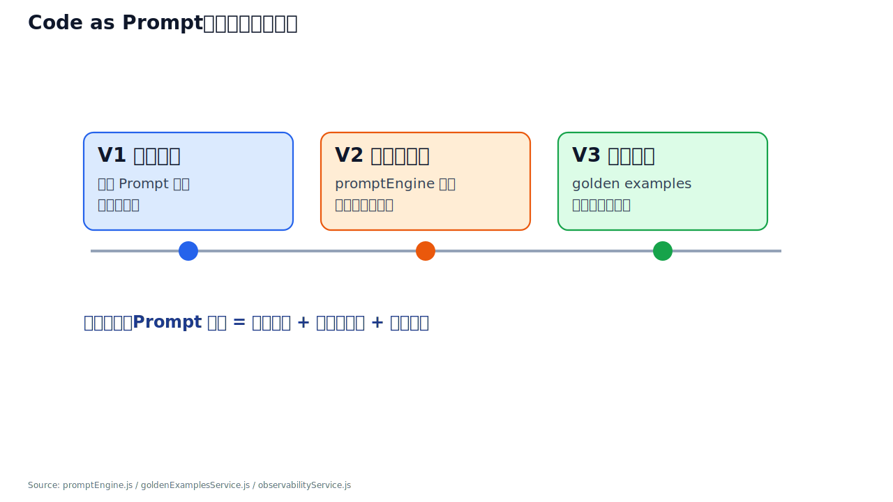
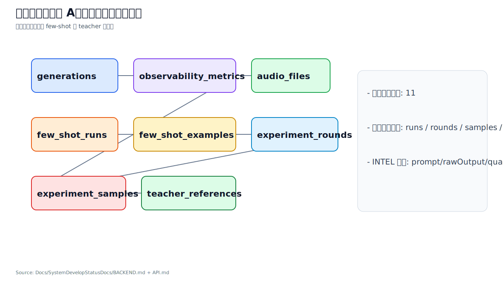
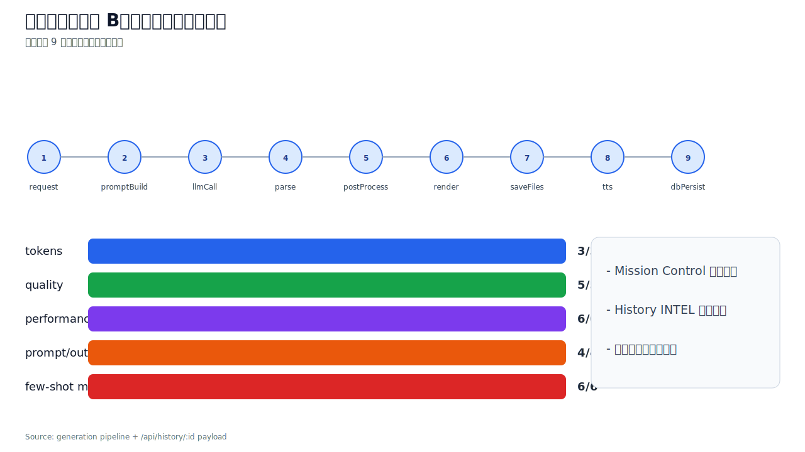
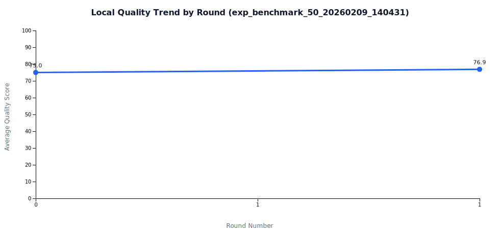
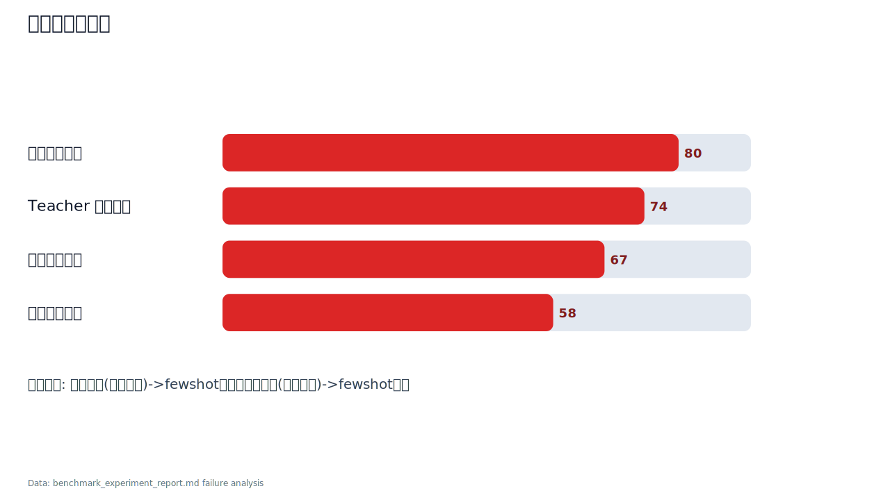
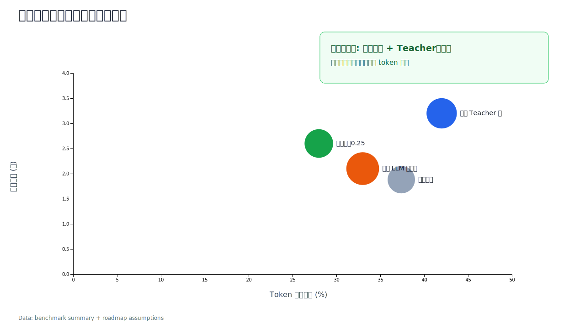
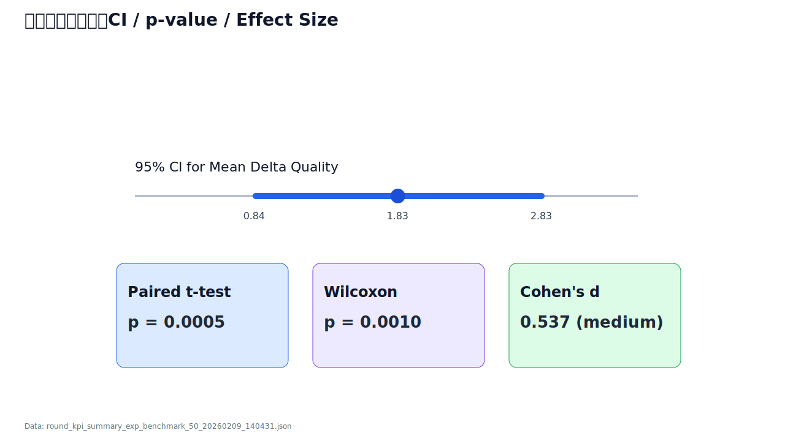

# Trilingual Records: Few-shot 提质汇报大纲 (Final)

**演示主题**: Code as Prompt — 基于代码演进驱动的本地 LLM 提质实践  
**受众**: 技术评审 / 项目管理 / 架构与算法团队  
**技术栈**: Node.js + D3.js + Gemini 3 Pro (Teacher) + Qwen 2.5-7B (Student)  
**口径说明**: 全文明确区分不同实验 ID，禁止跨实验混用结论

---

## Slide 0 概念界定：Prompt Engineering / Code as Prompt / Few-shot

- 目标一句话：先统一三者边界，避免后续把“方法”“工程实现”“策略机制”混为一谈。
- 核心内容：
  - `Prompt Engineering`：总方法论，定义任务目标、约束、评测与迭代闭环。
  - `Code as Prompt`：工程范式，把 Prompt 变成可编排、可版本化、可回归的代码系统。
  - `Few-shot`：运行时策略，在上下文预算内注入高质量示例来提升稳定性与精度。
  - 层级关系：**方法论（PE） -> 工程承载（Code as Prompt） -> 策略插件（Few-shot）**。


**讲者备注**：这页只做“术语定标”，后续所有实验结果都回到这三个层级解释。  
**Data Source**: `services/promptEngine.js`, `services/goldenExamplesService.js`, `Docs/TestDocs/fewshot_experiment_report.md`

---

## Slide 1 封面：问题与目标

- 目标一句话：在不依赖云端推理主链路的前提下，让本地 LLM 输出质量可测量地提升。
- 核心内容：
  - 业务场景：文本/OCR -> 三语卡片 + TTS
  - 核心挑战：质量、稳定性、成本三者冲突
  - 本次要回答的问题：**few-shot 是否"统计显著地有效"**


**讲者备注**：先定义问题，承诺后续用数据和统计检验验证。开场即提出“统计显著”标准。  
**Data Source**: `Docs/TestDocs/data/round_metrics_exp_benchmark_50_20260209_140431.csv`

---

## Slide 2 成功标准：评估框架

- 目标一句话：先定义"什么叫优化成功"，再看结果。
- 核心内容：
  - 主指标：`Quality Score`、`Success Rate`
  - 约束指标：`Avg Tokens`、`Avg Latency`
  - 效率指标：`Gain per 1k Extra Tokens = DeltaQuality / (DeltaTokens/1000)`
  - 稳定性指标：`Quality CV%`
  - **统计指标**：`p-value`、`95% CI`、`Cohen's d`


**讲者备注**：强调三点——提质不是单看分数、必须带上成本、结论必须有统计支撑。  
**Data Source**: `Docs/TestDocs/data/round_kpi_summary_exp_benchmark_50_20260209_140431.json`

---

## Slide 3 系统架构：从产品到可观测

- 目标一句话：展示系统为何支持可重复实验。
- 核心内容：
  - 前端：生成页 + Mission Control
  - 后端：`server.js` 编排、provider 切换、对比模式
  - 存储：文件系统 + SQLite（含实验表）
  - 关键：所有生成请求自动记录到 `experiment_samples` + `observability_metrics`


**讲者备注**：把“为什么能做实验”归因到结构化落库与追踪链路。  
**Data Source**: `Docs/SystemDevelopStatusDocs/BACKEND.md`, `Docs/SystemDevelopStatusDocs/API.md`

---

## Slide 4 Code as Prompt — 代码即提示词

- 目标一句话：Prompt 是“可迭代代码系统”，不是“一次性文本”。
- 演进主线：V1 静态模板 -> V2 程序化组装 -> V3 运行时 few-shot 注入。
- 单案例指标（打招呼）：Quality `64 -> 73`（`+14.1%`），Tokens `870 -> 1291`（`+48.4%`），Latency `27.6s -> 34.4s`（`+24.8%`）。
- 汇报重点：每次 Prompt 变更都可观测、可回放、可门禁。



**讲者备注**：先立住“工程化 Prompt”主论点，再进入数据与机制分解。  
**Data Source**: `services/promptEngine.js`, `services/goldenExamplesService.js`, `Docs/TestDocs/data/rounds/exp_benchmark_50_20260209_140431/*.jsonl`

---

## Slide 4.1 系统观测性子页 A：数据模型与追溯关系

- 目标一句话：质量问题可以定位到“样本-提示词-输出-指标”全链路。
- 数据域：业务生成表 + few-shot 实验表 + teacher 引用表。
- 回放字段：`promptFull`、`rawOutput`、`metadata.fewShot`、`quality/tokens/latency`。
- 汇报口径：异常样本可 1 条 SQL 追溯来源与影响范围。



**讲者备注**：突出“可追溯”是实验可信的前提。  
**Data Source**: `Docs/SystemDevelopStatusDocs/BACKEND.md`, `Docs/SystemDevelopStatusDocs/API.md`

---

## Slide 4.2 系统观测性子页 B：采集时序与指标落点

- 目标一句话：指标必须在正确阶段采集，否则无法解释质量变化原因。
- 时序节点：`request -> promptBuild -> llmCall -> parse -> save -> persist`。
- 指标分组：质量、Token、延迟、few-shot 注入元数据。
- 数据一致性：API 返回值、DB、实验报告三点校验。



**讲者备注**：这页只讲“何时采集什么”，不展开算法细节。  
**Data Source**: `server.js`, `Docs/SystemDevelopStatusDocs/API.md`, `Docs/SystemDevelopStatusDocs/BACKEND.md`

---

## Slide 4.3 Code as Prompt 子页 A：运行时组装架构

- 目标一句话：把 Prompt 工程拆成可替换组件，避免“全量重写”。
- 四层结构：模板层 / 组装层 / 注入层 / 校验层。
- 关键接口：`buildPrompt()`、`getRelevantExamples()`、`buildEnhancedPrompt()`。
- 工程收益：局部调参可独立回归、可灰度发布。


**讲者备注**：强调“可维护架构”而不是“提示词技巧”。  
**Data Source**: `services/promptEngine.js`, `services/goldenExamplesService.js`, `services/observabilityService.js`

---

## Slide 4.4 Code as Prompt 子页 B：实验门禁与发布判定

- 目标一句话：Prompt 发布走“指标门禁”，不走“主观好坏”。
- 门禁维度：`deltaQuality`、`pValue`、`tokenIncreasePct`、`gainPer1kTokens`。
- 判定规则：质量提升 + 显著性 + 成本约束同时满足。
- 结论口径：质量增益成立，但 token 膨胀仍是主瓶颈。


**讲者备注**：把“实验结论”转成可执行发布策略。  
**Data Source**: `Docs/TestDocs/data/round_metrics_exp_benchmark_50_20260209_140431.csv`, `Docs/TestDocs/data/round_kpi_summary_exp_benchmark_50_20260209_140431.json`

---

## Slide 4.5 Code as Prompt 子页 C：单案例 KPI 对照（数据感主图）

- 目标一句话：用 1 个真实样例快速展示“收益与代价”。
- 质量：`64 -> 73`（`+9`，`+14.1%`）。
- 成本：Tokens `+421`（`+48.4%`），Latency `+6835ms`（`+24.8%`）。
- 管理动作：保留 few-shot，但继续压缩注入长度与预算比例。


**讲者备注**：这是面向业务方最直观的一页。  
**Data Source**: `Docs/TestDocs/data/rounds/exp_benchmark_50_20260209_140431/baseline.jsonl`, `Docs/TestDocs/data/rounds/exp_benchmark_50_20260209_140431/fewshot_r1.jsonl`

---

## Slide 4.6 Code as Prompt 子页 D：Prompt Token 构成（预算视角）

- 目标一句话：解释“为什么 token 会涨”。
- 基础 Prompt：`274`（两轮不变）。
- 注入 Token：`0 -> 258`；总 Prompt：`274 -> 532`。
- 注入效率：本例 `countRequested=2`、`countUsed=1`、注入占比 `48.5%`。


**讲者备注**：直连预算调参（`tokenBudgetRatio` / 示例长度裁剪）。  
**Data Source**: `Docs/TestDocs/data/rounds/exp_benchmark_50_20260209_140431/fewshot_r1.jsonl`

---

## Slide 4.7 Code as Prompt 子页 E：阶段贡献拆分（V1/V2/V3）

- 目标一句话：明确质量提升主要来自哪个阶段。
- V1：结构稳定，无新增增益信号。
- V2：参数微调，小幅影响。
- V3：few-shot 注入后与质量提升同步出现（`64 -> 73`）。


**讲者备注**：用于回答“本轮优化到底改进在哪里”。  
**Data Source**: `Docs/TestDocs/data/rounds/exp_benchmark_50_20260209_140431/*.jsonl`

---

## Slide 4.8 Code as Prompt 子页 F：Prompt 差异门禁（上线前检查）

- 目标一句话：给 Prompt 变更增加轻量门禁，避免成本失控。
- 差异指标：Chars `+94.0%`、Lines `+83.7%`、Prompt Tokens `+94.2%`。
- 质量联动：当 Prompt Tokens 增幅 > `80%`，要求质量增幅 >= `+3`。
- 本例状态：质量 `+9`，满足联动门禁，但仍需继续降本。


**讲者备注**：这页给出“可执行门禁阈值”，便于团队统一评审标准。  
**Data Source**: `Docs/TestDocs/data/rounds/exp_benchmark_50_20260209_140431/*.jsonl`

---

## Slide 5 Few-shot 机制：Teacher 样本注入

- 目标一句话：说明 few-shot 不只是开关，而是有检索与筛选策略。
- 核心内容：
  - 样本来源优先级：
    1. 同实验 `teacher_references`（SQL 查询，按 quality_score DESC）
    2. 历史高质量样本（默认 gemini，bigram 相似度重排）
  - 筛选条件：`minScore >= 80`、bigram 关键词相似度排序
  - Token 预算：`contextWindow * tokenBudgetRatio`
  - 回退链：`budget_reduction -> budget_truncate -> budget_exceeded_disable`
  - **代码映射**：
    - `goldenExamplesService.js:bigramSimilarity()` -> Dice coefficient 实现
    - `server.js:handleFewShotInjection()` -> 预算计算与回退逻辑


**讲者备注**：讲清“为什么这套机制有机会提升质量”，以及预算控制如何防止 token 膨胀。  
**Data Source**: `server.js`, `services/goldenExamplesService.js`

---

## Slide 6 一键复现 — 实验可执行性

- 目标一句话：实验从运行到报告全流程脚本化，任何人可在 5 分钟内复现。
- 核心内容：
  - 实验管线 4 步：
    ```text
    run_fewshot_rounds.js           -> 执行实验，输出 JSONL
    export_round_trend_dataset.js   -> 导出数据 + 统计检验
    render_round_trend_charts.mjs   -> D3 渲染 6 类 SVG 图表
    generate_round_kpi_report.js    -> 生成 KPI 报告 Markdown
    ```
  - 一键执行：
    ```bash
    node scripts/run_fewshot_rounds.js benchmark_phrases_50.txt $EXP_ID rounds.json
    node scripts/export_round_trend_dataset.js $EXP_ID
    node d3/render_round_trend_charts.mjs data/round_trend_$EXP_ID.json
    node scripts/generate_round_kpi_report.js $EXP_ID
    ```
  - 输出物：JSON 数据集 + CSV + SVG 图表 + Markdown 报告


**讲者备注**：强调“可复现”是科学方法基础。代码即实验记录，git log 即实验日志。  
**Data Source**: `scripts/run_fewshot_rounds.js`, `scripts/export_round_trend_dataset.js`, `scripts/generate_round_kpi_report.js`

---

## Slide 7 实验设计：50 样本 Benchmark

- 目标一句话：用分类标注的 50 条短语系统验证 few-shot 效果。
- 核心内容：
  - **实验 ID**: `exp_benchmark_50_20260209_140431`
  - **样本设计**：
    - 日常词汇 (15 条)：打招呼、加油、干杯...
    - 技术术语 (20 条)：API Gateway、提示词工程、向量数据库...
    - 歧义/复杂 (15 条)：水很深、带节奏、降维打击...
  - **对照**：baseline (无 few-shot) vs fewshot_r1 (2 示例)
  - **改进点**：修正评分器偏差 + 升级示例选取 + 引入统计检验


**讲者备注**：明确“这次实验比之前 21 样本更可靠”，并解释分类设计的价值。  
**Data Source**: `Docs/TestDocs/data/benchmark_phrases_50.txt`

---

## Slide 8 结果：50 样本实验数据

- 目标一句话：few-shot 提升统计显著，但幅度需诚实报告。
- 核心数据：

| 指标 | Baseline | Fewshot_r1 | Delta |
|------|-------:|-------:|------:|
| 成功率 | 98% | 98% | 0 |
| 平均质量 | 75.00 | 76.88 | **+1.88** |
| 平均 Tokens | 1029 | 1414 | +385 (+37%) |
| 质量 CV% | 5.22% | 4.16% | **-1.06pp** |
| Gain/1k Tokens | - | 4.88 | - |

- **统计检验**：
  - 配对 t-test: **p = 0.0005**
  - Wilcoxon: **p = 0.0010**
  - 95% CI: **[0.84, 2.83]**
  - Cohen's d: **0.537 (medium)**




**讲者备注**：先给结论再解释代价。对比旧实验 +7.33 中评分器偏差部分，保持可信。  
**Data Source**: `Docs/TestDocs/data/round_metrics_exp_benchmark_50_20260209_140431.csv`

---

## Slide 9 分类洞察：谁受益最大？

- 目标一句话：日常词汇提升最大，技术术语提升空间有限。
- 核心数据：

| 类别 | Baseline 质量 | Fewshot 质量 | Delta | Gain/1k Tokens |
|------|-------:|-------:|------:|------:|
| 日常词汇 | 73.47 | 77.20 | **+3.73** | **9.06** |
| 技术术语 | 77.95 | 78.85 | +0.90 | 2.33 |
| 歧义/复杂 | 77.80 | 79.21 | +1.41 | 3.75 |

- **规律**：baseline 质量越低，few-shot 增益越大
- **解读**：
  - 日常词汇短小，模型更需要示例引导
  - 技术术语本身信息密度高，baseline 已较强
  - 歧义表达受益于“多义位展开”示例


**讲者备注**：传递“不同场景效果不同”的细粒度洞察，避免一刀切结论。  
**Data Source**: `Docs/TestDocs/benchmark_experiment_report.md`

---

## Slide 10 自我批判：已知问题与局限

- 目标一句话：承认不足比掩盖缺陷更有价值。
- 核心内容：
  1. **评分器仍为规则驱动**：无法评估语义准确性和翻译流畅度
  2. **Teacher 样本池未充分利用**：本次实验未预注入 Gemini Teacher 参考
  3. **Token 预算紧张**：contextWindow=2048, budget≈368 tokens，部分请求示例被裁剪
  4. **单轮对比**：仅 baseline vs fewshot_r1，未验证多轮渐进
  5. **旧实验偏差修正**：+7.33 中约 5.45 来自评分器长度偏差，真实贡献 +1.88
  - **代码层面的修正**：
    - `observabilityService.js`: `markdown.length > 500` -> 三语结构完整性检查
    - `goldenExamplesService.js`: `LENGTH()` 近邻 -> bigram 相似度重排



**讲者备注**：主动暴露问题建立信任。每个局限对应一个可执行改进方向。  
**Data Source**: `Docs/TestDocs/benchmark_experiment_report.md`

---

## Slide 11 优化路线图：代码变更驱动

- 目标一句话：每个优化方向都绑定具体代码变更。
- 核心内容：

| 阶段 | 优化方向 | 代码变更 | 预期影响 |
|------|------|------|------|
| 30天 | 扩充 Teacher 池 | `run_fewshot_rounds.js` 增加 teacher-seed 轮 | quality +2~3 |
| 30天 | 放宽 token 预算 | `tokenBudgetRatio: 0.18 -> 0.25` | 减少回退 |
| 60天 | 语义检索替代 bigram | `goldenExamplesService.js` -> 向量召回 | 示例相关度 +50% |
| 60天 | LLM 评分器 | `observabilityService.js` -> GPT/Gemini 评分 | 评估准确度 |
| 90天 | 多 Teacher 融合 | 新增 `teacherFusionService.js` | 多源一致性 |
| 90天 | Unified LLM Layer | `llmUnifiedService.js` (Vercel AI SDK) | 降低维护成本 |


**讲者备注**：路线图不是口号，每一项都要能定位到文件级改动。  
**Data Source**: `Docs/DesignDocs/CodeAsPrompt/Few-Shot机制设计方案.md`, `Docs/DesignDocs/LLM_Provider_Unified_Layer_Design.md`

---

## Slide 12 工程价值：可观测 + 可追溯 + 可复制

- 目标一句话：few-shot 不只是模型优化，也是工程效率优化。
- 核心内容：
  - **可观测**：每次生成自动记录 token、延迟、质量分到 SQLite
  - **可追溯**：实验参数、样本、输出、指标全链路可复盘
  - **可复制**：脚本化管线，任何人可在新环境重跑实验
  - **可验证**：统计检验集成到导出脚本，报告自动包含 p-value/CI
  - **代码证据**：
    - `databaseService.js` -> 11 张表自动建表
    - `statisticsService.js` -> 4 种检验方法，零外部依赖
    - `export_round_trend_dataset.js` -> 导出时自动配对检验


**讲者备注**：从“算法收益”上升到“研发效能收益”。代码本身就是文档。  
**Data Source**: `Docs/SystemDevelopStatusDocs/BACKEND.md`, `Docs/TestDocs/data/round_kpi_summary_exp_benchmark_50_20260209_140431.json`

---

## Slide 13 总结与决策请求

- 目标一句话：确认继续投入方向与验收方式。
- 核心结论：
  - Few-shot 提升**统计显著** (p=0.0005, d=0.537)
  - 真实提升 **+1.88 分**（修正评分器偏差后）
  - 日常词汇受益最大 (+3.73)，技术术语受益有限 (+0.90)
  - 稳定性改善 (CV: 5.22% -> 4.16%)
  - Token 成本 +37%，延迟 +6%
- 决策请求：
  1. 批准扩充 Teacher 池（预计 +2~3 质量增益）
  2. 放宽 token 预算到 0.25（减少回退截断）
  3. 启动 LLM 评分器替代规则评分
  4. 确认 30/60/90 天 KPI 阈值



**讲者备注**：用数据说话，以决策请求收尾。每个请求都绑定可量化预期收益。  
**Data Source**: `Docs/TestDocs/完整测试报告_20260206.md`, `Docs/TestDocs/benchmark_experiment_report.md`

---

## Slide 14 附录：统计显著性展开页

- 目标一句话：展示“显著性”不是口头结论，而是有完整证据链。
- 核心内容：
  - Mean diff: +1.83
  - 95% CI: [0.84, 2.83]
  - paired t-test p=0.0005
  - Wilcoxon p=0.0010
  - Cohen's d=0.537（medium）



**Data Source**: `Docs/TestDocs/data/round_kpi_summary_exp_benchmark_50_20260209_140431.json`

---

## Slide 15 附录：历史实验对照（21 vs 50）

- 目标一句话：解释为什么旧实验增幅更高，但新实验更可信。
- 核心内容：
  - 21 样本实验：增幅大，但受评分器偏差影响更高
  - 50 样本实验：增幅较小，但统计显著性更完整
  - 策略：以后以“显著性+可复现性”为验收主口径


**Data Source**: `Docs/TestDocs/data/round_metrics_exp_round_local20plus_20260206_073637.csv`, `Docs/TestDocs/data/round_metrics_exp_benchmark_50_20260209_140431.csv`

---

## Slide 16 附录：实验产物覆盖度

- 目标一句话：量化当前实验体系的“资产化程度”。
- 核心内容：
  - 数据文件规模
  - 图表产物规模
  - 报告沉淀规模
  - 形成可复盘、可审计、可复现的技术资产库


**Data Source**: `Docs/TestDocs/` 文件系统统计

---

*Data Baseline: `exp_benchmark_50_20260209_140431` | Pipeline: run -> export -> chart -> report | Statistical tests: paired t-test, Wilcoxon, 95% CI, Cohen's d*  
*D3 Chart Script: `d3/render_slides_outlines_charts.mjs` -> output `Docs/TestDocs/charts/slide_*.svg`*
