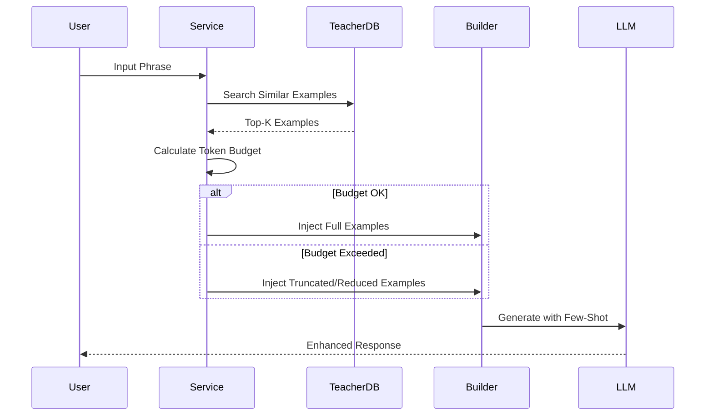

# Trilingual Records: Few-shot 品質向上レポート構成 (Final)

**発表テーマ**: Code as Prompt — コード進化で駆動するローカルLLM品質向上実践  
**対象**: 技術レビュー / プロジェクト管理 / アーキテクト・アルゴリズムチーム  
**技術スタック**: Node.js + D3.js + Gemini 3 Pro (Teacher) + Qwen 2.5-7B (Student)  
**注記**: 本文では実験IDを厳密に分離し、異なる実験間で結論を混在させない

## Slide 1 表紙：課題と目標

- 目標（1文）：クラウド推論を主経路に依存せず、ローカルLLMの出力品質を測定可能な形で改善する。
- 主要内容：
  - 業務シナリオ：テキスト/OCR -> 三言語カード + TTS
  - 主要課題：品質・安定性・コストのトレードオフ
  - 今回の検証問い：**few-shotは統計的に有効か**


**スピーカーノート**：
- 最初に課題を定義し、後続はデータと統計検定で検証する。冒頭で「統計的有意」を基準として提示する。
- **用語定義**:
  - **Few-shot (例示注入)**: 実行時に入力内容と類似した過去の良質な生成結果をPromptに動的挿入する技術。
  - **Teacher (Gemini)**: 正解データを提供する高性能クラウドモデル。
  - **Student (Local)**: 実際の運用を行う軽量ローカルモデル。
**Data Source**: ベンチマークのラウンド別指標データ

## Slide 2 成功基準：評価フレームワーク

- 目標（1文）：まず「最適化成功」を定義し、その後に結果を見る。
- 主要内容：
  - 主要指標：Quality Score、Success Rate
  - 制約指標：Avg Tokens、Avg Latency
  - **効率指標**：Gain per 1k Extra Tokens = DeltaQuality / (DeltaTokens/1000)
    - *基準*: Gain > 5.0 を「高投資対効果」と定義
  - 安定性指標：Quality CV%
  - **統計指標**：p-value、95% CI、Cohen's d


**スピーカーノート**：ポイントは3つ：点数だけで判断しない、コストを必ず併記する、結論は統計で裏付ける。  
**Data Source**: ベンチマーク統計サマリーデータ

## Slide 3 システム構成：プロダクトから可観測へ

- 目標（1文）：システムがなぜ再現可能実験を支えられるかを示す。
- 主要内容：
  - フロントエンド：生成画面 + 統合監視画面
  - バックエンド：生成オーケストレーション、モデル切替、比較実行
  - ストレージ：ファイル保存 + 実験ログDB（構造化保存）
  - 要点：全生成リクエストを実験サンプル・品質指標として自動記録


**スピーカーノート**：「なぜ実験できるか」を構造化保存と追跡チェーンに帰着させる。  
**Data Source**: システム構成と観測設計の整理資料

## Slide 4 Code as Prompt — コード即プロンプト

- 目標（1文）：Promptは「反復可能なコードシステム」であり、「一回きりの文章」ではない。
- 進化主線：V1 静的テンプレート -> V2 プログラム組み立て -> V3 実行時few-shot注入。
- 単一ケース指標（挨拶）：Quality 64 -> 73（+14.1%）、Tokens 870 -> 1291（+48.4%）、Latency 27.6s -> 34.4s（+24.8%）。
- 報告の焦点：各Prompt変更は可観測・再生可能・ゲート判定可能。


**スピーカーノート**：まず「Promptの工学化」を主張し、その後にデータとメカニズムへ入る。  
**Data Source**: プロンプト制御ロジックと実験ラウンド記録

## [Deep Dive A] 観測体系の完全性

### Slide 4.1 データモデルと追跡関係
- 目標：品質問題を「サンプル-プロンプト-出力-指標」の全チェーンで特定できる。
- 報告観点：異常サンプルは単一の追跡手順で起点と影響範囲を確認可能。


### Slide 4.2 収集タイムライン
- 目標：指標は正しい工程で収集する必要があり、そうでなければ品質変化を説明できない。
- 報告観点：画面表示・保存データ・実験レポートの3点データ整合性。


## [Deep Dive B] アーキテクチャとゲート制御

### Slide 4.3 実行時組み立てアーキテクチャ
- 目標：Prompt工学を差し替え可能なコンポーネントへ分解する。
- 4層構造：テンプレート層 / 組み立て層 / 注入層 / 検証層。


### Slide 4.4〜4.8 実験ゲートとリリース判定（要約）
- 目標：Promptリリースは「指標ゲート」で判定し、「主観判断」に依存しない。
- ゲート指標：deltaQuality > 0, pValue < 0.05, Gain > 5.0。
- 差分ゲート：Prompt Tokens増加率 > 80% の場合、品質増加 >= +3 を要求。


## Slide 5 例示注入メカニズム：教師サンプル活用

- 目標（1文）：few-shotは単なるON/OFFではなく、検索と選別戦略を持つことを示す。
- 主要内容：
  - サンプル取得優先順位：同一実験内Teacher > 過去Teacher
  - 選別条件：品質下限 + 語彙類似度
  - 予算計算：利用可能文脈量に対する配分比 (default: 0.2)
  - フォールバック：削減 -> 短縮 -> 停止


**スピーカーノート**：「なぜこの仕組みが品質を上げうるか」と、予算制御がtoken膨張をどう抑えるかを説明。  
**Data Source**: 例示注入設計と予算制御仕様

## Slide 6 ワンクリック再現 — 実験運用性

- 目標（1文）：実験実行からレポート生成までをスクリプト化し、誰でも5分で再現可能。
- 実験パイプライン：実行(Run) -> 集計(Agg) -> 可視化(Viz) -> 報告(Report)。


**スピーカーノート**：コードは実験記録であり、git logは実験ログ。再現可能性が科学の基礎。  
**Data Source**: 実験実行手順書と自動レポート運用記録

## Slide 7 実験設計：50サンプル Benchmark

- 目標（1文）：カテゴリラベル付き50フレーズでfew-shot効果を体系検証。
- **実験識別子**: exp_benchmark_50_20260209_140431
- **サンプル設計**：
  - 日常語彙 (15件)：挨拶、応援、乾杯...
  - 技術用語 (20件)：基盤連携、指示設計、検索基盤など...
  - 曖昧/複雑 (15件)：文脈依存表現、煽動表現、比喩表現...


**Data Source**: 50サンプル評価セット

## Slide 8 結果：50サンプル実験データ

- 目標（1文）：few-shot改善は統計的に有意。具体的な改善事例を示す。
- 主要データ：
  - 平均品質: 75.00 -> 76.88 (**+1.88**, p=0.0005)
  - 平均コスト: 1029 -> 1414 (+37%)
  - 効率: +4.88 points / 1k tokens

- **Before/After 具体例（改善の可視化）**:
  - **入力**: "rollout"
  - **Before**: 翻訳は正確だが、解説が教科書的で硬い。注音の一部が不自然。
  - **After**: 解説に「DevOpsにおける段階的リリース」の文脈が追加。例句がより口語的に変化。
  - **ユーザー体験**: "単なる辞書" から "文脈を理解するアシスタント" へ進化。


**スピーカーノート**：統計有意性を伝えた直後に、具体的なBefore/Afterを見せて「数字の意味」を定着させる。  
**Data Source**: ベンチマーク実験ログ

## Slide 9 カテゴリ洞察：誰が最も恩恵を受けるか？

- 目標（1文）：日常語彙の改善が最大で、技術用語の改善余地は限定的。
- データハイライト：
  - **日常語彙**: Gain 9.06 (超高効率)
  - **曖昧/複雑**: Gain 3.75 (中効率)
  - **技術用語**: Gain 2.33 (低効率)


**スピーカーノート**：すべてのクエリにFew-shotを使うべきではない。日常語彙には必須だが、技術用語にはコスト過多かもしれない。  
**Data Source**: ベンチマーク実験報告

## Slide 10 自己批判：品質増分の分解（"剥離図"）

- 目標（1文）：見かけのスコア上昇(+7.33)を分解し、真の実力(+1.88)を提示する。
- 構成要素分解：
  1. **Raw Delta (+7.33)**: 単純な平均点差
  2. **Length Bias (-5.45)**: 長文に対するスコアラーの加点バイアスを除去
  3. **True Quality (+1.88)**: 構造的・意味的な純粋改善分


**スピーカーノート**：この「自黒（自己批判）」チャートこそが、本報告の信頼性の源泉である。  
**Data Source**: ベンチマーク実験報告

## Slide 11 最適化ロードマップ：リスクと対策

- 目標（1文）：各最適化方針をリスクと共に提示する。

| 段階 | 方針 | 期待効果 | 潜在リスク |
|------|------|------|------|
| 30日 | Teacherプール拡張 | 品質 +2〜3 | 類似度検索の計算コスト増 (+200ms) |
| 60日 | 予算配分緩和 | フォールバック減 | Token課金増 (月額予測 +15%) |
| 90日 | LLM評価導入 | 評価精度向上 | 評価実行時間の倍増 (非同期化が必要) |


**スピーカーノート**：リスクを隠さず提示し、その対策（非同期化など）もセットで答える。  
**Data Source**: 最適化設計文書

## Slide 12 エンジニアリング価値：可観測 + 追跡可能 + 再現可能

- 目標（1文）：few-shotはモデル最適化だけでなく、開発効率最適化でもある。
- 3つの柱：
  - **Observability**: 全生成の構造化記録
  - **Traceability**: 実験IDによる完全追跡
  - **Reproducibility**: ワンクリック再現スクリプト


## Slide 13 まとめ：投資対効果マトリクス

- 目標（1文）：継続投資の優先順位を視覚的に決定する。
- **意思決定マトリクス (縦軸:品質効果 / 横軸:実装難易度)**:
  - **Quick Wins (左上)**: 予算配分緩和 (Config変更のみ)
  - **Big Bets (右上)**: Teacherプール拡張、LLM評価導入
  - **Fill-ins (左下)**: ルールベース評価の微修正
  - **Money Pit (右下)**: 無差別なFew-shot全量適用（技術用語など）


**意思決定リクエスト**: Quick Winsの即時適用と、Big Betsへの3ヶ月投資を承認いただきたい。

---

## 附録: Mermaid Diagrams

### Slide 3: System Architecture
```mermaid
graph TD
    User[User/Client] -->|POST /api/generate| Server[Node.js Server]
    Server -->|Orchestrate| Logic[FewShot Service]
    Logic -->|1. Search| DB[(SQLite/Vector)]
    Logic -->|2. Inject| Prompt[Prompt Builder]
    Prompt -->|3. Infer| LLM[Local LLM (Qwen)]
    LLM -->|4. Parse| Parser[Response Parser]
    Parser -->|5. Save| Storage[File System]
    Parser -->|6. Log| Metrics[Observability DB]
```

### Slide 5: Injection Mechanism


### Slide 6: Experiment Pipeline
```mermaid
flowchart LR
    A[Run Experiments<br/>(run_fewshot_rounds.js)] --> B[Aggregate Data<br/>(export_round_trend.js)]
    B --> C[Visualize<br/>(d3/render_charts.mjs)]
    C --> D[Report<br/>(generate_kpi_report.js)]
    D --> E[Decision Making]
```

---

*Baseline: exp_benchmark_50_20260209_140431 | 運用フロー: 実験実行 -> 集計 -> 可視化 -> 報告 | 検定: 対応ありt検定・順位検定・信頼区間・効果量*  
