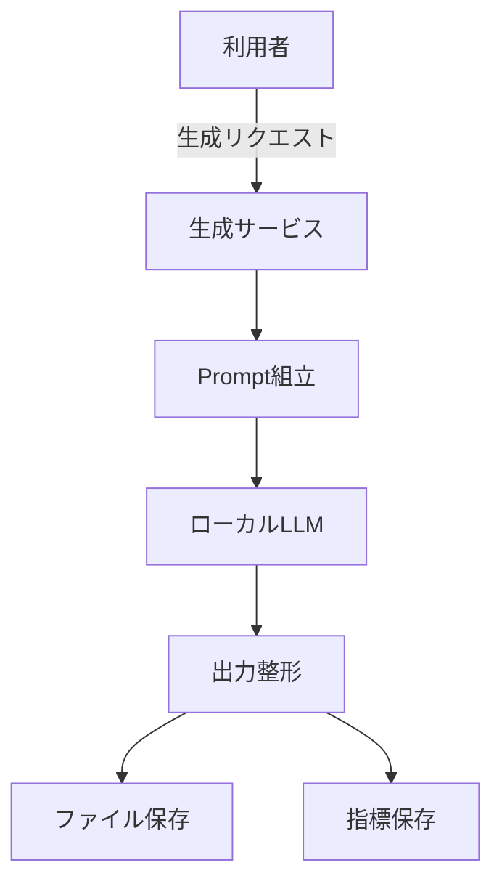
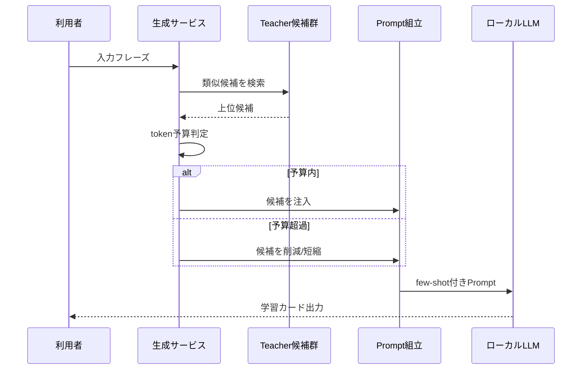
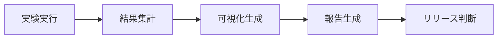

# Trilingual Records: Few-shot 品質改善レポート（JP版・改訂）

**発表テーマ**: Code as Prompt — コード進化で駆動するローカルLLM品質改善  
**対象**: 技術レビュー / PM / アーキテクト / アルゴリズムチーム  
**技術構成**: Node.js + D3.js + Gemini 3 Pro (Teacher) + Qwen 2.5-7B (Student)  
**前提**: 実験IDを分離し、異なる実験の結論を混在させない

---

## Slide 1 表紙：課題と到達目標

- **目的**: クラウド依存を抑えつつ、ローカルLLMの品質改善を定量管理する。
- **要点**:
  - 業務シナリオ: テキスト/OCR -> 三言語カード -> TTS
  - 制約: 品質・コスト・安定性の同時最適化
  - 検証問い: **few-shotは統計的に有効か**

**話すポイント**:
- 先に「評価軸」を固定し、後続スライドはすべて同じ軸で比較する。
- few-shotを機能ではなく「再現可能な運用単位」として扱う。

**出典**: ベンチマーク評価設計

---

## Slide 2 成功基準：評価フレーム

- **目的**: 結果を見る前に「成功判定」を明文化する。
- **要点**:
  - 主要指標: Quality Score / Success Rate
  - 制約指標: Avg Tokens / Avg Latency
  - 効率指標: Gain per 1k Extra Tokens
  - 統計指標: p-value / 95% CI / Cohen's d

**話すポイント**:
- 品質単独では判断しない。必ずコストと統計を同時提示する。
- 「改善したように見える」ではなく「有意差がある」を採用条件にする。

**出典**: `round_kpi_summary_exp_benchmark_50_20260209_140431.json`

---

## Slide 3 システム構成：実験再現を支える土台

- **目的**: なぜこのシステムで再現可能実験が成立するかを示す。
- **要点**:
  - UI -> Backend -> Prompt Engine -> Model の実行導線
  - 保存層で md/html/audio と指標を同時保存
  - 実験層で runs/samples/metrics をラウンド管理

**話すポイント**:
- 「生成成功」より「追跡可能性」を重視する設計にしている。
- 1リクエストが、そのまま分析可能な実験サンプルになる。

**出典**: backend/frontend + observability 実装

---

## Slide 4 Code as Prompt：進化の主線

- **目的**: Promptを“文章”ではなく“進化可能なコードシステム”として扱う。
- **要点**:
  - V1: 静的テンプレート
  - V2: プログラム組立
  - V3: 実行時few-shot注入
  - 単一ケース（挨拶）: Quality +14.1%、Tokens +48.4%、Latency +24.8%

**話すポイント**:
- 各バージョンを「差分として計測」できることが重要。
- Prompt改善は、コード改修 + 計測 + 判定のループで成立する。

**出典**: prompt制御ロジック + ラウンド記録

---

## [Deep Dive A] 観測体系

### Slide 4.1 データモデルと追跡関係

- **目的**: 品質問題をサンプル単位で特定可能にする。
- **観点**:
  - 生成記録・指標・音声・実験記録をIDで接続
  - Prompt/Output/Qualityを同一サンプルで再参照可能

### Slide 4.2 収集タイムライン

- **目的**: 指標の採取地点を固定し、解釈ブレを防ぐ。
- **観点**:
  - 9工程で計測地点を固定
  - 画面・DB・レポートの三者整合を担保

---

## [Deep Dive B] アーキテクチャとゲート

### Slide 4.3 実行時組立アーキテクチャ

- **目的**: Prompt処理を差し替え可能な4層へ分解する。
- **4層**: テンプレ層 / 組立層 / 注入層 / 検証層

### Slide 4.4 リリースゲート判定

- **目的**: Promptリリースを主観ではなく指標で判定する。
- **ゲート条件**:
  - `deltaQuality > 0`
  - `p-value < 0.05`
  - `Gain > 5.0`
  - 高コスト時は追加条件（品質増加しきい値）

---

## Slide 5 例示注入メカニズム

- **目的**: few-shotが単純なON/OFFではないことを示す。
- **要点**:
  - 候補取得: Teacher優先の類似検索
  - 選別: 品質下限 + 類似度
  - 予算: contextに対する配分比
  - 超過時: 削減 -> 短縮 -> 無効化

**話すポイント**:
- 品質改善とtoken管理はトレードオフではなく制御対象。

**出典**: `goldenExamplesService` / token予算ロジック

---

## Slide 6 実験運用：再現パイプライン

- **目的**: 実験実行から報告までを標準化する。
- **要点**:
  - Run -> Aggregate -> Visualize -> Report
  - 同一条件で再実行して同じ結論を再取得

**話すポイント**:
- 再現性がない改善は運用価値が低い。

**出典**: 実験スクリプトと報告運用

---

## Slide 7 実験設計：50サンプル

- **目的**: few-shot効果をカテゴリ横断で検証する。
- **実験ID**: `exp_benchmark_50_20260209_140431`
- **サンプル構成**:
  - 日常語彙: 15
  - 技術用語: 20
  - 曖昧/複雑: 15

**出典**: `benchmark_phrases_50.txt`

---

## Slide 8 主要結果：50サンプル比較

- **目的**: 改善量とコスト増を同時に可視化する。
- **主要結果**:
  - 平均品質: `75.00 -> 76.88`（+1.88）
  - 平均トークン: `1029 -> 1414`（+37%）
  - 効率: `4.88 points / 1k tokens`
  - 統計: `p=0.0005`（有意）
- **ケース（rollout）**:
  - Before: 辞書的で硬い
  - After: 文脈（段階的リリース）を含む説明へ改善

**出典**: ラウンド比較ログ

---

## Slide 9 カテゴリ洞察

- **目的**: どのカテゴリで投資対効果が高いかを示す。
- **Gain per 1k tokens**:
  - 日常語彙: 9.06
  - 曖昧/複雑: 3.75
  - 技術用語: 2.33

**話すポイント**:
- few-shotは全件一律適用ではなく、対象選別が必要。

**出典**: カテゴリ別集計

---

## Slide 10 自己批判：改善値の分解

- **目的**: 見かけ値と実質値を分離して信頼性を担保する。
- **分解**:
  1. Raw Delta: +7.33
  2. Length Bias: -5.45
  3. True Quality: +1.88

**話すポイント**:
- この分解があるため、過大評価を回避できる。

**出典**: バイアス補正分析

---

## Slide 11 最適化ロードマップ

- **目的**: 施策ごとの効果とリスクを同時提示する。

| 段階 | 方針 | 期待効果 | 潜在リスク |
|---|---|---|---|
| 30日 | Teacherプール拡張 | 品質 +2〜3 | 類似検索 +200ms |
| 60日 | 予算配分緩和 | fallback減少 | 月間コスト +15% |
| 90日 | LLM評価導入 | 評価精度向上 | 評価時間 x2 |

**出典**: 最適化設計文書

---

## Slide 12 エンジニアリング価値

- **目的**: few-shotを“モデル改善”だけでなく“開発改善”として位置づける。
- **3本柱**:
  - Observability: 記録可能
  - Traceability: 追跡可能
  - Reproducibility: 再実行可能

**出典**: 可観測性実装

---

## Slide 13 意思決定：投資優先順位

- **目的**: 実装難易度と品質効果で優先度を確定する。
- **推奨順**:
  1. 予算配分緩和（Quick Win）
  2. Teacherプール拡張（中期）
  3. LLM評価導入（中長期）

**意思決定リクエスト**:
- Quick Winを即時実施
- Big Betに対して3ヶ月の継続投資を承認

---

## 付録: Mermaid（発表用補助）

### Slide 3: システム全体

### Slide 5: few-shot注入フロー

### Slide 6: 実験パイプライン

