# Trilingual Records: Few-shot 品質向上レポート構成 (Final)

**発表テーマ**: Code as Prompt — コード進化で駆動するローカルLLM品質向上実践  
**対象**: 技術レビュー / プロジェクト管理 / アーキテクト・アルゴリズムチーム  
**技術スタック**: Node.js + D3.js + Gemini 3 Pro (Teacher) + Qwen 2.5-7B (Student)  
**注記**: 本文では実験IDを厳密に分離し、異なる実験間で結論を混在させない

## Slide 1 表紙：課題と目標

- 目標（1文）：クラウド推論を主経路に依存せず、ローカルLLMの出力品質を測定可能な形で改善する。
- 主要内容：
  - 業務シナリオ：テキスト/OCR -> 三言語カード + TTS
  - 主要課題：品質・安定性・コストのトレードオフ
  - 今回の検証問い：**few-shotは統計的に有効か**

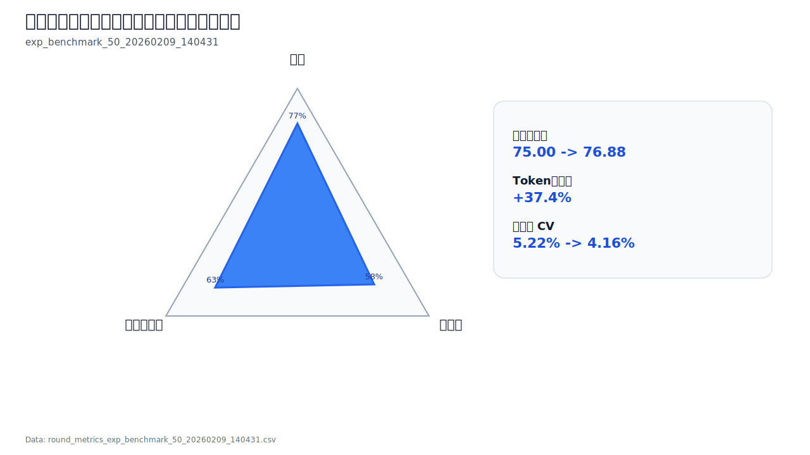

**スピーカーノート**：最初に課題を定義し、後続はデータと統計検定で検証する。冒頭で「統計的有意」を基準として提示する。  
**Data Source**: ベンチマークのラウンド別指標データ

## Slide 2 成功基準：評価フレームワーク

- 目標（1文）：まず「最適化成功」を定義し、その後に結果を見る。
- 主要内容：
  - 主要指標：Quality Score、Success Rate
  - 制約指標：Avg Tokens、Avg Latency
  - 効率指標：Gain per 1k Extra Tokens = DeltaQuality / (DeltaTokens/1000)
  - 安定性指標：Quality CV%
  - **統計指標**：p-value、95% CI、Cohen's d

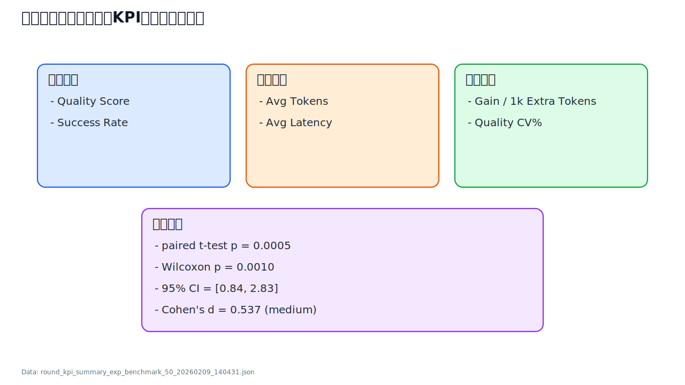

**スピーカーノート**：ポイントは3つ：点数だけで判断しない、コストを必ず併記する、結論は統計で裏付ける。  
**Data Source**: ベンチマーク統計サマリーデータ

## Slide 3 システム構成：プロダクトから可観測へ

- 目標（1文）：システムがなぜ再現可能実験を支えられるかを示す。
- 主要内容：
  - フロントエンド：生成画面 + 統合監視画面
  - バックエンド：生成オーケストレーション、モデル切替、比較実行
  - ストレージ：ファイル保存 + 実験ログDB（構造化保存）
  - 要点：全生成リクエストを実験サンプル・品質指標として自動記録

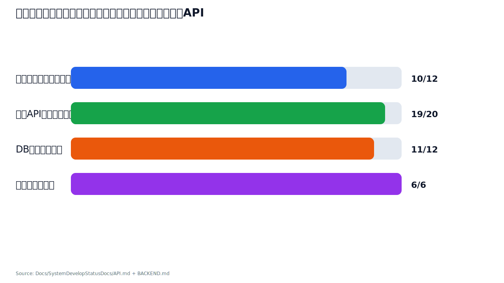

**スピーカーノート**：「なぜ実験できるか」を構造化保存と追跡チェーンに帰着させる。  
**Data Source**: システム構成と観測設計の整理資料

## Slide 4 Code as Prompt — コード即プロンプト

- 目標（1文）：Promptは「反復可能なコードシステム」であり、「一回きりの文章」ではない。
- 進化主線：V1 静的テンプレート -> V2 プログラム組み立て -> V3 実行時few-shot注入。
- 単一ケース指標（挨拶）：Quality 64 -> 73（+14.1%）、Tokens 870 -> 1291（+48.4%）、Latency 27.6s -> 34.4s（+24.8%）。
- 報告の焦点：各Prompt変更は可観測・再生可能・ゲート判定可能。

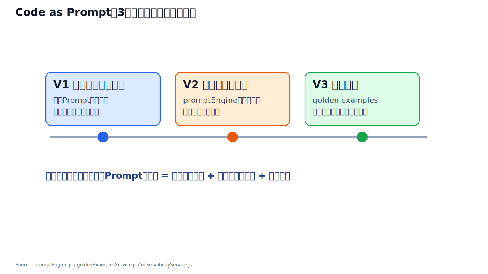

**スピーカーノート**：まず「Promptの工学化」を主張し、その後にデータとメカニズムへ入る。  
**Data Source**: プロンプト制御ロジックと実験ラウンド記録

## Slide 4.1 システム可観測性サブページA：データモデルと追跡関係

- 目標（1文）：品質問題を「サンプル-プロンプト-出力-指標」の全チェーンで特定できる。
- データ領域：生成ログ領域 + 実験ログ領域 + 教師参照領域。
- 再生フィールド：入力要件、モデル生出力、注入有無、品質/コスト/遅延。
- 報告観点：異常サンプルは単一の追跡手順で起点と影響範囲を確認可能。

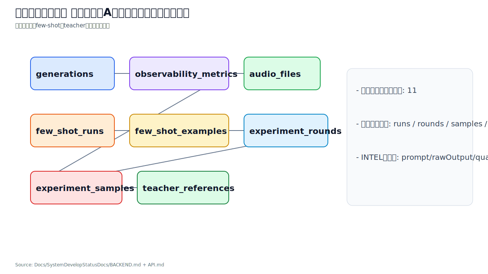

**スピーカーノート**：「追跡可能性」が実験信頼性の前提である点を強調。  
**Data Source**: システム構成と観測設計の整理資料

## Slide 4.2 システム可観測性サブページB：収集タイムラインと指標配置

- 目標（1文）：指標は正しい工程で収集する必要があり、そうでなければ品質変化を説明できない。
- 時系列ノード：受付 -> 指示生成 -> 生成実行 -> 構造化 -> 保存 -> 永続記録。
- 指標グループ：品質、Token、遅延、few-shot注入メタデータ。
- データ整合性：画面表示・保存データ・実験レポートの3点照合。

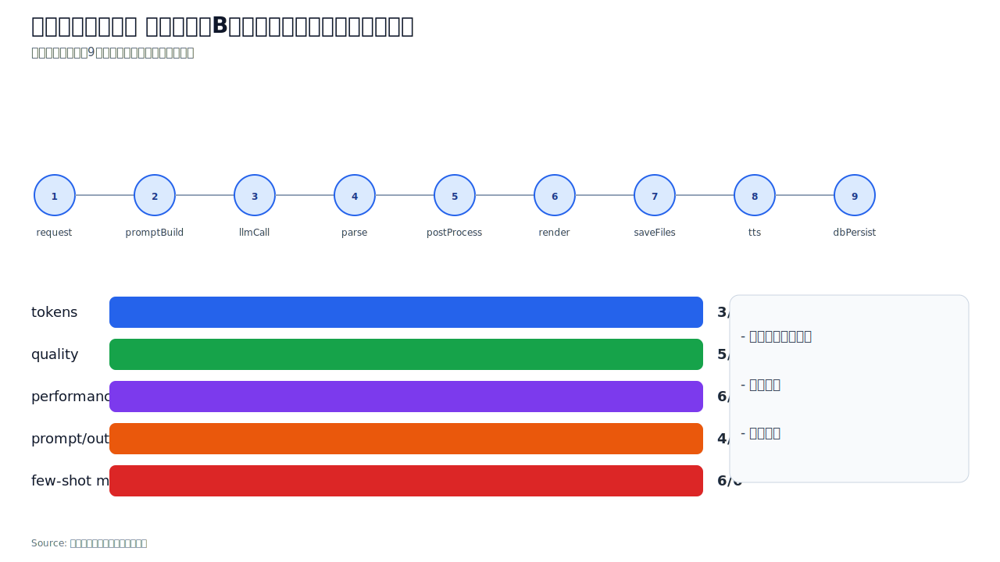

**スピーカーノート**：このページは「いつ何を収集するか」に限定し、アルゴリズム詳細には踏み込まない。  
**Data Source**: 生成処理フロー設計と観測仕様ドキュメント

## Slide 4.3 Code as Prompt サブページA：実行時組み立てアーキテクチャ

- 目標（1文）：Prompt工学を差し替え可能なコンポーネントへ分解し、「全面書き換え」を避ける。
- 4層構造：テンプレート層 / 組み立て層 / 注入層 / 検証層。
- 主要機能：入力要件の構造化、関連例の選定、最終指示の合成。
- 工学的メリット：局所調整を独立回帰でき、段階リリース可能。

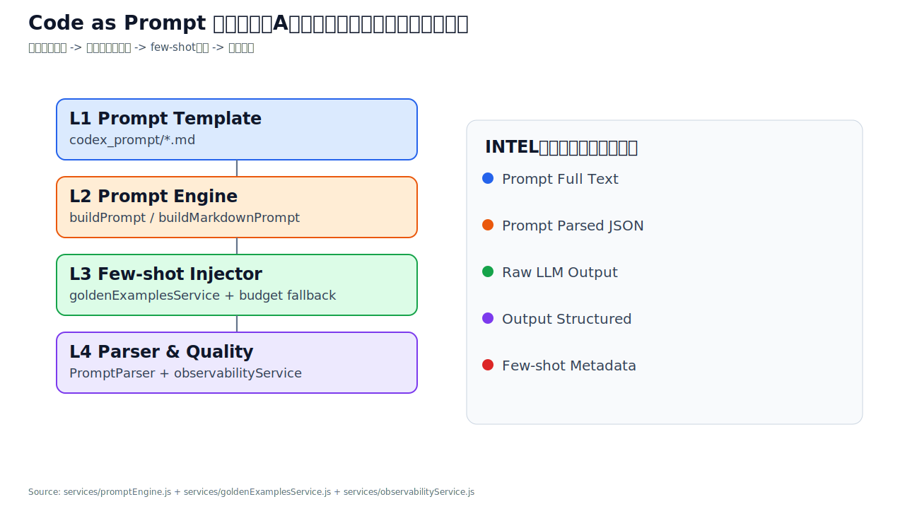

**スピーカーノート**：「プロンプト技巧」ではなく「保守可能アーキテクチャ」を強調。  
**Data Source**: プロンプト生成・例示選定・観測ロジック

## Slide 4.4 Code as Prompt サブページB：実験ゲートとリリース判定

- 目標（1文）：Promptリリースは「指標ゲート」で判定し、「主観判断」に依存しない。
- ゲート指標：deltaQuality、pValue、tokenIncreasePct、gainPer1kTokens。
- 判定ルール：品質向上 + 有意性 + コスト制約を同時に満たす。
- 結論：品質改善は成立するが、token膨張が主ボトルネック。

**スピーカーノート**：「実験結論」を実行可能なリリース戦略へ変換する。  
**Data Source**: ベンチマーク指標集計と統計サマリー

## Slide 4.5 Code as Prompt サブページC：単一ケースKPI比較（データ主図）

- 目標（1文）：1つの実例で「効果と代償」を迅速に示す。
- 品質：64 -> 73（+9、+14.1%）。
- コスト：Tokens +421（+48.4%）、Latency +6835ms（+24.8%）。
- 運用アクション：few-shotを維持しつつ、注入長と予算比率を継続圧縮。

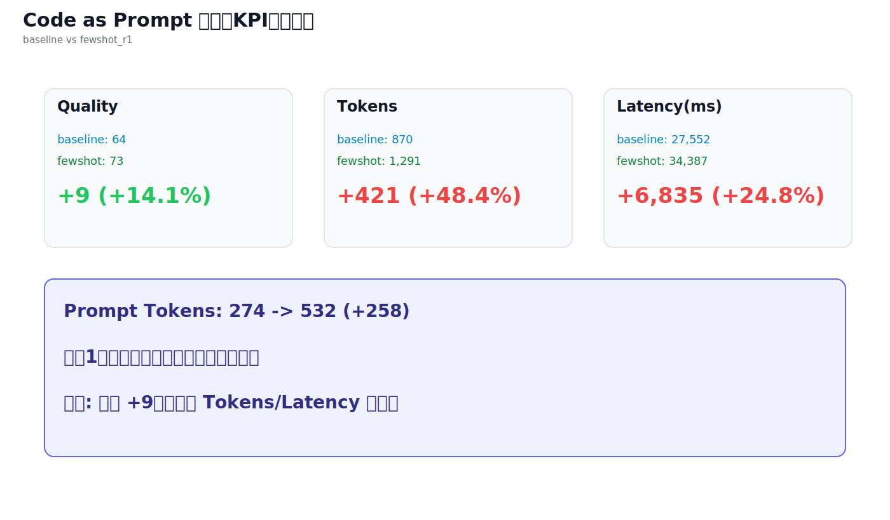

**スピーカーノート**：ビジネス側に最も直感的なページ。  
**Data Source**: ベースライン/改善ラウンドの個票データ

## Slide 4.6 Code as Prompt サブページD：指示文構成（予算視点）

- 目標（1文）：「なぜtokenが増えるか」を説明する。
- ベースPrompt：274（2ラウンド不変）。
- 注入Token：0 -> 258；総Prompt：274 -> 532。
- 注入効率：本ケース countRequested=2、countUsed=1、注入比率 48.5%。

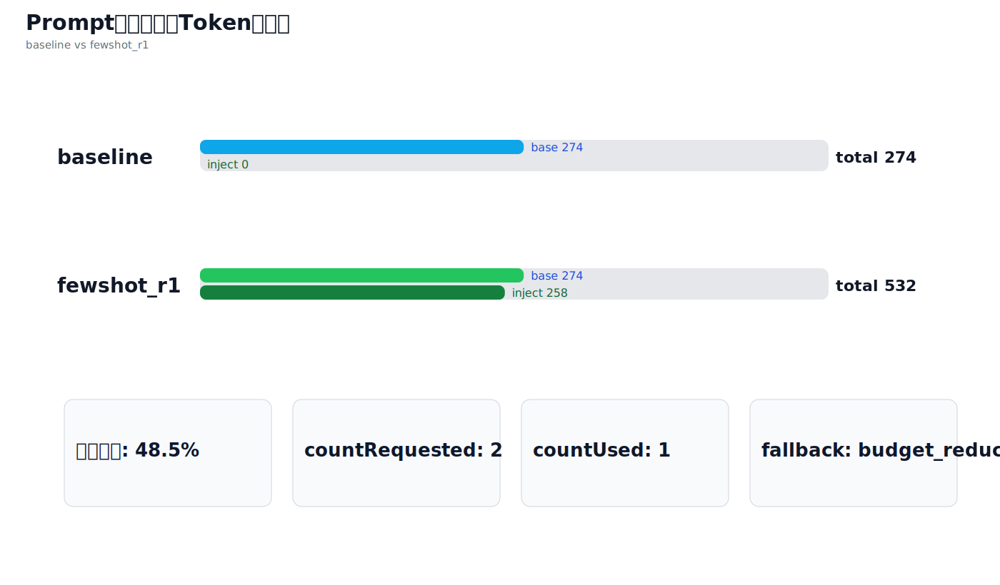

**スピーカーノート**：予算配分と例示長調整の意思決定に直結する。  
**Data Source**: 改善ラウンドの詳細ログ

## Slide 4.7 Code as Prompt サブページE：段階別寄与（V1/V2/V3）

- 目標（1文）：品質改善が主にどの段階由来かを明確化。
- V1：構造は安定し、追加の改善信号なし。
- V2：パラメータ微調整で小幅影響。
- V3：few-shot注入後に品質改善が同時発生（64 -> 73）。

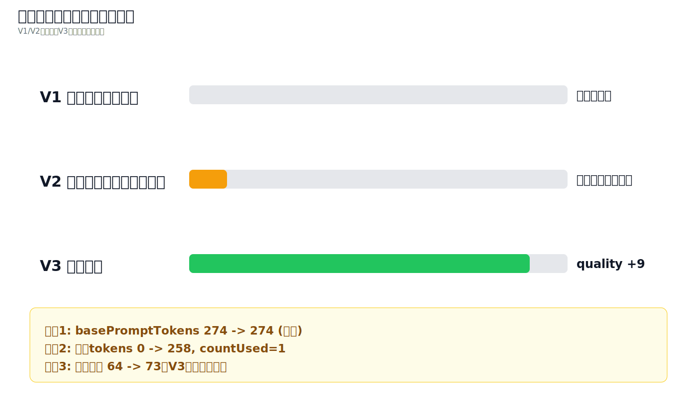

**スピーカーノート**：「今回の改善はどこに効いたか」への回答に使う。  
**Data Source**: ケース別生成ログ（ベースライン/改善）

## Slide 4.8 Code as Prompt サブページF：指示文差分ゲート（リリース前チェック）

- 目標（1文）：Prompt変更に軽量ゲートを追加し、コスト暴走を防ぐ。
- 差分指標：Chars +94.0%、Lines +83.7%、Prompt Tokens +94.2%。
- 品質連動：Prompt Tokens増加率 > 80% の場合、品質増加 >= +3 を要求。
- 本ケース状態：品質 +9 で連動ゲートは満たすが、さらなるコスト低減が必要。

**スピーカーノート**：このページは「実行可能なゲート閾値」を提示し、チーム審査基準を統一する。  
**Data Source**: ケース別生成ログ（ベースライン/改善）

## Slide 5 例示注入メカニズム：教師サンプル活用

- 目標（1文）：few-shotは単なるON/OFFではなく、検索と選別戦略を持つことを示す。
- 主要内容：
  - サンプル取得優先順位：
    1. 同一実験内の高品質教師サンプル（品質順）
    2. 過去の高品質サンプル（類似度で再順位付け）
  - 選別条件：品質下限以上、入力との語彙類似度順
  - 予算計算：利用可能文脈量に対する配分比で上限を設定
  - フォールバック連鎖：例示数削減 -> 内容短縮 -> 注入停止で標準生成へ戻す
  - **実装上の要点**：
    - 類似度計算で関連例を選定し、入力との整合性を担保
    - 予算管理と段階的フォールバックで失敗率を抑制

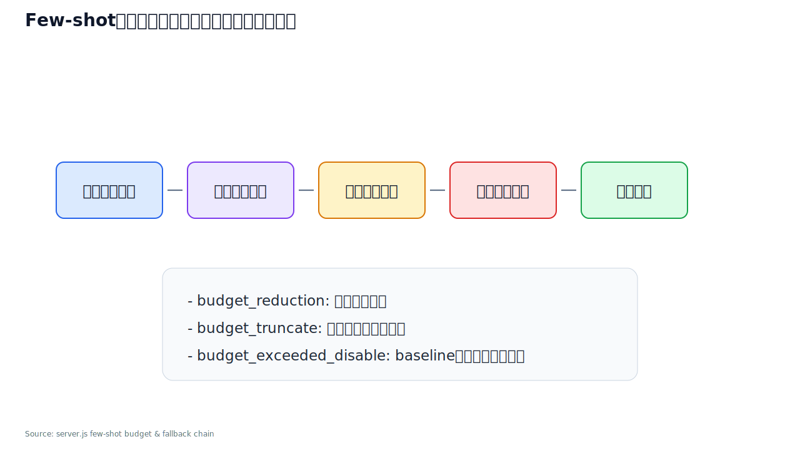

**スピーカーノート**：「なぜこの仕組みが品質を上げうるか」と、予算制御がtoken膨張をどう抑えるかを説明。  
**Data Source**: 例示注入設計と予算制御仕様

## Slide 6 ワンクリック再現 — 実験運用性

- 目標（1文）：実験実行からレポート生成までをスクリプト化し、誰でも5分で再現可能。
- 主要内容：
  - 実験パイプライン4ステップ：
    1. 実験を実行して個票データを収集  
    2. 集計データを生成して統計検定  
    3. 主要指標を図表化  
    4. 評価レポートを自動生成
  - 実運用：
    - 上記4工程を定型化し、担当者差なく再現可能
  - 成果物：個票データ、集計表、図表、評価レポート

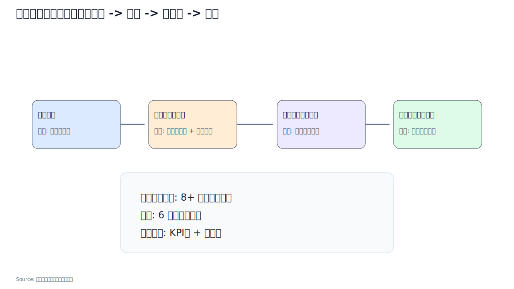

**スピーカーノート**：「再現可能性」が科学的方法の基礎。コードは実験記録であり、git logは実験ログ。  
**Data Source**: 実験実行手順書と自動レポート運用記録

## Slide 7 実験設計：50サンプル Benchmark

- 目標（1文）：カテゴリラベル付き50フレーズでfew-shot効果を体系検証。
- 主要内容：
  - **実験識別子**: exp_benchmark_50_20260209_140431
  - **サンプル設計**：
    - 日常語彙 (15件)：挨拶、応援、乾杯...
    - 技術用語 (20件)：基盤連携、指示設計、検索基盤など...
    - 曖昧/複雑 (15件)：文脈依存表現、煽動表現、比喩表現...
  - **比較**：標準生成（例示なし） vs 例示注入あり（2候補）
  - **改善点**：スコアラー偏差修正 + 例示選定強化 + 統計検定導入

**スピーカーノート**：「今回の実験は以前の21サンプルより信頼できる」ことを明示し、カテゴリ設計の価値を説明。  
**Data Source**: 50サンプル評価セット

## Slide 8 結果：50サンプル実験データ

- 目標（1文）：few-shot改善は統計的に有意だが、改善幅は正直に報告する。
- 主要データ：

| 指標 | Baseline | Fewshot_r1 | Delta |
|------|-------:|-------:|------:|
| 成功率 | 98% | 98% | 0 |
| 平均品質 | 75.00 | 76.88 | **+1.88** |
| 平均コスト指標 | 1029 | 1414 | +385 (+37%) |
| 品質 CV% | 5.22% | 4.16% | **-1.06pp** |
| 追加コスト当たり改善効率 | - | 4.88 | - |

- **統計検定**：
  - 対応あり t-test: **p = 0.0005**
  - Wilcoxon: **p = 0.0010**
  - 95% CI: **[0.84, 2.83]**
  - Cohen's d: **0.537 (medium)**

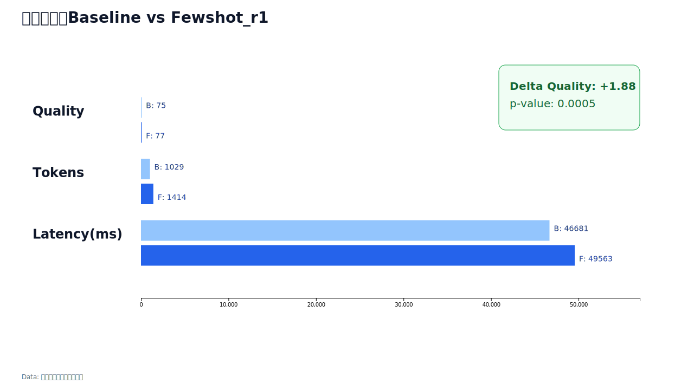
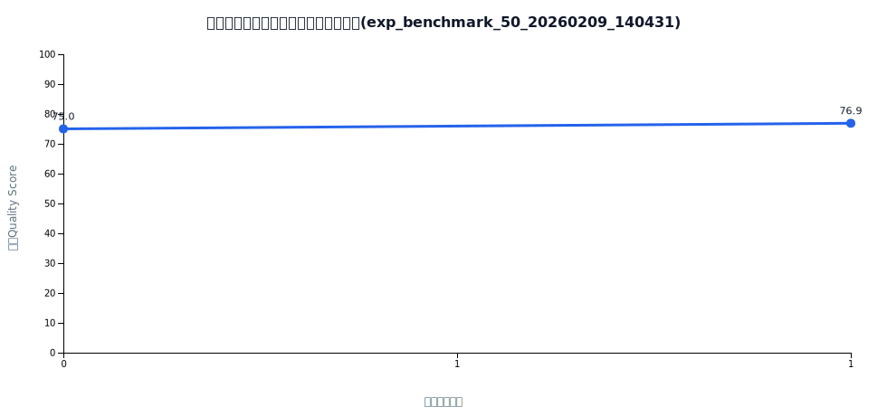

**スピーカーノート**：先に結論を示し、次に代償を説明する。旧実験 +7.33 のうちスコアラー偏差を切り分け、信頼性を担保する。  
**Data Source**: ベンチマークのラウンド別指標データ

## Slide 9 カテゴリ洞察：誰が最も恩恵を受けるか？

- 目標（1文）：日常語彙の改善が最大で、技術用語の改善余地は限定的。
- 主要データ：

| カテゴリ | Baseline 品質 | Fewshot 品質 | Delta | Gain/1k Tokens |
|------|-------:|-------:|------:|------:|
| 日常語彙 | 73.47 | 77.20 | **+3.73** | **9.06** |
| 技術用語 | 77.95 | 78.85 | +0.90 | 2.33 |
| 曖昧/複雑 | 77.80 | 79.21 | +1.41 | 3.75 |

- **傾向**：標準生成品質が低いほど例示注入の改善幅が大きい
- **解釈**：
  - 日常語彙は短文のため、モデルが例示誘導を必要とする
  - 技術用語は情報密度が高く、baselineが比較的強い
  - 曖昧表現は「多義展開」例示の恩恵を受ける

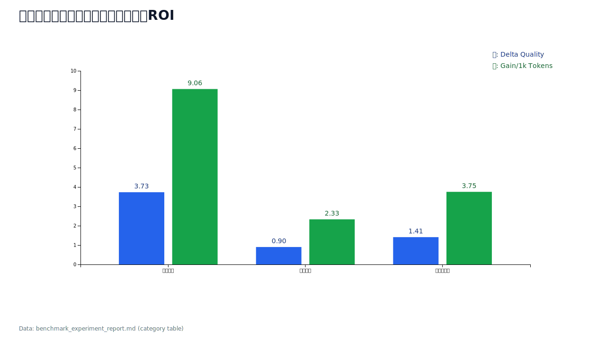

**スピーカーノート**：「シーンごとに効果が異なる」という粒度の高い洞察を伝え、一律結論を避ける。  
**Data Source**: ベンチマーク実験報告

## Slide 10 自己批判：既知課題と限界

- 目標（1文）：不足を認めることは欠陥を隠すより価値が高い。
- 主要内容：
  1. **スコアラーは依然ルール駆動**：意味精度と翻訳流暢性を十分評価できない
  2. **Teacherサンプルプール活用不足**：本実験ではGemini Teacher参照を事前注入していない
  3. **予算が逼迫**：利用可能文脈に対して配分が小さく、一部例示が切り詰められた
  4. **単一ラウンド比較**：標準生成と1回の改善比較のみで、多段改善を未検証
  5. **旧実験の偏差補正**：+7.33 のうち約 5.45 はスコアラー長さバイアス、実質寄与は +1.88
  - **改善済みの機能面**：
    - 文字量偏重の判定を廃止し、三言語構造の完全性チェックへ変更
    - 単純な長さ近傍選択を廃止し、語彙類似度ベースの再ランキングへ変更

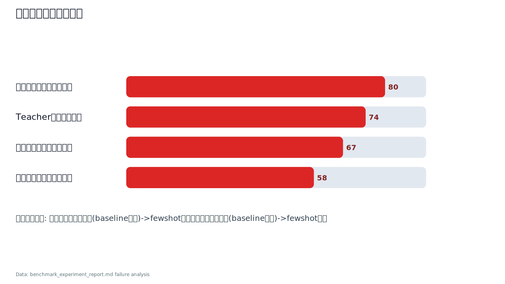

**スピーカーノート**：課題を先に開示して信頼を獲得する。各限界に実行可能な改善策を対応させる。  
**Data Source**: ベンチマーク実験報告

## Slide 11 最適化ロードマップ：コード変更駆動

- 目標（1文）：各最適化方針を具体的なコード変更に紐付ける。
- 主要内容：

| 段階 | 最適化方針 | 実装アクション | 期待効果 |
|------|------|------|------|
| 30日 | Teacherプール拡張 | 教師サンプルの事前投入ラウンドを追加 | 品質 +2〜3 |
| 30日 | 予算配分緩和 | 例示に割り当てる比率を段階的に拡大 | フォールバック減少 |
| 60日 | 類似度検索強化 | 語彙類似中心から意味類似中心へ移行 | 例示関連度 +50% |
| 60日 | 品質評価高度化 | ルール評価から意味理解を含む評価へ移行 | 評価精度向上 |
| 90日 | 複数Teacher統合 | 複数参照を統合する判断層を追加 | 多ソース整合性 |
| 90日 | LLM層統一 | プロバイダ差分吸収の共通実行層を導入 | 保守コスト低減 |

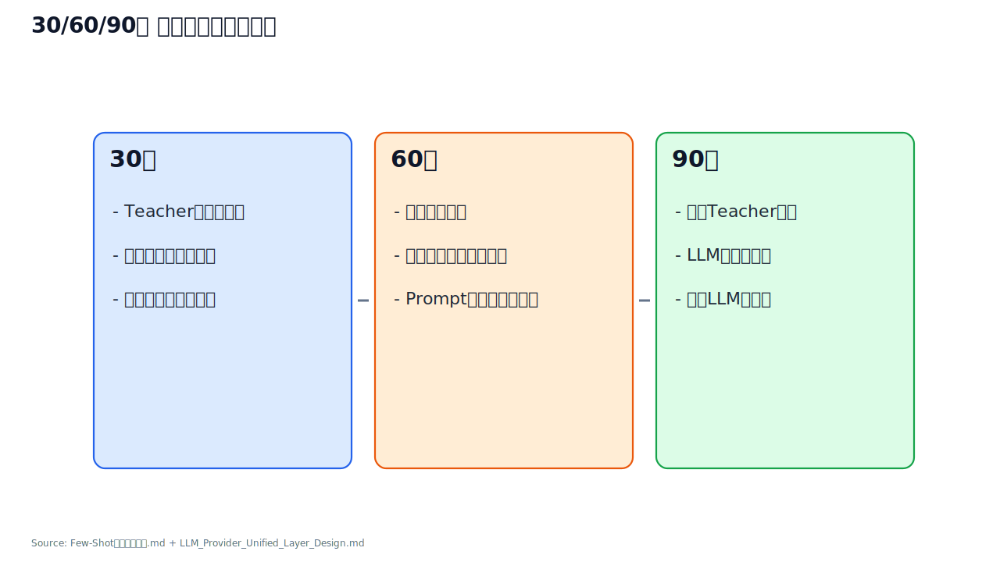

**スピーカーノート**：ロードマップをスローガンにしない。各項目をファイルレベル変更へ落とし込む。  
**Data Source**: 最適化設計文書と統合運用計画

## Slide 12 エンジニアリング価値：可観測 + 追跡可能 + 再現可能

- 目標（1文）：few-shotはモデル最適化だけでなく、開発効率最適化でもある。
- 主要内容：
  - **可観測**：各生成でコスト・遅延・品質スコアを構造化記録
  - **追跡可能**：実験パラメータ、サンプル、出力、指標を全経路で再確認可能
  - **再現可能**：スクリプト化パイプラインで新環境でも実験を再実行可能
  - **検証可能**：統計検定を運用フローに統合し、有意性指標を自動出力
  - **実装成果**：
    - 実験・生成・観測データを自動で標準構造化
    - 複数の統計検定を標準機能として実行可能
    - 集計出力時に検定結果を自動付与

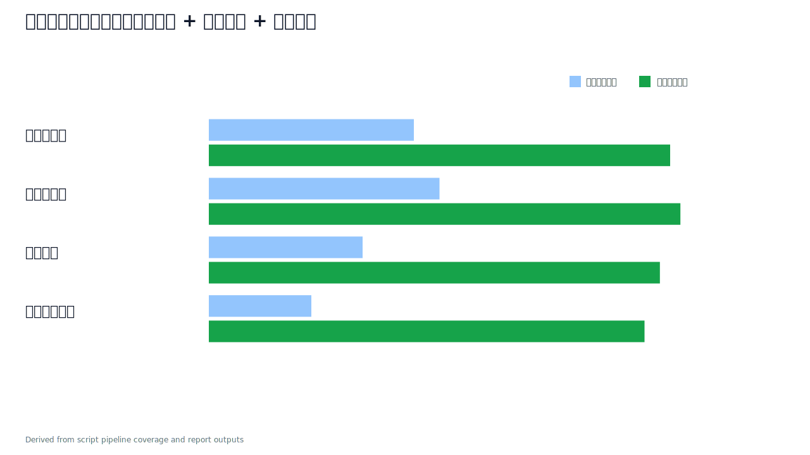

**スピーカーノート**：「アルゴリズム収益」から「開発生産性収益」へ議論を引き上げる。コード自体がドキュメント。  
**Data Source**: システム構成資料と統計サマリーデータ

## Slide 13 まとめと意思決定リクエスト

- 目標（1文）：継続投資の方向と受け入れ基準を確定する。
- 主要結論：
  - Few-shot改善は**統計的有意** (p=0.0005, d=0.537)
  - 実質改善は **+1.88点**（スコアラー偏差補正後）
  - 日常語彙の恩恵が最大 (+3.73)、技術用語は限定的 (+0.90)
  - 安定性は改善 (CV: 5.22% -> 4.16%)
  - Tokenコスト +37%、遅延 +6%
- 意思決定リクエスト：
  1. Teacherプール拡張を承認（想定 +2~3 品質改善）
  2. token予算を 0.25 に緩和（フォールバック切り詰めを減少）
  3. ルール評価をLLMスコアラーへ置換開始
  4. 30/60/90日 KPI閾値を確定

**スピーカーノート**：データで意思決定を促し、各依頼に定量的な期待効果を紐付ける。  
**Data Source**: 総合テスト報告とベンチマーク分析報告

## Slide 14 付録：統計的有意性詳細ページ

- 目標（1文）：有意性は口頭主張ではなく、完全な証拠チェーンで示す。
- 主要内容：
  - Mean diff: +1.83
  - 95% CI: [0.84, 2.83]
  - paired t-test p=0.0005
  - Wilcoxon p=0.0010
  - Cohen's d=0.537（medium）

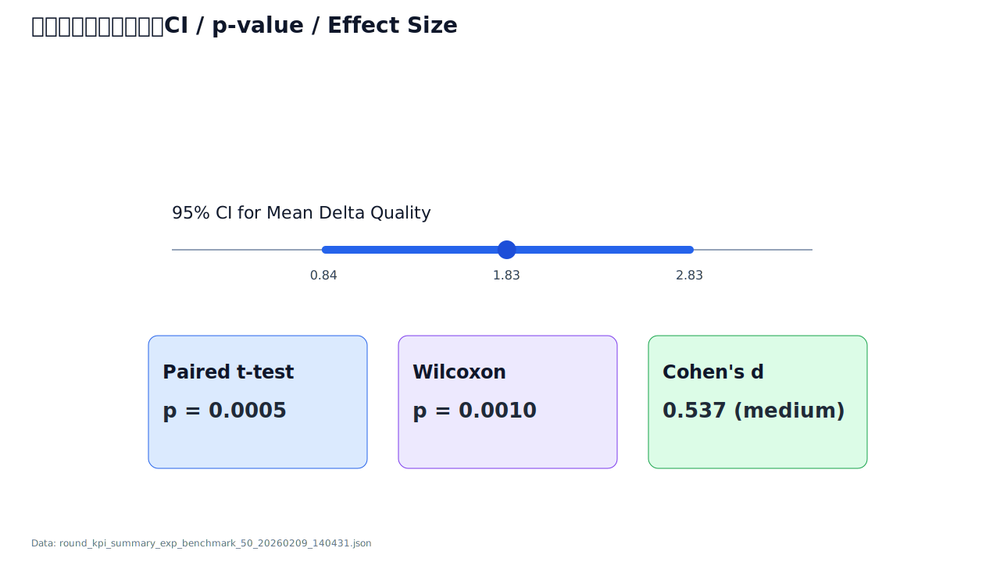

**Data Source**: ベンチマーク統計サマリーデータ

## Slide 15 付録：履歴実験比較（21 vs 50）

- 目標（1文）：旧実験の改善幅が大きく、新実験の信頼性が高い理由を説明する。
- 主要内容：
  - 21サンプル実験：改善幅は大きいが、スコアラー偏差の影響が高い
  - 50サンプル実験：改善幅は小さいが、統計的有意性がより完全
  - 方針：今後は「有意性 + 再現可能性」を受け入れ主基準にする

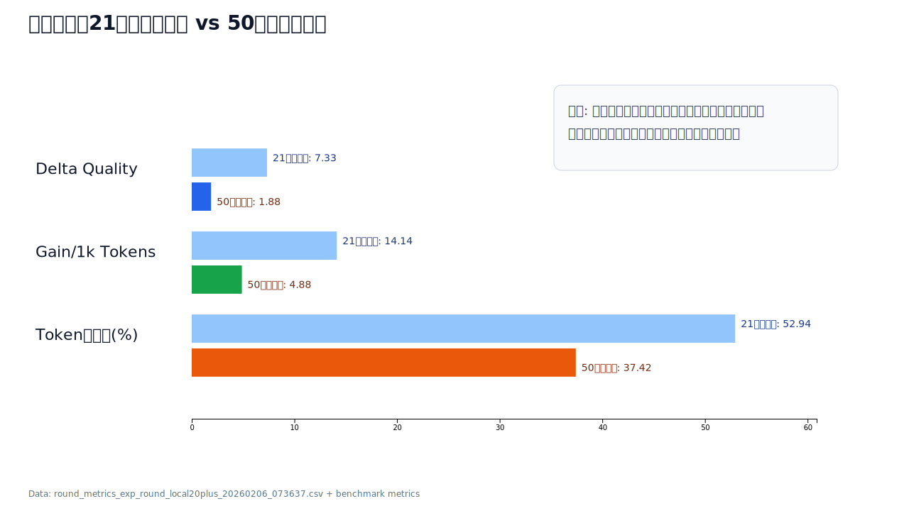

**Data Source**: 履歴比較用のラウンド別指標データ

## Slide 16 付録：実験成果物カバレッジ

- 目標（1文）：現在の実験体系の「資産化レベル」を定量化する。
- 主要内容：
  - データファイル規模
  - 図表成果物規模
  - レポート蓄積規模
  - 再確認・監査・再現が可能な技術資産庫を形成

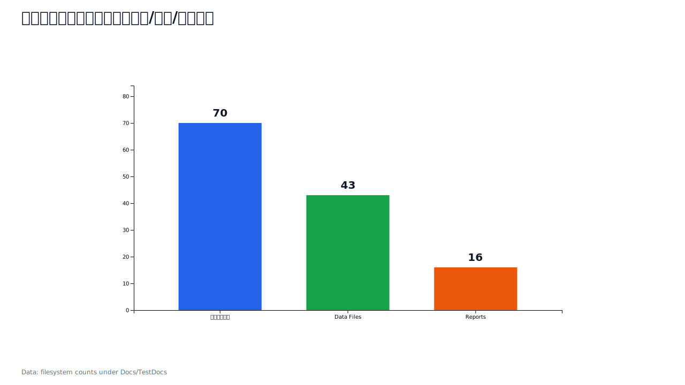

**Data Source**: 実験成果物の集計結果

---

*Baseline: exp_benchmark_50_20260209_140431 | 運用フロー: 実験実行 -> 集計 -> 可視化 -> 報告 | 検定: 対応ありt検定・順位検定・信頼区間・効果量*  
*図表はプレゼン用に日本語化済みSVGセットを利用*
