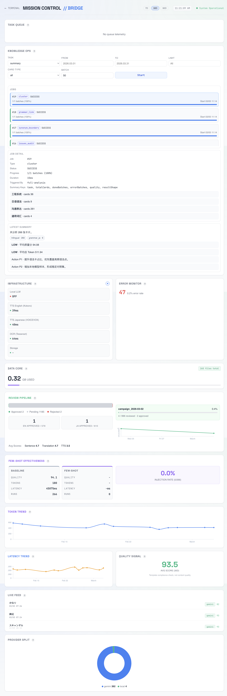
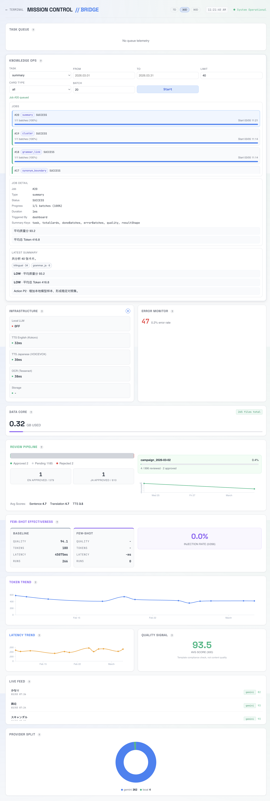
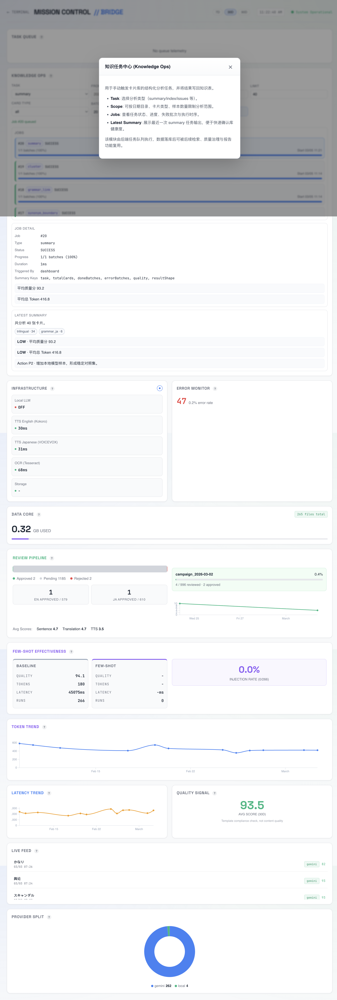

# Mission Control UI 验证报告（2026-03-05）

## 1. 测试范围

本轮验证目标：确认 Mission Control 中新增的 **Knowledge Ops** 能正常展示、触发任务、回显任务结果与指标说明。

- 访问页面：`http://localhost:3010/dashboard.html`
- 测试环境：Docker Compose（viewer + ocr + tts-en + tts-ja）
- 验证方式：MCP Chrome DevTools 手工自动化
- 测试时间：2026-03-05 11:20 ~ 11:22 (JST)

## 2. 结果结论

- 总结论：**通过（PASS）**
- 通过项：5
- 失败项：0
- 阻断项：0

## 3. 关键验证项

| 编号 | 验证项 | 结果 | 说明 |
|---|---|---|---|
| 1 | Dashboard 页面可访问 | PASS | 页面加载正常，状态区与主网格可见 |
| 2 | Knowledge Ops 面板渲染 | PASS | Task/Scope/Batch/Start/Jobs/Job Detail/Latest Summary 全部出现 |
| 3 | 从 UI 触发任务 | PASS | 点击 Start 后出现 `Job #20 queued`，任务进入 Jobs 列表并完成 |
| 4 | 任务详情与预览 | PASS | Job Detail 正确显示 type/status/progress/duration/result key，预览内容可见 |
| 5 | 指标说明弹窗 | PASS | 点击 Knowledge Ops 的 `?` 可弹出说明内容 |

## 4. 截图证据

### 4.1 初始页面（含 Knowledge Ops）

### 4.2 任务启动后（UI 触发 summary）

### 4.3 Knowledge Ops 指标说明弹窗

## 5. 同步接口校验（辅助）

在同一轮中，后端接口返回正常：

- `GET /api/knowledge/jobs?limit=6`：最新任务 `#14~#19` 全部 `success`
- `GET /api/knowledge/summary/latest`：返回 `共分析 266 张卡片。`
- `GET /api/knowledge/index?limit=10000`：`266` 条
- `GET /api/knowledge/issues?limit=10000`：`156` 条
- `GET /api/knowledge/grammar?limit=10000`：`4` 条
- `GET /api/knowledge/clusters?limit=10000`：`4` 条

## 6. 观察与建议

- 当前非阻断观察：`Infrastructure` 中 `Local LLM = OFF`（与你当前“封存本地 LLM”状态一致，不影响本轮 Knowledge Ops UI 验证）。
- 建议后续进入全量分析前，固定一次“全量任务参数模板”（scope/batchSize/cardType），方便复现实验与回归对比。

