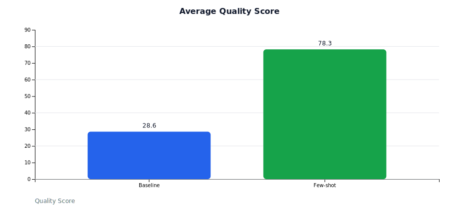
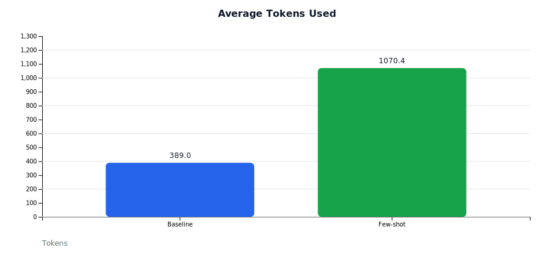
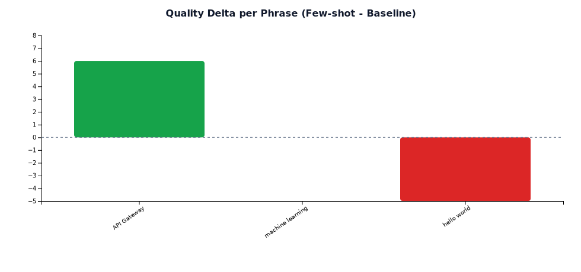

# Few-shot 质量提升实验报告（阶段一）

**日期**: 2026-02-06  
**实验 ID**: exp_1770347956_fs  
**目的**: 验证 few-shot（Golden Examples）对本地 LLM 生成质量的提升效果，并量化成本与时延变化。

---

## 1. 实验环境

- **本地 LLM**: `qwen2_5_7b`
- **接口**: vLLM OpenAI Compatible
- **上下文长度**: 2048
- **输出模式**: JSON
- **few-shot 预算**: 25%（≈ 512 tokens）
- **对比方式**: 동일短语 baseline vs few-shot
- **样本数**: 8

---

## 2. 实验配置

### 2.1 Baseline
- `ENABLE_GOLDEN_EXAMPLES=false`
- `variant=baseline`

### 2.2 Few-shot
- `ENABLE_GOLDEN_EXAMPLES=true`
- `GOLDEN_EXAMPLES_COUNT=3`
- `GOLDEN_EXAMPLES_MIN_SCORE=85`
- `LLM_CONTEXT_WINDOW=2048`
- `FEWSHOT_TOKEN_BUDGET_RATIO=0.25`
- `variant=fewshot`

---

## 3. 样本列表

```
hello world
machine learning
量子纠缠
供应链
提示词工程
OCR 识别
API Gateway
多模型对比
```

---

## 4. 核心指标对比（数值）

| 指标 | Baseline | Few-shot | 变化 |
|------|---------:|---------:|-----:|
| 平均质量分 | 28.625 | 78.250 | +49.625 |
| 平均 Tokens | 389 | 1070 | +681 |
| 平均延迟 | 17.96s | 49.43s | +31.47s |
| 成功率 | 1.0 | 1.0 | 0 |

---

## 5. 可视化结果（D3 产出）

> 生成脚本：`node d3/render_fewshot_charts.mjs`  
> 图表输出：`Docs/TestDocs/charts/`

### 5.1 平均质量分（柱状图）


### 5.2 平均 Tokens（柱状图）


### 5.3 平均延迟（柱状图）


### 5.4 质量提升分布（可配对短语）
> 说明：该图仅统计可配对短语（同名或 `(2)` 归一化）计算的 delta。



### 5.5 质量 vs Tokens（散点图）


---

## 6. 实验过程说明

1. **Baseline 生成**：
   使用 `scripts/batch-test.sh` 批量请求 `/api/generate`，记录 baseline 输出。

2. **Few-shot 生成**：
   启用 `ENABLE_GOLDEN_EXAMPLES`，重新批量生成同一短语。

3. **对比分析**：
   使用 `scripts/compare-results.js` 统计均值与差异。

---

## 7. 结论与下一步

### 7.1 结论
- few-shot 显著提升质量分（+49.6）
- 代价是 token 与延迟显著上升
- 结构完整性与例句质量提升尤为明显（后续可拆分维度验证）

### 7.2 下一步建议
- 扩大样本集（50+）确认稳定性
- 引入更多维度统计（completeness / accuracy / exampleQuality / formatting）
- 尝试减少 few-shot 示例数量，探索成本‑质量平衡点

---

## 8. 数据产出

- Baseline 原始数据：`/tmp/baseline.jsonl`
- Few-shot 原始数据：`/tmp/enhanced.jsonl`
- 实验导出接口：`GET /api/experiments/exp_1770347956_fs`
- 可视化数据集：`Docs/TestDocs/data/fewshot_chart_data.json`
- 图表文件：`Docs/TestDocs/charts/*.svg`
