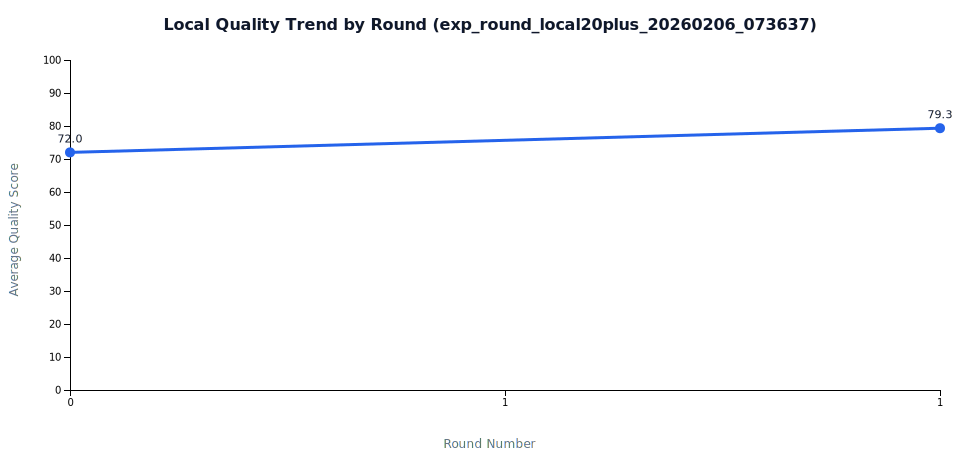
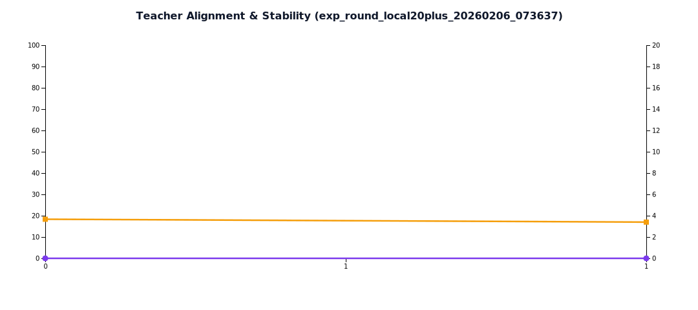

# Few-shot 轮次实验报告（exp_round_local20plus_20260206_073637）

- 生成时间: 2026-02-06T08:26:40.113Z

## KPI 总览

- 可见提升轮次数: **1/2**（50.0%)
- 平均 Teacher 对齐率: **0.0%**
- 平均稳定性 CV: **3.5%**
- few-shot 作用可见: **是**
- 最佳质量轮次: **fewshot_r1 (79.3)**
- 最佳效率轮次: **fewshot_r1 (14.14)**

## 轮次指标表

| Round | Avg Quality | ΔQuality | Avg Tokens | ΔTokens | Gain/1kExtraTokens | Teacher Align | Quality SD |
|---|---:|---:|---:|---:|---:|---:|---:|
| baseline | 72.00 | 0.00 | 979.76 | 0.00 | - | 0.0% | 2.64 |
| fewshot_r1 | 79.33 | 7.33 | 1498.48 | 518.71 | 14.14 | 0.0% | 2.70 |

## 图表

## 数据文件

- Docs/TestDocs/data/round_trend_exp_round_local20plus_20260206_073637.json
- Docs/TestDocs/data/round_metrics_exp_round_local20plus_20260206_073637.csv
- Docs/TestDocs/data/round_kpi_summary_exp_round_local20plus_20260206_073637.json