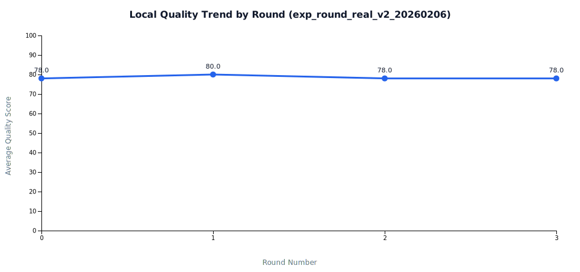

# Few-shot 轮次机制完整测试报告（含图表）

**报告日期**: 2026-02-06  
**系统**: Trilingual Records / Local LLM Few-shot  
**模型**: `qwen2_5_7b`（本地） + `gemini`（Teacher）  
**测试样本**: `提示词工程`、`API Gateway`、`多模型对比`

---

## 1. 测试目标

本次测试聚焦两个问题：

1. 验证“本地 LLM 随轮次优化”的实验机制是否可稳定运行并可视化。  
2. 解决并验证 two blockers：  
   - few-shot 示例未注入（`fewshot_enabled=0`）  
   - `budget_exceeded_disable` 频繁触发导致回退到 baseline

---

## 2. 测试方法与分组

### 2.1 阶段 A（问题复现基线）
- 实验 ID: `exp_round_real_v2_20260206`
- 轮次: `baseline -> fewshot_r1 -> fewshot_r2 -> fewshot_r3`
- 特点: 无 teacher 种子轮次，few-shot 仅依赖历史样本

### 2.2 阶段 B（修复后验证）
- 实验 ID: `exp_round_teacherfix_20260206`
- 轮次: `baseline -> teacher_seed_r1(gemini) -> fewshot_r1 -> fewshot_r2 -> fewshot_r3`
- 特点: teacher 优先取样、示例长度压缩、预算策略优化

---

## 3. 阶段 A 结果（修复前）

### 3.1 数据表

| Round | 成功率 | 平均质量分 | 平均 Tokens | 平均延迟 |
|---|---:|---:|---:|---:|
| baseline | 3/3 | 78.00 | 1124.33 | 57.61s |
| fewshot_r1 | 3/3 | 80.00 | 1166.67 | 62.61s |
| fewshot_r2 | 3/3 | 78.00 | 1148.00 | 58.63s |
| fewshot_r3 | 3/3 | 78.00 | 1134.67 | 56.58s |

### 3.2 关键现象

- few-shot 机制虽然“开启”，但**未实际注入样本**（teacher gap 为空）。  
- 质量提升不稳定且幅度小，无法支撑“持续优化曲线”。

### 3.3 图表

#### 质量趋势（修复前）

#### 质量-Token 双轴（修复前）

#### Teacher Gap（修复前，空）

---

## 4. 阶段 B 结果（修复后）

### 4.1 数据表（含 teacher 轮次）

| Round | Provider | 成功率 | 平均质量分 | 平均 Tokens | 平均延迟 |
|---|---|---:|---:|---:|---:|
| baseline | local | 3/3 | 82.00 | 1095.00 | 54.07s |
| teacher_seed_r1 | gemini | 3/3 | 96.00 | 452.67 | 34.56s |
| fewshot_r1 | local | 3/3 | 79.00 | 1352.67 | 59.93s |
| fewshot_r2 | local | 3/3 | 80.33 | 1527.33 | 56.73s |
| fewshot_r3 | local | 3/3 | 79.33 | 1548.33 | 56.56s |

### 4.2 相对 baseline 增量（local 轮次）

| Round | 质量分增量 | Tokens 增量 | 延迟增量 | Teacher Gap |
|---|---:|---:|---:|---:|
| fewshot_r1 | -3.00 | +257.67 | +5.86s | 17.00 |
| fewshot_r2 | -1.67 | +432.33 | +2.67s | 15.67 |
| fewshot_r3 | -2.67 | +453.33 | +2.50s | 16.67 |

### 4.3 机制生效证据（修复成功）

- `few_shot_runs` 总记录: **15**
- `fewshot_enabled=1`: **9**
- `example_count>0`: **9**
- fallback 统计:
  - `none`: 12
  - `budget_reduction`: 3
  - `budget_exceeded_disable`: 0
  - `no_examples`: 0

结论：**“示例注入未发生”与“超预算全量回退”两类问题已被修复。**

### 4.4 图表

#### 质量趋势（修复后）

#### 质量-Token 双轴（修复后）

#### Teacher Gap（修复后）

---

## 5. 修复前后对比结论

### 5.1 机制层结论

1. 轮次机制、数据落库、趋势导出、图表链路已经全通。  
2. 修复后 few-shot 实际注入已生效，可稳定记录到 DB，并产生 teacher_gap 曲线。  
3. 当前瓶颈从“机制失效”转为“参数与样本质量匹配不足”。

### 5.2 质量层结论

1. 在当前参数下（count 1->3，minScore 70/75），local 质量未超过 baseline。  
2. Token 与延迟显著上升，说明存在“成本增、收益弱”的配置区间。  
3. 下一步应从“样本相似度”和“示例压缩强度”继续调参，而不是继续提升示例数量。

---

## 6. 下一轮建议（直接可执行）

1. 固定 `count=1`，将 `exampleMaxChars` 收敛到 `280~360`，先做低成本探索。  
2. 在 `getRelevantExamples` 增加相似度阈值（词面/向量），过滤不相干高分样本。  
3. 增加 `teacher_seed_r2` 更新轮次，形成 `teacher refresh -> fewshot evaluate` 的稳定闭环。  
4. 增加 20+ 样本集，避免 3 样本下的波动误判。

---

## 7. 数据与报告文件索引

- 阶段 A:
  - `Docs/TestDocs/data/rounds/exp_round_real_v2_20260206/summary.json`
  - `Docs/TestDocs/data/round_trend_exp_round_real_v2_20260206.csv`
  - `Docs/TestDocs/data/round_deltas_exp_round_real_v2_20260206.csv`
- 阶段 B:
  - `Docs/TestDocs/data/rounds/exp_round_teacherfix_20260206/summary.json`
  - `Docs/TestDocs/data/round_trend_exp_round_teacherfix_20260206.csv`
  - `Docs/TestDocs/data/round_deltas_exp_round_teacherfix_20260206.csv`
- 本报告:
  - `Docs/TestDocs/完整测试报告_20260206.md`
