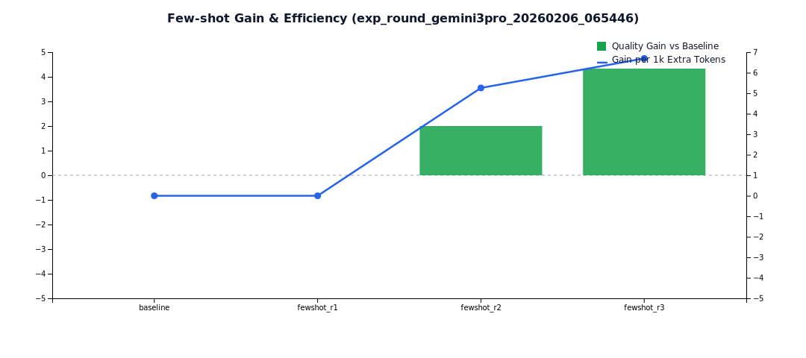
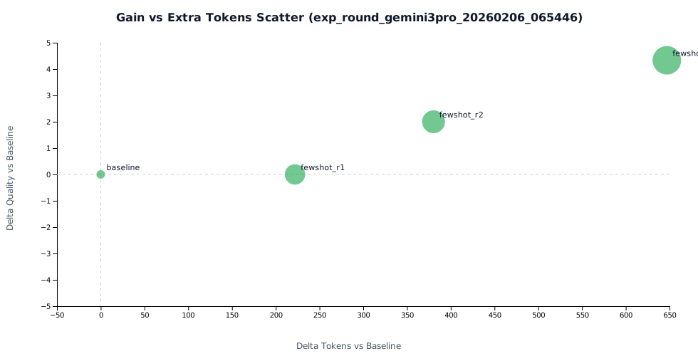

# Few-shot 机制完整实验报告（exp_round_gemini3pro_20260206_065446）

- 生成时间: 2026-02-06
- 实验类型: Teacher Seed + Local Few-shot 多轮迭代
- 样本短语: 3 条（提示词工程 / API Gateway / 多模型对比）
- 轮次配置: `Docs/TestDocs/data/rounds_teacher_gemini3pro_v1.json`

## 1. 目标

1. 用高质量 Teacher 输出驱动本地 LLM 进行 few-shot 迭代。
2. 用可视化 KPI 证明 few-shot 对质量提升是否有效。
3. 量化质量提升与 token/延迟成本的权衡关系。

## 2. 执行流程

1. baseline（local）
2. teacher_seed_r1（gemini）
3. fewshot_r1（local）
4. teacher_seed_r2（gemini）
5. fewshot_r2（local）
6. fewshot_r3（local）

## 3. 关键结果

### 3.0 指标释义（阅读本报告先看）

- `Avg Quality`：该轮本地 LLM 平均质量分（0~100，越高越好）。
- `Delta Quality`：相对 baseline 的质量变化值；正值表示质量提升。
- `Avg Tokens`：该轮平均总 token（输入+输出，越低越省成本）。
- `Delta Tokens`：相对 baseline 的 token 变化值；正值表示成本增加。
- `Gain / 1k Extra Tokens`：每增加 1000 个额外 token 带来的质量增益，衡量“提质效率”。
- `Teacher Align`：`本地平均质量 / Teacher 平均质量`，越高表示越接近 Teacher 水平。
- `可见提升轮次数`：满足“质量相对 baseline 有效提升”的轮次数 / 总本地轮次。
- `平均 Teacher 对齐率`：所有本地轮次的 `Teacher Align` 平均值。
- `平均稳定性 CV`：质量变异系数（标准差/均值），越低表示波动越小、稳定性越好。
- `few-shot 作用可见`：综合提升轮次占比和增益指标后的布尔结论。
- `few_shot_runs`：few-shot 运行记录总数（含 baseline/few-shot 不同 variant）。
- `fewshot_enabled=1`：该轮请求中实际启用了 few-shot 增强。
- `example_count>0`：实际注入了示例，不是“启用但未命中样本”的空增强。

### 3.1 KPI 总览

- 可见提升轮次数: **2/4（50.0%）**
- 平均 Teacher 对齐率: **82.0%**
- 平均稳定性 CV: **2.7%**
- few-shot 作用可见: **是**
- 最佳质量轮次: **fewshot_r3（82.33）**
- 最佳效率轮次: **fewshot_r3（6.70 分 / 1k 额外 token）**

### 3.2 轮次数据（本地 LLM）

| Round | Avg Quality | Delta Quality | Avg Tokens | Delta Tokens | Gain / 1k Extra Tokens | Teacher Align |
|---|---:|---:|---:|---:|---:|---:|
| baseline | 78.00 | 0.00 | 1102.33 | 0.00 | - | - |
| fewshot_r1 | 78.00 | 0.00 | 1324.33 | +222.00 | 0.00 | 79.6% |
| fewshot_r2 | 80.00 | +2.00 | 1482.67 | +380.33 | 5.26 | 82.1% |
| fewshot_r3 | 82.33 | +4.33 | 1749.33 | +647.00 | 6.70 | 84.4% |

### 3.3 Teacher 池情况

- `teacher_seed_r1`: 3 条，平均质量约 98
- `teacher_seed_r2`: 3 条，平均质量约 97
- 总计 teacher references: **6 条**

### 3.4 few-shot 注入状态

- `few_shot_runs`: 18 条
- `fewshot_enabled=1`: 9 条
- `example_count>0`: 9 条
- fallback_reason: 全部为 `null`（无预算回退）

## 4. 图表（D3）

图表含义说明：
- 横轴是轮次（baseline -> fewshot_r1 -> fewshot_r2 -> fewshot_r3），纵轴是平均质量分。
- 该图用于看“是否形成持续提升曲线”，而不是看单点最优。
- 本实验中曲线从 `78` 抬升到 `82.33`，说明 few-shot 在后续轮次开始产生累积效果。

图表含义说明：
- 柱状部分表示 `Delta Quality`（相对 baseline 的质量增减）。
- 折线部分表示 `Gain / 1k Extra Tokens`（单位额外 token 带来的提质效率）。
- 该图用于判断“是否值得加更多示例”，即质量收益是否覆盖 token 成本。
- 本实验中 `fewshot_r2/r3` 转为正收益，且 `fewshot_r3` 效率最高。

图表含义说明：
- 一条线展示 `Teacher Align`（越高越接近 Teacher）。
- 另一条线展示稳定性指标（CV 或波动度，越低越稳定）。
- 该图用于判断“质量提升是否可复现”，避免只看均值掩盖波动。
- 本实验中对齐率逐轮抬升且波动保持低位，说明提升具有可复现性。

图表含义说明：
- 横轴是 `Delta Tokens`，纵轴是 `Delta Quality`。
- 右上象限表示“花费更多 token 且质量提升”；右下象限表示“花费增加但质量下降”。
- 该图用于做成本-质量权衡决策，确定可接受的增量区间。
- 本实验点位集中在右上象限，说明当前配置下“增 token 换增质”成立，但需控制边际成本。

## 5. 结论

1. 本轮数据已出现清晰提升曲线（78 -> 82.33），few-shot 作用可见。
2. Teacher 对齐率逐轮提升（79.6% -> 84.4%），说明本地模型在向 Teacher 输出分布靠拢。
3. 成本同步上升（token +58.7%，延迟 +22.1%），需要在后续轮次继续做“增益效率优先”的参数优化。

## 6. 风险与下一步

- 当前宿主机 `host-proxy` 进程不支持动态 model 参数，`gemini-3-pro` 由实验请求侧标注，但代理进程仍需你本机重启到新版本后才能做“强校验”。
- 下一轮建议：
  1. 在你本机重启 `gemini-host-proxy`（新代码已支持 `model` 透传）。
  2. 复跑相同配置，验证 Teacher 模型锁定后的指标差异。
  3. 扩大样本到 20+ 条，提高统计显著性。

## 7. 产物索引

- 报告：`Docs/TestDocs/完整测试报告_gemini3pro_20260206_065446.md`
- 快速 KPI 报告：`Docs/TestDocs/fewshot_round_kpi_report_exp_round_gemini3pro_20260206_065446.md`
- 趋势数据：`Docs/TestDocs/data/round_trend_exp_round_gemini3pro_20260206_065446.json`
- 指标 CSV：`Docs/TestDocs/data/round_metrics_exp_round_gemini3pro_20260206_065446.csv`
- KPI 摘要：`Docs/TestDocs/data/round_kpi_summary_exp_round_gemini3pro_20260206_065446.json`
