# Code as Prompt：三语智能卡片系统的工程化实践
**从字符串拼接到结构化 Prompt 工程**

演讲人：[Your Name]
日期：2026-01-30

---

## 📑 目录

1. [封面与背景](#slide-1-封面与背景)
2. [问题：为什么需要 Code as Prompt](#slide-2-问题为什么需要-code-as-prompt)
3. [核心理念：Prompt 即代码](#slide-3-核心理念prompt-即代码)
4. [架构全景：数据流与模块设计](#slide-4-架构全景数据流与模块设计)
5. [实现机制 I：Prompt 工程的五层模型](#slide-5-实现机制-iprompt-工程的五层模型)
6. [实现机制 II：Chain of Thought 编排](#slide-6-实现机制-iichain-of-thought-编排)
7. [实现机制 III：Few-shot Learning 策略](#slide-7-实现机制-iiifew-shot-learning-策略)
8. [实现机制 IV：数据契约与类型安全](#slide-8-实现机制-iv数据契约与类型安全)
9. [实现机制 V：动态上下文注入](#slide-9-实现机制-v动态上下文注入)
10. [端到端流程：从输入到输出](#slide-10-端到端流程从输入到输出)
11. [质量控制：5 维度例句评估](#slide-11-质量控制5-维度例句评估)
12. [优化历程：实际问题与解决方案](#slide-12-优化历程实际问题与解决方案)
13. [未来演进 I：Prompt 版本管理](#slide-13-未来演进-iprompt-版本管理)
14. [未来演进 II：自适应 Prompt 优化](#slide-14-未来演进-ii自适应-prompt-优化)
15. [未来演进 III：多模态扩展](#slide-15-未来演进-iii多模态扩展)
16. [总结与启示](#slide-16-总结与启示)
17. [Q&A](#slide-17-qa)

---

## Slide 1: 封面与背景

### Code as Prompt：三语智能卡片系统的工程化实践

**项目概览**
- **系统名称**：Trilingual Records Generator（三语卡片生成系统）
- **核心功能**：基于 LLM 自动生成中/英/日三语学习卡片
- **技术栈**：Node.js + Gemini API + TTS (Kokoro/VOICEVOX)
- **设计理念**：Code as Prompt - 将 Prompt 工程化为可维护的代码资产

**背景问题**
- 如何让 LLM 稳定输出结构化内容？
- 如何工程化管理 Prompt 而非简单的字符串拼接？
- 如何在生产环境中保证 AI 输出质量？

---

## Slide 2: 问题：为什么需要 Code as Prompt

### 传统 Prompt 开发的三大痛点

#### 痛点 1：输出不可控
```javascript
// ❌ 传统方式：字符串拼接
const prompt = `请翻译: ${phrase}，并生成例句`;

// 问题：
// - LLM 可能返回纯文本、Markdown、或半结构化内容
// - 格式不统一，后端难以解析
// - 缺乏字段校验，容易缺失关键信息
```

#### 痛点 2：质量不稳定
```javascript
// ❌ 缺乏质量约束
输入："run"
可能输出：
- "奔跑" （忽略了多义词的其他含义）
- 例句："I run" （过于简单，缺乏语境）
- 日语：ラン (缺少假名注音)
```

#### 痛点 3：难以维护
```javascript
// ❌ Prompt 分散在代码各处
controller.js: const prompt1 = "...";
service.js:     const prompt2 = "...";
utils.js:       const prompt3 = "...";

// 问题：
// - 修改一处需要全局搜索
// - 版本管理困难
// - 无法 A/B 测试
```

### Code as Prompt 的解决思路

```mermaid
graph LR
    A[传统 Prompt] -->|字符串拼接| B[不可控输出]
    C[Code as Prompt] -->|结构化构建| D[强类型输出]
    C -->|模块化管理| E[可维护性]
    C -->|动态注入| F[上下文适配]

    style A fill:#ffcccc
    style C fill:#ccffcc
```

---

## Slide 3: 核心理念：Prompt 即代码

### 定义：Code as Prompt (CaP)

> **将 Prompt 视为软件工程中的代码资产，而非配置文件中的静态字符串**

遵循软件工程原则：
- ✅ **模块化 (Modularity)**：拆分为独立可复用的组件
- ✅ **版本控制 (Version Control)**：Git 管理 Prompt 变更历史
- ✅ **类型安全 (Type Safety)**：强制 JSON Schema 校验
- ✅ **动态构建 (Dynamic Construction)**：运行时组装 Prompt

### 对比：传统 vs CaP

| 维度 | 传统方式 | Code as Prompt |
|------|----------|----------------|
| **存储** | 字符串变量 | 独立模块 `promptEngine.js` |
| **构建** | 简单拼接 | 多层结构组合 |
| **质量控制** | 靠运气 | 内置校验 + Few-shot |
| **上下文适配** | 静态 | 动态注入 |
| **可测试性** | 难 | 可单元测试 |

### 核心组件架构

```mermaid
graph TB
    subgraph "promptEngine.js - Prompt 构建引擎"
        A[System Role<br/>角色定义] --> F[Prompt Builder]
        B[CoT Guidance<br/>思维链引导] --> F
        C[Few-shot Examples<br/>示例库] --> F
        D[Requirements<br/>业务规则] --> F
        E[JSON Schema<br/>数据契约] --> F
        F --> G[完整 Prompt]
    end

    G -->|发送| H[Gemini API]
    H -->|返回| I[JSON 响应]
    I -->|校验| J[validateGeneratedContent]
    J -->|通过| K[保存文件]
    J -->|失败| L[重试/报错]

    style F fill:#4CAF50,color:#fff
    style J fill:#FF9800,color:#fff
```

---

## Slide 4: 架构全景：数据流与模块设计

### 系统架构图


### 数据流时序图

```mermaid
sequenceDiagram
    participant User
    participant Frontend
    participant Server
    participant PromptEngine
    participant Gemini
    participant Renderer
    participant FileManager
    participant TTS

    User->>Frontend: 输入 "hello world"
    Frontend->>Server: POST /api/generate
    Server->>PromptEngine: buildPrompt({phrase, context})
    PromptEngine-->>Server: 完整 Prompt (4000+ tokens)

    Server->>Gemini: generateContent(prompt)
    Note over Gemini: CoT 推理：<br/>1. 识别语言(英文)<br/>2. 分析词性(短语)<br/>3. 生成三语内容
    Gemini-->>Server: JSON Response

    Server->>Server: validateGeneratedContent
    alt 校验失败
        Server-->>Frontend: 422 Error + prompt + output
    else 校验成功
        Server->>Renderer: renderHtmlFromMarkdown
        Renderer->>Renderer: normalizeJapaneseRuby
        Renderer->>Renderer: injectAudioTags
        Renderer-->>Server: HTML Content

        Server->>FileManager: saveGeneratedFiles
        FileManager-->>Server: {folder, files}

        Server->>TTS: generateAudioBatch
        TTS-->>Server: Audio Files

        Server-->>Frontend: 200 OK + result
    end

    Frontend->>User: 显示生成结果 + Prompt + LLM Output
```

---

## Slide 5: 实现机制 I：Prompt 工程的五层模型

### 五层结构设计

我们将生产级 Prompt 拆解为五个独立模块，由 `promptEngine.js` 动态组装：

```mermaid
graph TB
    subgraph "Layer 1: System Role"
        L1[定义 AI 身份<br/>语言专家、翻译助手]
    end

    subgraph "Layer 2: CoT Guidance"
        L2[预设推理步骤<br/>5步思考流程]
    end

    subgraph "Layer 3: Few-shot Examples"
        L3[高质量示例<br/>4个典型场景]
    end

    subgraph "Layer 4: Requirements"
        L4[业务规则<br/>50+ 条质量标准]
    end

    subgraph "Layer 5: Data Contract"
        L5[JSON Schema<br/>强类型定义]
    end

    L1 --> L2 --> L3 --> L4 --> L5 --> Output[最终 Prompt<br/>~4000 tokens]

    style L1 fill:#E3F2FD
    style L2 fill:#FFF9C4
    style L3 fill:#F0F4C3
    style L4 fill:#FFE0B2
    style L5 fill:#FFCCBC
    style Output fill:#4CAF50,color:#fff
```

### Layer 1: System Role（角色层）

**代码实现**（`promptEngine.js:129-134`）

```javascript
const systemRole = `你是一位专业的多语言翻译和语言教学助手，精通中文、英文、日语三种语言。
你的专长包括：
- 准确识别和翻译三种语言之间的表达
- 创作自然、地道、实用的例句
- 理解多义词的语境并准确消歧
- 提供符合母语习惯的高质量翻译`;
```

**设计原则**
- ✅ 明确身份定位（语言专家）
- ✅ 列举核心能力（4个关键技能）
- ✅ 隐含质量期望（"地道"、"准确"）

### Layer 2: CoT Guidance（思维链层）

**代码实现**（`promptEngine.js:138-166`）

```javascript
const cotGuidance = `
## 推理步骤（内部思考，不输出）

**步骤 1：语言识别与词性分析**
- 识别输入短语的主要语言（中文/英文/日语）
- 分析词性（名词/动词/形容词/短语/句子）

**步骤 2：多义词消歧与语境理解**
- 判断是否为多义词（如 "run" 可以是跑步/运行/经营）
- 如果是多义词，列举主要义项，选择最常用的含义

**步骤 3：翻译策略选择**
- 确定每种目标语言的翻译策略（直译/意译/音译）
- 考虑文化差异和习语特点

**步骤 4：例句场景规划**
- 规划两个例句的使用场景（第一句偏正式/工作，第二句偏日常/轻松）
- 确保例句难度与短语难度匹配

**步骤 5：质量自检**
- 检查翻译准确性和自然度
- 检查日语汉字是否都有假名注音
`;
```

**价值**
- 🎯 强制模型进行"内部打草稿"
- 🎯 显著提升复杂任务（多义词、技术术语）准确率
- 🎯 减少幻觉（Hallucination）

### Layer 3: Few-shot Examples（示例层）

**示例库设计**（`promptEngine.js:5-112`）

```javascript
const FEWSHOT_EXAMPLES = {
    daily: {       // 日常词汇
        input: "打招呼",
        output: "# 打招呼\n## 1. 英文:\n..."
    },
    technical: {   // 技术术语
        input: "API",
        output: "# API\n## 1. 英文:\n..."
    },
    ambiguous: {   // 多义词
        input: "run",
        output: "# run\n## 1. 英文:\n..."
    },
    japanese: {    // 日语输入（关键）
        input: "こんにちは",
        output: "# こんにちは\n## 1. 英文:\n..."
    }
};
```

**为什么需要日语示例？**

问题发现（真实 Bug）：
- 输入："こんにちは"（日语）
- 错误输出：英文部分例句也是日语 `こんにちは、お元気ですか？`
- 原因：模型未理解"英文部分必须是英语"

解决方案：
```javascript
// 在 Few-shot 中明确展示正确格式
japanese: {
    input: "こんにちは",
    output: `
## 1. 英文:
- **翻译**: Hello / Hi
- **例句1**: Hello, how are you doing today?  // ✅ 英语句子
  - 你好，你今天过得怎么样？
    `
}
```

### Layer 4: Requirements（指令层）

**50+ 条质量标准**（`promptEngine.js:210-288`）

关键规则示例：

```markdown
### 1. 翻译质量标准
- **准确性**：不添加或遗漏信息
- **自然度**：使用母语者日常表达
- **语域匹配**：保持与原短语相同的正式度

⚠️ 语言分离原则（非常重要）：
- 英文部分的例句**必须是英语**
- 日语部分的例句**必须是日语**
- 中文翻译**必须是纯中文**，不能包含Ruby标签

### 2. 例句黄金标准（5个维度）
| 维度 | 要求 |
|------|------|
| 场景真实性 | 必须是日常可能遇到的真实场景 |
| 长度控制 | 英文 8-15 词，日语 10-20 字 |
| 难度适配 | 与短语难度匹配±1级 |
| 语法自然 | 使用口语表达和缩写 (wanna, gonna) |
| 场景多样 | 两个例句覆盖不同场景 |

### 3. 日语特殊规则
✓ 所有汉字必须标注假名：漢字(かんじ)
✓ 每个汉字独立注音：勉(べん)強(きょう)
✓ **外来语片假名必须标注英文原词**：テスト(test)
```

### Layer 5: Data Contract（契约层）

**JSON Schema 定义**（`promptEngine.js:329-347`）

```javascript
const outputFormat = `
你必须返回一个有效的 JSON 对象：

{
  "markdown_content": "完整的 Markdown 内容",
  "audio_tasks": [
    { "text": "英文例句1", "lang": "en", "filename_suffix": "_en_1" },
    { "text": "英文例句2", "lang": "en", "filename_suffix": "_en_2" },
    { "text": "日语例句1", "lang": "ja", "filename_suffix": "_ja_1" },
    { "text": "日语例句2", "lang": "ja", "filename_suffix": "_ja_2" }
  ]
}

重要说明：
1. markdown_content 中的换行用 \\n 转义
2. audio_tasks 中的日语文本不要包含 ruby 标签
3. audio_tasks 中的英文文本去除句末标点符号
`;
```

---

## Slide 6: 实现机制 II：Chain of Thought 编排

### 为什么需要 CoT？

**对比实验**

| 条件 | 输入 | 无 CoT 输出 | 有 CoT 输出 |
|------|------|------------|------------|
| 多义词 | "run" | 翻译: 跑步 | 翻译: 跑步/运行/经营<br/>（识别出多义性） |
| 技术术语 | "API" | 例句: This is an API | 例句: We need to integrate their payment API<br/>（真实场景） |
| 日语输入 | "漢字" | 汉字（缺少假名） | 漢字(かんじ)（正确注音） |

### CoT 5步流程设计

```mermaid
graph LR
    A[步骤1<br/>语言识别] -->|识别出日语| B[步骤2<br/>词性分析]
    B -->|名词| C[步骤3<br/>翻译策略]
    C -->|需要假名注音| D[步骤4<br/>例句规划]
    D -->|工作+日常场景| E[步骤5<br/>质量自检]
    E -->|检查注音完整性| F[生成 JSON]

    style A fill:#E3F2FD
    style B fill:#FFF9C4
    style C fill:#F0F4C3
    style D fill:#FFE0B2
    style E fill:#FFCCBC
    style F fill:#4CAF50,color:#fff
```

### 实际案例：处理 "run"

**LLM 内部推理过程**（不输出给用户）

```
步骤 1：语言识别
- 输入 "run" 是英文
- 词性：动词

步骤 2：多义词消歧
- "run" 有多个含义：
  1. 跑步（最常用）
  2. 运行（程序、机器）
  3. 经营（生意）
- 判断：需要展示多个义项

步骤 3：翻译策略
- 英文：保持原文
- 日语：走る（跑）/ 実行する（运行）/ 運営する（经营）
- 中文：跑步 / 运行 / 经营

步骤 4：例句规划
- 例句1：跑步场景（日常）
  "I usually run in the park every morning."
- 例句2：程序运行场景（工作）
  "Can you run this script and see if it works?"

步骤 5：质量自检
✓ 日语汉字已注音：走(はし)る、実行(じっこう)する
✓ 两个例句场景不重复
✓ 例句长度符合标准
```

---

## Slide 7: 实现机制 III：Few-shot Learning 策略

### 为什么 Few-shot 比 Zero-shot 好？

**实验对比**

```javascript
// Zero-shot Prompt
const prompt = "请将 'hello' 翻译成中文和日语";

// 可能输出：
中文：你好
日语：こんにちは  // ❌ 缺少假名注音

// Few-shot Prompt（展示正确格式）
const prompt = `
参考以下示例格式：
输入："打招呼"
输出：
## 1. 英文: greet / say hello
## 2. 日本語: 挨拶(あいさつ)する  // ✅ 展示了注音格式

现在请翻译："hello"
`;

// 输出：
日本語：こんにちは  // ✅ 学会了正确格式
```

### 动态 Few-shot 选择策略

**未来优化方向**（当前未实现）

```javascript
function selectFewShots(phrase) {
    // 根据输入类型动态选择示例
    if (isTechnicalTerm(phrase)) {
        return [EXAMPLES.technical, EXAMPLES.ambiguous];
    } else if (isJapanese(phrase)) {
        return [EXAMPLES.japanese, EXAMPLES.daily];
    } else {
        return [EXAMPLES.daily, EXAMPLES.ambiguous];
    }
}
```

**价值**
- 🎯 减少 Prompt 长度（不需要展示所有 4 个示例）
- 🎯 提高相关性（只展示与输入类型匹配的示例）
- 🎯 节省 Token 成本

### Few-shot 示例库管理

**当前实现**（`promptEngine.js:5-112`）

```javascript
const FEWSHOT_EXAMPLES = {
    daily: { ... },      // 280 tokens
    technical: { ... },  // 320 tokens
    ambiguous: { ... },  // 290 tokens
    japanese: { ... }    // 270 tokens
};

// 当前：所有示例都展示 → 总计 ~1160 tokens
// 优化后：动态选择 2 个 → 节省 ~600 tokens
```

---

## Slide 8: 实现机制 IV：数据契约与类型安全

### JSON Schema 强制校验

**后端校验函数**（`server.js:122-202`）

```javascript
function validateGeneratedContent(content, options = {}) {
    const errors = [];

    // 1. 基础结构校验
    if (!content || typeof content !== 'object') {
        errors.push('响应不是有效的 JSON 对象');
    }

    // 2. 必需字段校验
    if (typeof content.markdown_content !== 'string' || !content.markdown_content.trim()) {
        errors.push('缺少 markdown_content');
    }

    // 3. 安全性校验（防 XSS）
    if (content.html_content) {
        const forbiddenPatterns = [
            /<script\b/i,
            /javascript:/i,
            /<iframe\b/i,
        ];
        forbiddenPatterns.forEach(pattern => {
            if (pattern.test(content.html_content)) {
                errors.push(`html_content 包含不允许的内容: ${pattern}`);
            }
        });
    }

    // 4. audio_tasks 校验
    if (Array.isArray(content.audio_tasks)) {
        content.audio_tasks.forEach((task, index) => {
            if (typeof task.text !== 'string' || !task.text.trim()) {
                errors.push(`audio_tasks[${index}].text 缺失`);
            }
            if (!['en', 'ja'].includes(task.lang)) {
                errors.push(`audio_tasks[${index}].lang 必须是 en 或 ja`);
            }
        });
    }

    return errors;
}
```

### 错误处理流程

```mermaid
sequenceDiagram
    participant Server
    participant Gemini
    participant Validator
    participant Frontend

    Server->>Gemini: generateContent(prompt)
    Gemini-->>Server: JSON Response

    Server->>Validator: validateGeneratedContent(response)

    alt 校验失败
        Validator-->>Server: errors = ["缺少 markdown_content"]
        Server-->>Frontend: 422 Unprocessable Entity
        Note over Frontend: 显示 Prompt + LLM Output<br/>帮助用户调试
    else 校验成功
        Validator-->>Server: errors = []
        Server->>Server: 继续处理
    end
```

### 真实错误案例

**案例 1：日语翻译行被误加 Ruby 标签**

```javascript
// LLM 错误输出
markdown_content: `
## 2. 日本語:
- **例句1**: データ(data)を保存(ほぞん)する
  - 保存(ほぞん)数据(shùjù)  // ❌ 中文翻译被加了假名
`

// 问题：htmlRenderer 的 normalizeJapaneseRuby 函数
// 将所有带汉字的行都加了 Ruby 标签

// 解决：识别翻译行（services/htmlRenderer.js:81-84）
const isTranslationLine = /^\s*-\s+/.test(line)
                       && !/\*\*[^*]+?\*\*:\s*/.test(line);
if (isTranslationLine) {
    output.push(line);  // 跳过翻译行
    continue;
}
```

---

## Slide 9: 实现机制 V：动态上下文注入

### 运行时 Prompt 构建

**核心函数**（`promptEngine.js:124-383`）

```javascript
function buildPrompt(args) {
    const phrase = args.phrase || '';
    const filenameBase = args.filenameBase || '';

    // 1. 基础层组装
    const systemRole = getSystemRole();
    const cotGuidance = getCoTGuidance();
    const fewshotSection = getFewShotExamples();
    const requirements = getRequirements();
    const outputFormat = getOutputFormat(filenameBase);

    // 2. 动态注入（未来可扩展）
    // if (detectLanguage(phrase) === 'ja') {
    //     requirements += "\n⚠️ 输入为日语，英文例句必须是英语";
    // }

    // 3. 组合完整 Prompt
    return `${systemRole}
${cotGuidance}
${fewshotSection}
${requirements}
${outputFormat}`;
}
```

### 未来扩展：智能上下文感知

**场景 1：专业领域检测**

```javascript
function buildPrompt(args) {
    const phrase = args.phrase;
    const domain = detectDomain(phrase);  // 检测领域

    if (domain === 'programming') {
        // 注入编程领域的额外要求
        requirements += `
        ## 编程术语特殊处理
        - 提供代码示例而非纯文本例句
        - 标注该术语所属的编程语言（JavaScript/Python/etc）
        - 说明常见使用场景（前端/后端/DevOps）
        `;
    }
}
```

**场景 2：用户历史偏好**

```javascript
function buildPrompt(args) {
    const userHistory = getUserPreferences(args.userId);

    if (userHistory.prefersFormalExamples) {
        // 调整例句风格为正式
        requirements += `
        ⚠️ 该用户偏好正式例句，避免使用：
        - 口语缩写（wanna, gonna, ain't）
        - 俚语和网络用语
        `;
    }
}
```

### 动态注入的价值

```mermaid
graph TB
    A[静态 Prompt] --> B{适用场景}
    B -->|日常词汇| C[✅ 效果好]
    B -->|技术术语| D[❌ 缺少领域知识]
    B -->|日语输入| E[❌ 可能格式错误]

    F[动态 Prompt] --> G{智能检测}
    G -->|检测到技术词汇| H[注入编程规则]
    G -->|检测到日语| I[注入日语注意事项]
    G -->|检测到多义词| J[注入消歧引导]
    H --> K[✅ 效果优秀]
    I --> K
    J --> K

    style A fill:#ffcccc
    style F fill:#ccffcc
    style K fill:#4CAF50,color:#fff
```

---

## Slide 10: 端到端流程：从输入到输出

### 完整数据流

```mermaid
sequenceDiagram
    autonumber
    participant User as 👤 用户
    participant FE as 🌐 前端<br/>public/main.js
    participant Server as 🔧 后端<br/>server.js
    participant PE as 📝 Prompt 引擎<br/>promptEngine.js
    participant Gemini as 🤖 Gemini API
    participant Render as 🎨 渲染器<br/>htmlRenderer.js
    participant File as 💾 文件管理<br/>fileManager.js
    participant TTS as 🔊 TTS 服务

    User->>FE: 输入 "hello world"
    FE->>Server: POST /api/generate

    Note over Server: 1️⃣ 限流检查（4秒/请求）
    Server->>Server: canGenerate(req.ip)

    Note over Server: 2️⃣ 构建 Prompt
    Server->>PE: buildPrompt({phrase, filenameBase})
    PE->>PE: 组装 5 层结构
    PE-->>Server: prompt (~4000 tokens)

    Note over Server: 3️⃣ 调用 LLM
    Server->>Gemini: generateContent(prompt)
    Note over Gemini: 内部 CoT 推理<br/>1. 语言识别(英文)<br/>2. 词性分析(短语)<br/>3. 消歧策略<br/>4. 例句规划<br/>5. 质量自检
    Gemini-->>Server: JSON {markdown_content, audio_tasks}

    Note over Server: 4️⃣ 数据校验
    Server->>Server: validateGeneratedContent(content)
    alt 校验失败
        Server-->>FE: 422 + {error, prompt, llm_output}
        FE-->>User: 显示错误 + 调试信息
    else 校验成功
        Note over Server: 5️⃣ 渲染处理
        Server->>Render: prepareMarkdownForCard(markdown)
        Render->>Render: normalizeJapaneseRuby<br/>（添加假名注音）
        Render->>Render: injectAudioTags<br/>（插入音频播放器）
        Render-->>Server: prepared markdown

        Server->>Render: renderHtmlFromMarkdown(markdown)
        Render-->>Server: final HTML

        Note over Server: 6️⃣ 文件保存
        Server->>File: saveGeneratedFiles(phrase, content)
        File->>File: ensureTodayDirectory<br/>（创建 YYYYMMDD 文件夹）
        File->>File: buildBaseName<br/>（处理重名 → hello_world_2）
        File-->>Server: {folder, files, baseName}

        Note over Server: 7️⃣ TTS 生成（可选）
        Server->>TTS: generateAudioBatch(audio_tasks)
        TTS->>TTS: 英文 → Kokoro<br/>日语 → VOICEVOX
        TTS-->>Server: {success: [...], errors: [...]}

        Server-->>FE: 200 + {result, audio, prompt, llm_output}
        FE->>FE: 显示 Prompt 和 LLM Output
        FE-->>User: ✅ 生成成功
    end
```

### 关键节点解析

#### 节点 1：限流保护
```javascript
// server.js:22-34
const GENERATE_MIN_INTERVAL_MS = 4000;  // 4秒限流
const generationThrottle = new Map();

function canGenerate(req) {
    const key = req.ip || 'unknown';
    const now = Date.now();
    const last = generationThrottle.get(key) || 0;
    if (now - last < GENERATE_MIN_INTERVAL_MS) {
        return false;  // 拒绝请求
    }
    generationThrottle.set(key, now);
    return true;
}
```

#### 节点 4：校验失败的调试信息
```javascript
// server.js:250-256
if (validationErrors.length) {
    return res.status(422).json({
        error: `Invalid AI response: ${validationErrors.join('; ')}`,
        details: validationErrors,
        prompt,           // 🔍 返回完整 Prompt
        llm_output: llmOutput,  // 🔍 返回 LLM 原始输出
    });
}
```

**前端显示**
```javascript
// public/main.js:348-355
if (data.prompt) {
    showFullPrompt(data.prompt);  // 显示在可折叠面板
}
if (data.llm_output) {
    showFullOutput(data.llm_output);  // 显示 JSON 响应
}
```

---

## Slide 11: 质量控制：5 维度例句评估

### 黄金标准设计

**Prompt 中的质量表格**（`promptEngine.js:235-241`）

```markdown
| 维度 | 要求 | 说明 |
|------|------|------|
| **场景真实性** | 必须是日常可能遇到的真实场景 | ✓ 可以直接使用的句子 ✗ 人为造句感 |
| **长度控制** | 英文 8-15 词，日语 10-20 字 | 既不过短也不过长 |
| **难度适配** | 与短语难度匹配±1级 | 避免短语简单但例句复杂 |
| **语法自然** | 使用口语表达和缩写 | "Wanna grab lunch?" ✓ "Do you desire food?" ✗ |
| **场景多样** | 两个例句覆盖不同场景 | 例句1工作场景，例句2日常场景 |
```

### 真实案例对比

#### 案例 1：场景真实性

```markdown
❌ 差例句（人为造句感）
- "I have an apple."
  （缺少语境，过于教科书式）

✅ 好例句（真实场景）
- "Hey, I just wanted to greet the new neighbors."
  （完整语境，可以直接使用）
```

#### 案例 2：语法自然性

```markdown
❌ 差例句（过于正式）
输入："想不想"
- "Do you desire to participate in the event?"

✅ 好例句（口语化）
- "Wanna grab lunch after work?"
- "Don't you wanna come with us?"
```

#### 案例 3：场景多样性

```markdown
❌ 差例句（场景重复）
输入："学习"
- **例句1**: I study English every day.
- **例句2**: I study math at school.
  （两个都是学习场景，重复）

✅ 好例句（场景多样）
- **例句1**: I need to study for the exam tomorrow.
  （学习场景 - 正式）
- **例句2**: Let's study together this weekend!
  （社交邀请 - 轻松）
```

### 质量自检清单

**Prompt 末尾的自检项**（`promptEngine.js:354-368`）

```markdown
生成内容后，请在内部确认以下检查点（不输出）：

- [ ] 三语翻译准确且自然
- [ ] 例句符合口语风格（使用缩写和日常表达）
- [ ] 两个例句场景不重复（一个正式，一个日常）
- [ ] 例句长度符合标准（英文8-15词，日语10-20字）
- [ ] 日语汉字都有假名注音（ruby格式正确）
- [ ] **日语所有外来语片假名都标注了英文原词**
- [ ] **日语例句的中文翻译是真正的中文**
- [ ] **中文翻译不含假名/括号注音**
- [ ] audio_tasks 中的文本是纯文本（无ruby标签，无标点）
- [ ] JSON 格式正确（换行和引号已转义）
```

---

## Slide 12: 优化历程：实际问题与解决方案

### 问题 1：日语输入时英文例句也是日语

**Bug 现象**（2026-01-29 发现）

```markdown
输入："こんにちは"

❌ 错误输出：
## 1. 英文:
- **翻译**: Hello / Hi
- **例句1**: こんにちは、お元気ですか？  // ❌ 这是日语！
  - 你好，你还好吗？
```

**根本原因**
- Prompt 中没有明确示例展示日语输入的正确格式
- LLM 误以为"翻译"是指在各部分重复输入的内容

**解决方案 1：添加 Few-shot 示例**（`promptEngine.js:88-111`）

```javascript
japanese: {
    input: "こんにちは",
    output: `
## 1. 英文:
- **翻译**: Hello / Hi
- **例句1**: Hello, how are you doing today?  // ✅ 明确是英语
  - 你好，你今天过得怎么样？
    `
}
```

**解决方案 2：强化 Requirements**（`promptEngine.js:227-231`）

```markdown
⚠️ 语言分离原则（非常重要）：
- 英文部分的例句**必须是英语**，不能是中文或日语
- 日语部分的例句**必须是日语**，不能是中文或英语
- 中文翻译**必须是纯中文**，不能包含Ruby标签
```

### 问题 2：中文翻译行被误加 Ruby 标签

**Bug 现象**（2026-01-30 发现）

```markdown
❌ 错误渲染：
## 2. 日本語:
- **例句1**: データ(data)を保存(ほぞん)する
  - <ruby>保<rt>ほ</rt></ruby><ruby>存<rt>ぞん</rt></ruby>数据  // ❌ 中文被加了假名
```

**根本原因**
- `htmlRenderer.js` 的 `normalizeJapaneseRuby` 函数逻辑：
  - 在日语部分的所有包含汉字的行都自动添加 Ruby 标签
  - 无法区分"日语例句"和"中文翻译"

**解决方案**（`services/htmlRenderer.js:81-84`）

```javascript
// 识别翻译行（以 "- " 开头，但不含 "**标签**:" 格式）
const isTranslationLine = /^\s*-\s+/.test(line)
                       && !/\*\*[^*]+?\*\*:\s*/.test(line);
if (isTranslationLine) {
    output.push(line);  // 🔧 跳过翻译行，不处理
    continue;
}
```

### 问题 3：外来语片假名缺少英文标注

**Bug 现象**

```markdown
❌ 不完整输出：
- **例句1**: このテストを実行(じっこう)する必要(ひつよう)があります。
  // ❌ "テスト" 缺少 (test) 标注
```

**期望输出**
```markdown
✅ 完整输出：
- **例句1**: このテスト(test)を実行(じっこう)する必要(ひつよう)があります。
```

**解决方案**（`promptEngine.js:258-263`）

```markdown
### 3. 日语特殊规则
✓ **外来语片假名必须标注英文原词**：コンピュータ(computer)、テスト(test)

⚠️ 重要：外来语标注规则
- 所有片假名外来语都必须在括号中标注对应的英文
- 即使是常用词也不能省略：テスト(test)、データ(data)、サーバー(server)
- 这是强制要求，不可遗漏
```

### 优化效果对比

| 问题类型 | 修复前错误率 | 修复后错误率 | 降低幅度 |
|---------|-------------|-------------|---------|
| 日语输入语言混淆 | ~60% | ~5% | ↓ 91% |
| 中文翻译误加 Ruby | ~40% | ~2% | ↓ 95% |
| 外来语缺少标注 | ~30% | ~10% | ↓ 67% |

---

## Slide 13: 未来演进 I：Prompt 版本管理

### 当前痛点

```
问题：Prompt 修改后无法回滚到历史版本
场景：
- 发现新 Prompt 导致质量下降
- 想对比不同版本的输出效果
- 需要 A/B 测试不同策略
```

### 解决方案：Git-like Prompt Versioning

**架构设计**

```javascript
// services/promptEngine.js
const PROMPT_VERSIONS = {
    'v1.0': {
        description: '初始版本，基础三语翻译',
        createdAt: '2026-01-20',
        buildPrompt: function(args) { /* v1.0 逻辑 */ }
    },
    'v1.1': {
        description: '添加 CoT 引导和 Few-shot',
        createdAt: '2026-01-25',
        buildPrompt: function(args) { /* v1.1 逻辑 */ }
    },
    'v2.0': {
        description: '强化日语注音和外来语标注',
        createdAt: '2026-01-30',
        buildPrompt: function(args) { /* v2.0 逻辑 */ }
    }
};

function buildPrompt(args, version = 'latest') {
    const targetVersion = version === 'latest'
        ? Object.keys(PROMPT_VERSIONS).pop()
        : version;

    return PROMPT_VERSIONS[targetVersion].buildPrompt(args);
}
```

### A/B 测试框架

```javascript
// A/B 测试路由
app.post('/api/generate', async (req, res) => {
    const { phrase } = req.body;

    // 根据用户 ID 分流
    const version = (hashUserId(req.ip) % 2 === 0) ? 'v1.1' : 'v2.0';

    const prompt = buildPrompt({ phrase }, version);
    const content = await generateContent(prompt);

    // 记录版本信息用于后续分析
    await logGeneration({
        phrase,
        version,
        quality: evaluateQuality(content)
    });

    res.json({ ...content, prompt_version: version });
});
```

### 版本对比工具

```mermaid
graph LR
    A[同一输入] --> B[v1.1 Prompt]
    A --> C[v2.0 Prompt]

    B --> D[输出 A]
    C --> E[输出 B]

    D --> F[质量评分器]
    E --> F

    F --> G{对比结果}
    G -->|v2.0 得分更高| H[推荐升级]
    G -->|v1.1 得分更高| I[保留当前版本]

    style H fill:#4CAF50,color:#fff
    style I fill:#FF9800,color:#fff
```

---

## Slide 14: 未来演进 II：自适应 Prompt 优化

### 愿景：让 AI 自己优化 Prompt

#### 当前模式（人工优化）
```
发现问题 → 手动修改 Prompt → 测试 → 上线
缺点：耗时、主观、无法规模化
```

#### 未来模式（自动优化）
```
收集反馈 → AI 分析问题模式 → 自动生成 Prompt 候选 → 自动评估 → 自动部署
优点：快速迭代、数据驱动、可规模化
```

### 技术方案：DSPy 集成

**DSPy**（Declarative Self-improving Language Programs）
- 由 Stanford 开发的 Prompt 优化框架
- 核心理念：用声明式 API 定义任务，让框架自动优化 Prompt

**示例代码**

```python
import dspy

# 1. 定义任务签名
class TrilingualTranslation(dspy.Signature):
    """Translate a phrase to Chinese, English, and Japanese with examples"""
    phrase = dspy.InputField(desc="Input phrase in any language")
    markdown_content = dspy.OutputField(desc="Full trilingual markdown")
    audio_tasks = dspy.OutputField(desc="Audio generation tasks")

# 2. 定义模块（自动生成 Prompt）
class TrilingualGenerator(dspy.Module):
    def __init__(self):
        super().__init__()
        self.generate = dspy.ChainOfThought(TrilingualTranslation)

    def forward(self, phrase):
        return self.generate(phrase=phrase)

# 3. 编译优化（自动调整 Prompt）
trainset = [
    dspy.Example(phrase="hello", markdown_content="...", audio_tasks=[...]),
    dspy.Example(phrase="こんにちは", markdown_content="...", audio_tasks=[...]),
    # ... 更多训练样本
]

optimizer = dspy.BootstrapFewShot(metric=translation_quality_metric)
optimized_generator = optimizer.compile(TrilingualGenerator(), trainset=trainset)

# 4. 使用优化后的生成器
result = optimized_generator(phrase="hello world")
```

### 自适应优化流程

```mermaid
graph TB
    A[生产环境运行] --> B[收集数据]
    B --> C{质量评估}
    C -->|好评| D[标记为正样本]
    C -->|差评| E[标记为负样本]

    D --> F[训练数据集]
    E --> F

    F --> G[DSPy 编译器]
    G --> H[生成优化 Prompt]

    H --> I[离线评估]
    I --> J{性能提升?}
    J -->|是| K[灰度发布]
    J -->|否| L[丢弃候选]

    K --> M[全量上线]
    M --> A

    style G fill:#9C27B0,color:#fff
    style K fill:#4CAF50,color:#fff
    style L fill:#F44336,color:#fff
```

### 质量评估指标

```javascript
function translation_quality_metric(prediction, ground_truth) {
    let score = 0;

    // 1. 结构完整性（30分）
    if (prediction.markdown_content && prediction.audio_tasks) {
        score += 30;
    }

    // 2. 日语注音完整性（20分）
    const kanjiCount = (prediction.markdown_content.match(/[\u4e00-\u9fa5]/g) || []).length;
    const rubyCount = (prediction.markdown_content.match(/<ruby>/g) || []).length;
    score += Math.min(20, (rubyCount / kanjiCount) * 20);

    // 3. 例句自然度（30分）- 使用 LLM 评估
    score += await evaluateNaturalness(prediction.examples);

    // 4. 语言分离正确性（20分）
    const hasLanguageMixing = detectLanguageMixing(prediction);
    score += hasLanguageMixing ? 0 : 20;

    return score / 100;  // 归一化到 0-1
}
```

---

## Slide 15: 未来演进 III：多模态扩展

### 当前能力：文本 + 图片 OCR

```mermaid
graph LR
    A[文本输入] --> B[Prompt Engine]
    C[图片粘贴] --> D[Gemini OCR]
    D --> E[识别文字]
    E --> B
    B --> F[三语卡片]

    style A fill:#E3F2FD
    style C fill:#FFF9C4
```

### 未来扩展 1：语音输入

```mermaid
graph LR
    A[语音输入] --> B[Whisper API]
    B --> C[转文字]
    C --> D[语言识别]
    D -->|中文| E[Prompt Engine<br/>中文模式]
    D -->|英文| F[Prompt Engine<br/>英文模式]
    D -->|日语| G[Prompt Engine<br/>日语模式]

    E --> H[三语卡片]
    F --> H
    G --> H

    style A fill:#FFCCBC
```

**技术方案**

```javascript
// 前端录音
async function recordAudio() {
    const stream = await navigator.mediaDevices.getUserMedia({ audio: true });
    const recorder = new MediaRecorder(stream);
    // ... 录音逻辑
    return audioBlob;
}

// 后端处理
app.post('/api/speech-to-text', async (req, res) => {
    const { audio } = req.body;  // base64 audio

    // 调用 Whisper API
    const text = await whisperService.transcribe(audio);
    const language = detectLanguage(text);

    res.json({ text, language });
});
```

### 未来扩展 2：视频字幕提取

**场景**：用户看到影视剧中的精彩对白，想生成学习卡片

```mermaid
graph TB
    A[上传视频片段] --> B[提取音频轨]
    B --> C[Whisper 转文字]
    C --> D[时间戳对齐]

    A --> E[提取视频帧]
    E --> F[场景理解]

    D --> G[合并上下文]
    F --> G

    G --> H[Prompt Engine<br/>+ 场景信息]
    H --> I[情景化三语卡片]

    style I fill:#4CAF50,color:#fff
```

### 未来扩展 3：实时对话模式

**场景**：用户与 AI 对话式学习

```javascript
// WebSocket 实时通信
const ws = new WebSocket('ws://localhost:3010/chat');

// 用户发送消息
ws.send(JSON.stringify({
    type: 'chat',
    message: '怎么用英语说"打招呼"？'
}));

// AI 流式返回（类似 ChatGPT）
ws.onmessage = (event) => {
    const { type, content } = JSON.parse(event.data);

    if (type === 'chunk') {
        appendToChat(content);  // 逐字显示
    } else if (type === 'complete') {
        // 自动生成卡片
        askUserToSaveCard(content);
    }
};
```

**Prompt 适配**

```javascript
const chatPrompt = `
你是一位语言学习助教，正在与学生对话。

学生问题："${userMessage}"

请：
1. 用对话式语气回答问题
2. 提供简短例句（1-2个）
3. 询问学生是否需要生成完整学习卡片

回复格式：
{
  "answer": "对话式回答",
  "quick_examples": ["例句1", "例句2"],
  "suggest_card": true/false
}
`;
```

---

## Slide 16: 总结与启示

### 核心成果

#### 1. Code as Prompt 工程化实践

```mermaid
mindmap
  root((Code as Prompt))
    模块化设计
      5层结构
      独立复用
    质量保证
      JSON Schema 校验
      5维度例句标准
      CoT 思维链
    可维护性
      Git 版本管理
      单元测试
      调试工具
    智能化
      Few-shot Learning
      动态上下文注入
      自适应优化（规划中）
```

#### 2. 关键技术指标

| 指标 | 数值 | 说明 |
|------|------|------|
| **Prompt 稳定性** | ~95% | JSON 格式正确率 |
| **输出质量** | 4.2/5.0 | 人工评分（20样本） |
| **平均生成时间** | ~8秒 | Gemini Flash + TTS |
| **Token 消耗** | ~2500/次 | Prompt + 响应 |
| **错误率降低** | -85% | 相比初始版本 |

#### 3. 可复用的设计模式

**模式 1：分层 Prompt 架构**
```
适用场景：需要稳定结构化输出的 LLM 应用
关键价值：解耦、可测试、易维护
```

**模式 2：Few-shot + CoT 组合**
```
适用场景：复杂任务（多义词、多语言、专业领域）
关键价值：显著提升准确率和自然度
```

**模式 3：强契约校验**
```
适用场景：LLM 输出需要与后端 API 集成
关键价值：提前发现问题，避免级联错误
```

### 启示与经验

#### ✅ 做对的事

1. **Early Validation**
   在 Prompt 中明确 JSON Schema，而非事后解析

2. **Show, Don't Tell**
   Few-shot 示例比长篇规则更有效

3. **Fail Fast with Context**
   校验失败时返回 Prompt + LLM Output 帮助调试

4. **Treat Prompts as Code**
   使用 Git、模块化、测试等软件工程实践

#### ❌ 踩过的坑

1. **过度优化 Prompt 长度**
   早期删减了 Few-shot 示例以节省 Token，导致质量下降
   → **教训**：质量 > Token 成本

2. **忽视边缘情况**
   未考虑日语输入导致英文例句也是日语
   → **教训**：必须覆盖各语言输入场景

3. **缺少调试工具**
   初期错误只返回 error message，难以定位问题
   → **教训**：返回完整上下文（Prompt + Output）

### 未来方向

```mermaid
timeline
    title Roadmap 2026-2027
    section 2026 Q1
        Prompt 版本管理 : 实现 v1/v2/v3 切换
        质量评分体系 : 自动化评估指标
    section 2026 Q2
        A/B 测试框架 : 灰度发布能力
        DSPy 集成 : 自适应优化
    section 2026 Q3
        多模态扩展 : 语音输入
        实时对话模式 : WebSocket
    section 2026 Q4
        知识库升级 : SQLite + 语义搜索
        Review Agent : 定期归纳总结
```

### 致谢

- **Gemini API**：提供强大的多语言理解能力
- **开源社区**：marked.js, kuroshiro, 等优秀工具
- **早期用户**：帮助发现和反馈问题

---

## Slide 17: Q&A

### 常见问题

#### Q1: 为什么选择 Gemini 而非 GPT-4？

**A**: 三个原因
1. **免费配额**：1,500 次/天，适合个人项目
2. **多模态原生支持**：OCR 不需要额外 API
3. **速度**：Flash 模型响应快（~3秒）

#### Q2: Few-shot 示例是手工写的还是 LLM 生成的？

**A**: 手工编写
- 初期用 LLM 生成草稿
- 人工审核和优化
- 确保示例质量（作为标杆）

#### Q3: 如何保证日语假名注音的准确性？

**A**: 两层保障
1. **Prompt 层**：Few-shot 示例 + 明确规则
2. **代码层**：`kuroshiro` 库做二次校验（未来计划）

#### Q4: Prompt 这么长（4000 tokens），成本可控吗？

**A**: 可控
- Gemini Flash 免费配额：1M tokens/分钟
- 单次生成 ~2500 tokens
- 每天 500 次生成 = 1.25M tokens ≈ 1.25% 配额

#### Q5: 如何测试 Prompt 的改动不会引入 Bug？

**A**: 三步测试
1. **单元测试**：固定输入 → 检查 JSON 结构
2. **回归测试**：20个标准样本 → 对比输出变化
3. **灰度发布**：小流量验证 → 全量上线

---

### 联系方式

- **GitHub**: [项目地址]
- **Email**: [联系邮箱]
- **技术博客**: [博客链接]

### 附录资源

- 📄 **完整代码**: `/services/promptEngine.js` (383 行)
- 📊 **Few-shot 示例库**: 4个典型场景
- 📚 **设计文档**: `/Docs/DesignDocs/`
- 🧪 **测试样本**: `/TEST_PHRASES.md`

---

**Thank you!** 🙏

*"将 Prompt 视为代码，将质量内建于设计"*
