# Code as Prompt：三语学习卡片系统实战与演进
## 演讲用 Slides Outline（基于本工程实现 + 业界 Golden Practices）

---

## Slide 1  封面
- 标题：Code as Prompt：三语学习卡片系统实战与演进
- 副标题：从“可运行 Prompt”到“可演进系统”
- 演讲者/团队
- 日期
- 图表/视觉建议：
  - 极简封面：中心大标题 + 细副标题
  - 背景可用“代码块/JSON 结构”的淡色纹理或简化流程线
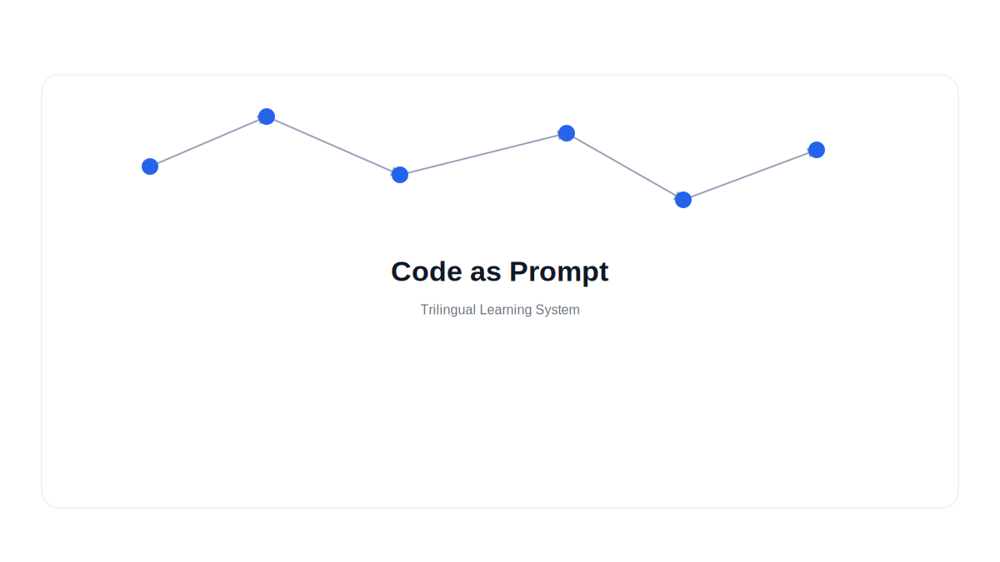

---

## Slide 2  议程
- 背景与问题
- Code as Prompt 的核心理念
- 本工程已落地的机制与实践
- 业界 Golden Practices 对照
- 后续可优化/增强的机制路线
- 成本与效果总结
- 图表/视觉建议：
  - 横向时间轴/路线图式目录（6 个节点）
  - 每节点小图标：问题/理念/实践/对照/演进/总结
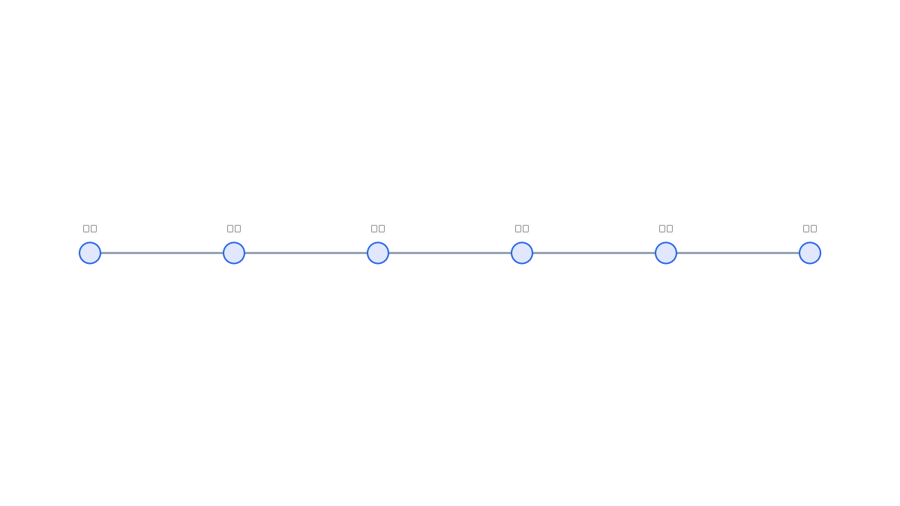

---

## Slide 3  背景与痛点
- 手工卡片效率低、质量不稳定
- 多语例句与发音难以规模化
- 输出结构不稳定，无法直接工程化
- 缺少复用与迭代机制（Prompt 难维护）
- 图表/视觉建议：
  - 2×2 痛点矩阵（效率/质量/结构化/可维护）
  - 或“传统流程”泳道图：手工→多步骤→低一致性
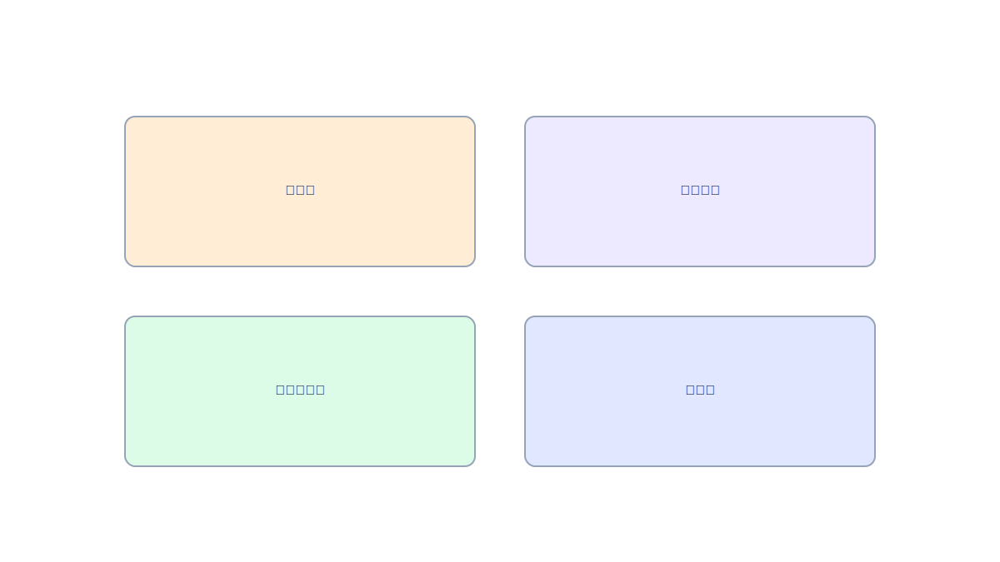

---

## Slide 4  Code as Prompt 的定义
- Prompt 是“代码资产”，具备模块化与可测试性
- 与系统数据结构强耦合（JSON 合同）
- 运行时动态组装，而非静态字符串
- 目标：让 LLM 输出“可编程、可验证、可复用”
- 图表/视觉建议：
  - “字符串 Prompt vs 代码 Prompt”对比示意（左右对照）
  - 代码样例 + 结构化 JSON 输出框
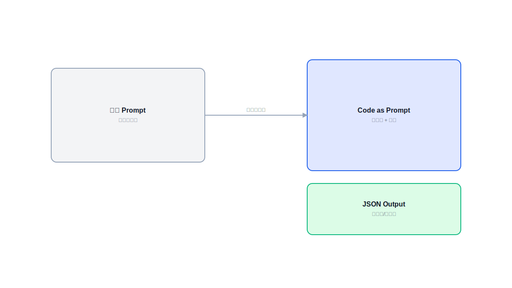

---

## Slide 5  本工程的 Prompt 结构（已实现）
（对应 `services/promptEngine.js`）
- **System Role**：定义三语翻译专家身份
- **CoT Guidance**：固定 5 步推理流程
- **Few-shot Examples**：4 类高质量样例
- **Detailed Requirements**：例句长度、语域、日语注音、外来语规则等
- **Data Contract**：严格 JSON 格式与字段约束
- 图表/视觉建议：
  - “5 层堆栈图”或分层卡片（Role/CoT/Few-shot/Rules/Contract）
  - 每层用不同颜色，强调由下至上组装
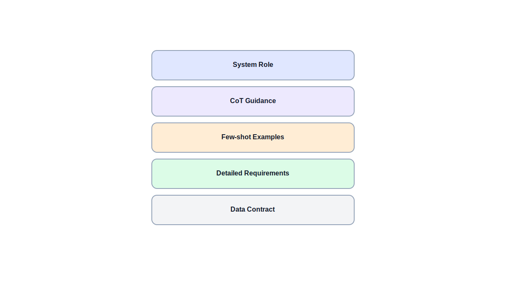

---

## Slide 6  已实现机制 1：强契约输出（JSON Contract）
- 产出字段固定：`markdown_content` + `audio_tasks`
- 服务端校验：`validateGeneratedContent` 拦截非法响应
- HTML 安全约束：过滤 `<script>/<iframe>` 等
- 优势：减少“可用性崩溃”，输出可直接入库
- 图表/视觉建议：
  - “契约链路图”：Prompt → JSON → 校验器 → 文件落盘
  - 在“校验器”处标红拦截非法 JSON
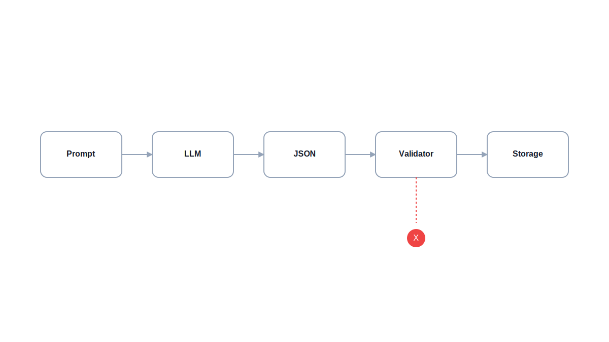

---

## Slide 7  已实现机制 2：内容质量约束
- 例句场景分层（正式/日常）
- 例句长度范围（英 8–15 词、日 10–20 字）
- 日语注音规则（汉字注音、外来语英文标注）
- **新增约束**：日语例句的中文翻译禁止注音/假名
- 图表/视觉建议：
  - “规则清单” + 右侧“合规/不合规”对比卡片
  - 用 ✅/❌ 标注：例如“汉字(かな) 禁止”
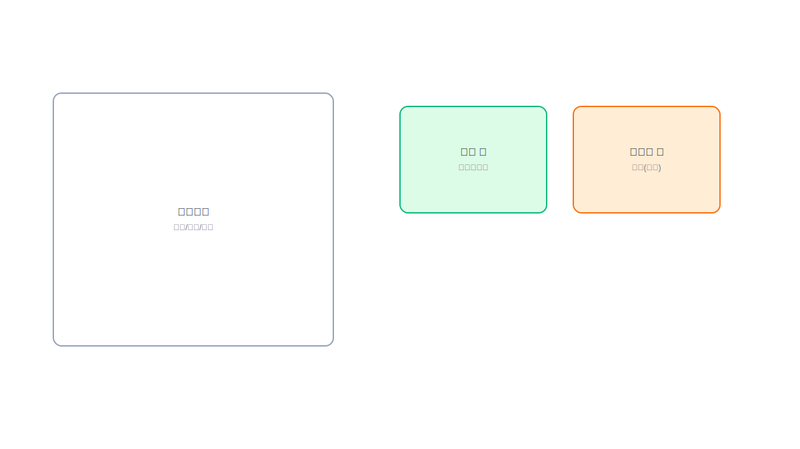

---

## Slide 8  已实现机制 3：渲染与音频编排
- Markdown 主体 + 本地 HTML 渲染（安全可控）
- 例句解析自动生成 audio_tasks
- TTS：英文 Kokoro + 日文 VoiceVox
- 文件归档：YYYYMMDD 目录 + 去重命名
- 图表/视觉建议：
  - 流程图：Markdown → 解析 → audio_tasks → TTS → 文件归档
  - 两个 TTS 分支并行到音频输出
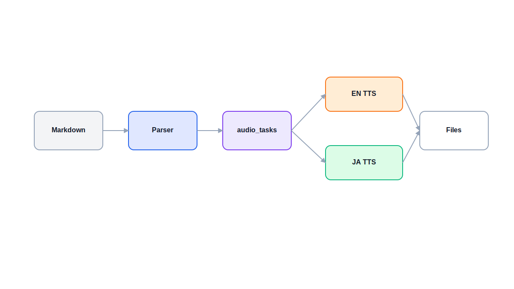

---

## Slide 9  已实现机制 4：可观测与可调试
- 前端显示**完整 Prompt**与**完整 LLM 输出**
- 便于定位质量问题与 Prompt 回归
- 生成流程可见化（进度、错误）
- 图表/视觉建议：
  - UI 截图占位 + 高亮 Prompt/LLM Output 区块
  - 或“诊断面板”示意图
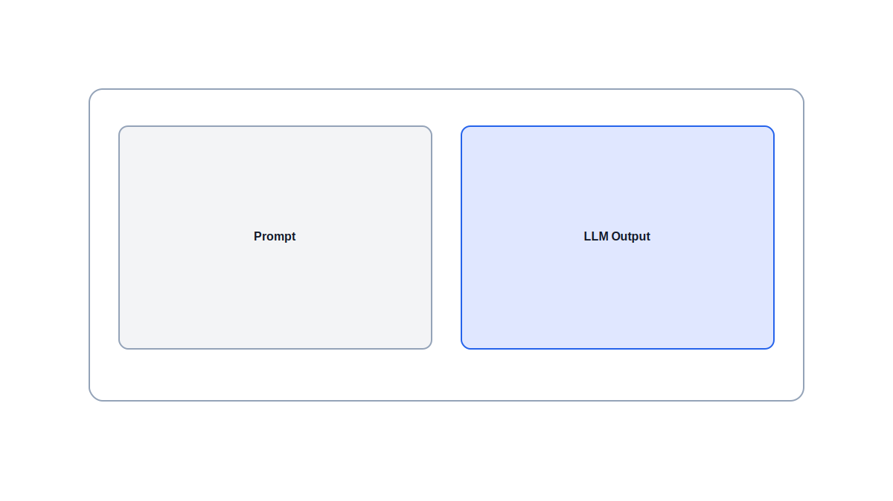

---

## Slide 10  业界 Golden Practices 对照（已覆盖部分）
- ✅ **Prompt 模块化**（Role/Examples/Rules/Contract）
- ✅ **输出校验**（schema-like validation）
- ✅ **最小可用输出**（Markdown + Audio Task）
- ✅ **安全约束**（HTML tag 过滤 + CSP）
- ⚠️ **缺失项**：评测、A/B、版本化、回归基准、自动重试
- 图表/视觉建议：
  - 对照表（左：已覆盖 ✅，右：缺失 ⚠️）
  - 或雷达图（6 维能力成熟度）
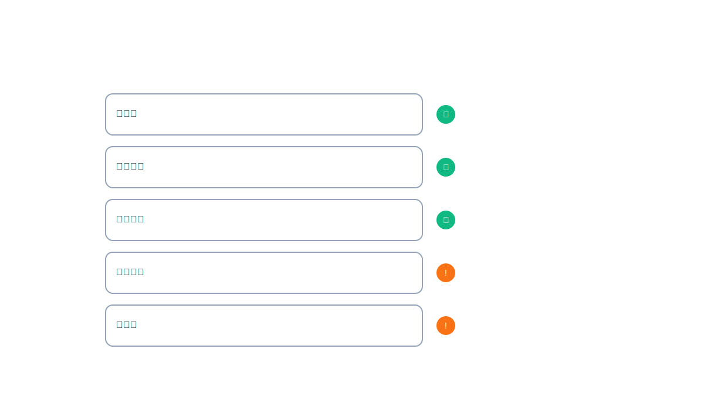

---

## Slide 11  业界 Golden Practices（建议引入）
- **Prompt Versioning**：v1.0/v1.1 版本管理
- **Regression Set**：固定样例集+质量指标
- **自动重试与自修复**：失败时回写错误上下文
- **Token 预算与成本监控**
- **Shadow/A/B Prompt**：对比不同策略
- 图表/视觉建议：
  - “能力提升路线图”或“工具链拼图”
  - 每项用图标并标注价值（稳定性/成本/质量）
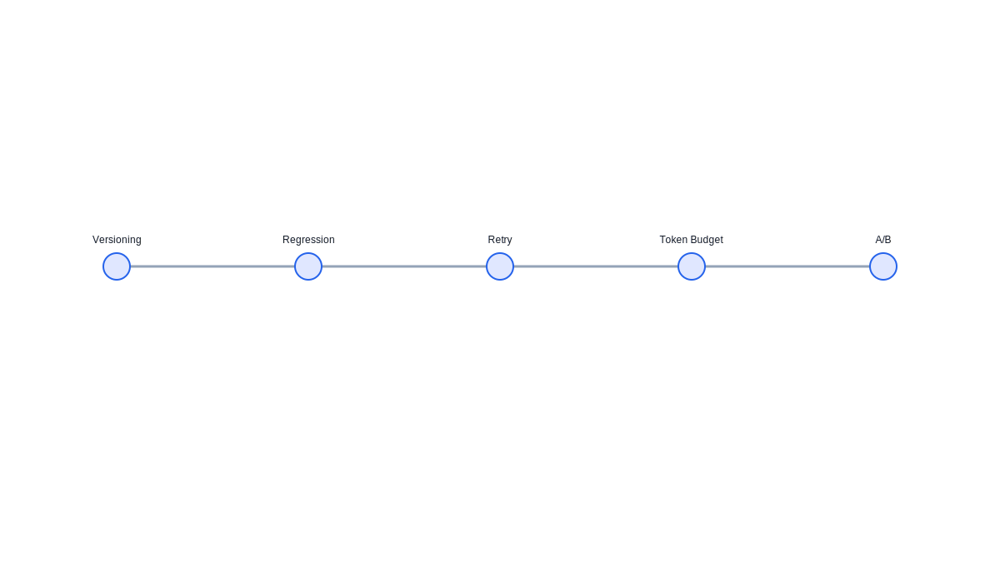

---

## Slide 12  后续可优化机制 1：结构化评测与回归
- 建立“固定评测短语集”
- 指标：例句长度、注音完整率、JSON 合法率
- 自动化脚本每日跑并产出报告
- 图表/视觉建议：
  - 测试管线图：评测集 → 自动执行 → 报表 → 回归对比
  - 指标仪表盘样式
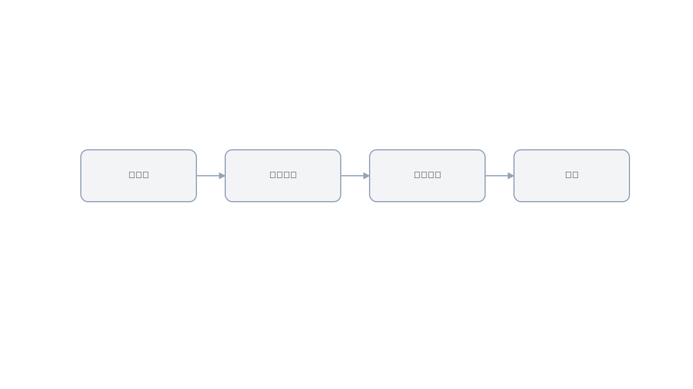

---

## Slide 13  后续可优化机制 2：多级策略与动态注入
- 语言检测（中文/日文/英文）动态注入约束
- 技术词汇检测触发“技术概念说明”
- 风格可切换：口语/商务/学术
- 图表/视觉建议：
  - 决策树/路由图：输入 → 检测 → 注入规则 → 输出
  - 右侧展示不同风格的卡片片段
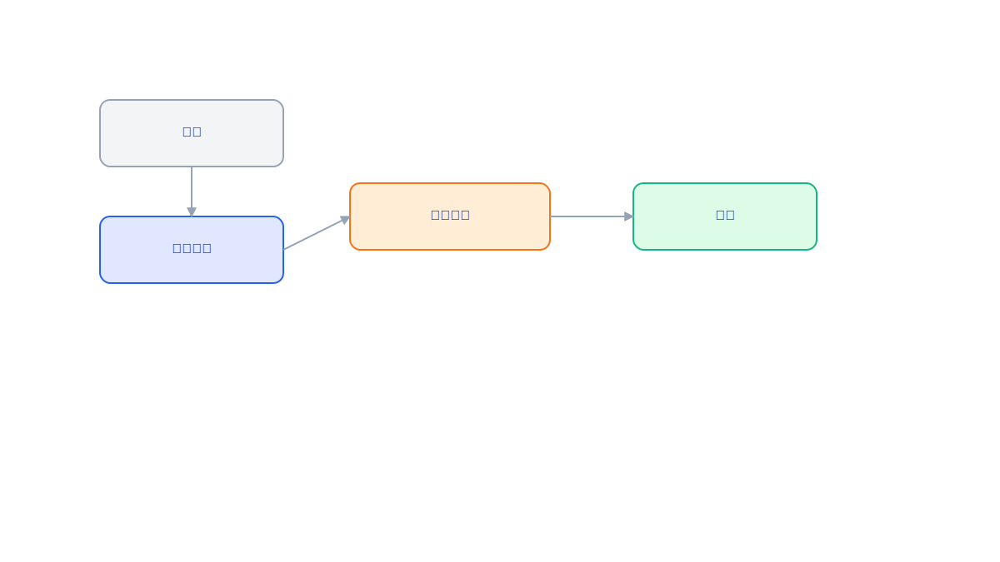

---

## Slide 14  后续可优化机制 3：强 Schema 与类型安全
- 引入 JSON Schema 校验（ajv）
- 失败反馈 + 自动重试（self-correction）
- 与前端/后端类型定义对齐
- 图表/视觉建议：
  - “Schema 盾牌”+ 校验链路图
  - 失败回路箭头形成闭环
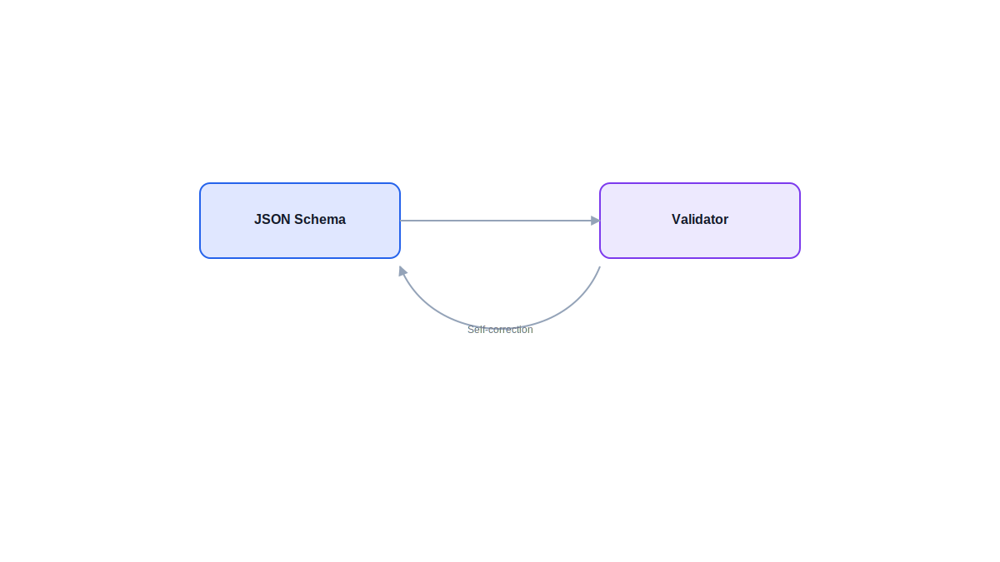

---

## Slide 15  后续可优化机制 4：智能化闭环
- Review Agent：周期性标签归纳与知识总结
- Embedding 检索：语义近义与表达替换
- 知识图谱：词条关联与语法模式网络
- 图表/视觉建议：
  - 知识网络图（节点：词条/语法/主题）
  - Agent 闭环图：输入→生成→归纳→回到 Prompt
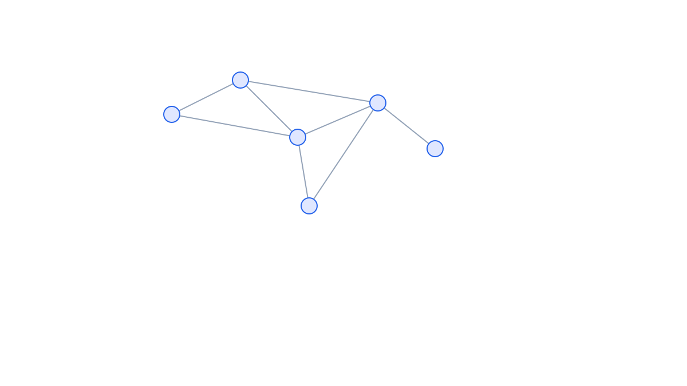

---

## Slide 16  成本与性价比（示例）
- Gemini 2.0 Flash：
  - 文本生成：约 $0.00078 / 卡片
  - OCR+生成：约 $0.00089 / 卡片
- 结论：单卡成本 < 0.1 美分，可规模化
- 图表/视觉建议：
  - 条形图对比：文本 vs OCR 总成本
  - 右侧用“<0.1¢”徽标强调
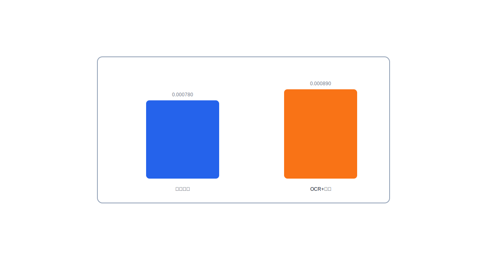

---

## Slide 17  总结
- Code as Prompt 将“Prompt”变成“可演进系统”
- 本工程已具备：模块化、强契约、质量规则、可观测
- 下一步：引入评测/版本化/动态注入/智能闭环
- 图表/视觉建议：
  - 三段式总结卡片（已完成/进行中/下一步）
  - 或“山峰/阶梯”式升级路径
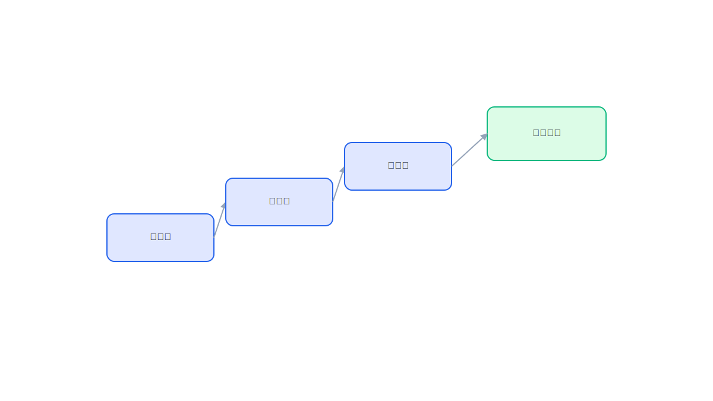

---

## Slide 18  Q&A
- Thank you
- 图表/视觉建议：
  - 轻量背景图（波纹/网格/二维码占位）
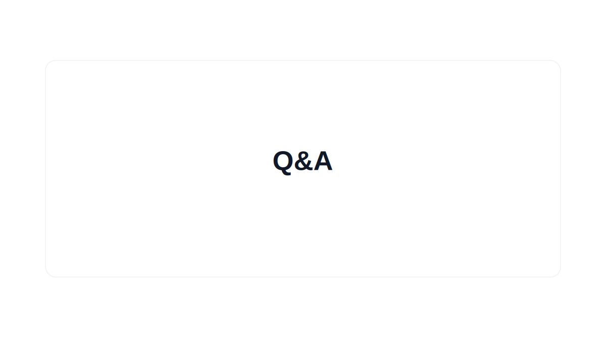
